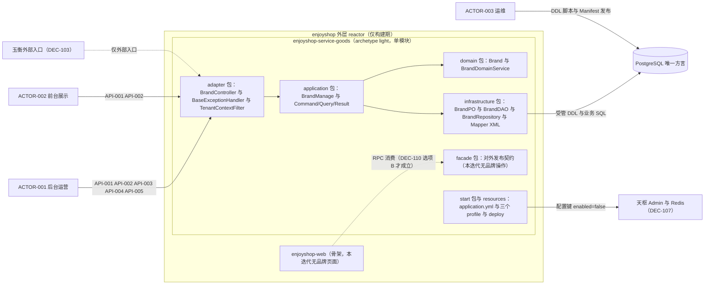
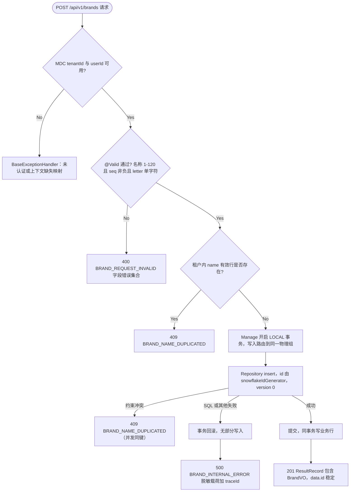
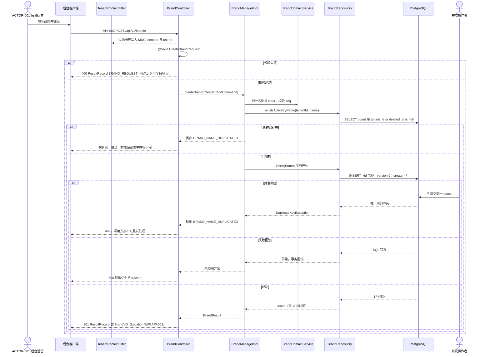
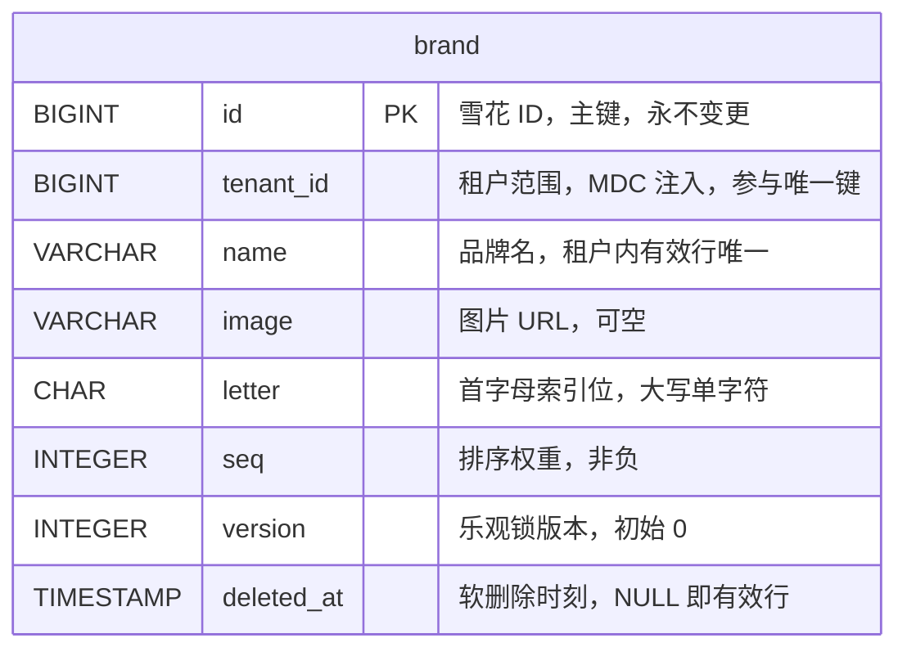

# enjoyshop 工程骨架与商品品牌 CRUD 设计

| Field | Value |
| --- | --- |
| Document | `docs/egon/spec/2026-09-23-17-16-enjoyshop-scaffold-brand-crud.md` |
| Template Version | `7` |
| Status | `Accepted` |
| Type | `Architecture` |
| Complexity | `Complex` |
| Complexity Drivers | `多工程 Maven 聚合与准确 archetype 形态选择；品牌读写契约族（5 个原子 HTTP 操作）与统一响应及错误信封；PostgreSQL 受管 DDL 与分片 STRATEGY 选择；租户上下文来源；天枢注册与多环境配置键一致性；§5.4 的架构级冲突（网关、分布式事务、契约工程、共享 common、方言与主键类型、文档发布）已由用户在 2026-09-23 全部选定，其设计后果仍贯穿 §6 至 §11；2026-09-24 因 web archetype 的对端 Evaluation facade 硬约束（BLOCK-001）改选 light 形态，其四项连带决策（DEC-115 至 DEC-118）同样贯穿 §6 至 §11` |
| Created | `2026-09-23 17:16 CST` |
| Updated | `2026-09-24 15:20 CST` |
| Owner | `mario` |
| Repository | `enjoyshop` |
| Scope | `enjoyshop 仓库根（外层 reactor 与二级聚合 POM）、商品上下文（品牌）、公共异常处理、天枢配置块、多环境配置文件` |
| Change Surface | `新建外层与二级聚合 POM、由 light archetype 生成的 enjoyshop-service-goods 单模块工程内品牌垂直切片（Controller、Request/VO、Command/Query/Result、Manage、Domain Service、Repository、DAO、PO、Mapper XML、Converter）、一份新受管 DDL 脚本与 Manifest 条目、统一异常处理类、租户上下文过滤器、删除 light 自带的 ResponseWrapperHandler 与 GlobalExceptionHandler、更新自带架构 verifier 的计数基线、application 与三个 profile 的配置键` |
| Affected Chapters | `§7, §8, §9, §10, §11, §13, §14, §15, §16` |
| Source Requirement | `用户 2026-09-23 迭代说明：项目结构（gateway、service、service_api、transaction_fescar、web）与 8 条需求（父 pom、五个二级模块、tianshu 注册中心、enjoyshop_common、enjoyshop_service_goods_api、enjoyshop_service_goods、商品微服务品牌增删改查含 8 种查询/写入行为、公共异常处理 BaseExceptionHandler）` |
| Baseline Revision | `02cda6b (main)，工作树干净；仓库只含 README.md、.gitignore、.idea、.agents/skills 符号链接` |
| Amends | `None` |
| Supersedes | `None` |
| Depends On | `None` |
| Related Specs | `None` |
| Related Plans | [enjoyshop 骨架与品牌 CRUD 实施计划](../plan/2026-09-24-12-42-scaffold-brand-crud-implementation.md) |

## 1. Summary

本仓库目前是空仓库（只有 `README.md` 与 `.gitignore`），用户希望按自己的 Egon-COLA 架构启动 enjoyshop 电商项目：先建立父工程与五个二级模块，配置天枢（Tianshu），创建公共模块与商品契约/服务模块，并在商品微服务中交付"品牌"表的增删改查（8 项行为：查询全部、按 ID 查询单条、增加、修改、删除、条件查询、分页查询、分页加条件查询），同时提供统一异常处理类 `BaseExceptionHandler`。

本 Spec 给出的选定方向是：仓库根使用一个纯外层 reactor（`packaging=pom`，无 `<parent>`，只列生成工程根），二级目录只做工程分组聚合；业务工程一律由 `egon-coding-create-new-module` 从一个非 open archetype 生成，本迭代的载体为 `egon-cola-archetype-light`（单模块，HTTP Controller 与 RPC facade 都在该模块的 `adapter/` 与 `facade/` 包内）；品牌垂直切片落在生成工程的 COLA 分包内，持久化使用 `egon-cola-component-common-mybatis-plus-sharding-jdbc-ext-spring-boot-starter`（强制 PostgreSQL），DDL 由 `EgonColaPostgreDdlRunner` 与 `db/egon-mp/` 加 `repository-manifest.json` 受管；HTTP 响应与异常统一使用 `egon-cola-component-common-core` 已有的 `ResultRecord` 与 `PageResultRecord` 信封，异常处理类以 `@RestControllerAdvice` 落地并保留用户指定的 `BaseExceptionHandler` 名称。8 项品牌行为按最小接口原则映射为 5 个原子 HTTP 操作（4 项列表类行为合并为一个集合查询操作）。

同时，用户请求中的若干要素与仓库既有强制契约存在冲突：下划线模块名、独立 `enjoyshop_transaction_fescar` 分布式事务工程、独立 `enjoyshop_service_api` 契约工程、独立 `enjoyshop_common` 共享工程、`enjoyshop_gateway` 自建网关工程、`id INT` 主键与 MySQL 风格列型、以及天枢"注册中心"的实际接入前置条件。这些冲突会改变公共契约、职责边界、持久化数据与外部依赖，因此曾被逐项记为 §5.4 的重大决策；用户已于 2026-09-23 以"按照推荐方案 继续"一次性选定全部 14 项（`DEC-101` 至 `DEC-114` 一律取推荐项，即不新建 gateway、fescar、service-api、common 四个工程，商品工程选 `egon-cola-archetype-web`，`brand` 用 `BIGINT` 加八个继承列，信封沿用 `ResultRecord` 并保留 `BaseExceptionHandler` 名，天枢与文档发布均"键写全、默认关闭"，8 项行为映射为 5 个原子契约，`brand` 取 `SINGLE`），本 Spec 据此进入 `Review`，并于 2026-09-24 由用户批准转为 `Accepted`。

2026-09-24 的实施阶段暴露 `BLOCK-001`：`egon-cola-archetype-web` 的 `archetype-metadata.xml` 把四个 `evaluationFacade*` 对端契约坐标声明为**无默认值的 requiredProperty**，且它们是生成物的真实组成部分（infrastructure 模块的真实编译期依赖 加 8 个 `client/evaluation/**` 样例文件 加两个 verifier 断言），因此"暂不使用外部 facade、不引入"在该形态下不可实现；而 `egon-coding-create-new-module` 技能明文禁止把坐标默认指向 `top.egon.internal.archetype.source` 样例契约。用户据此改选 `DEC-101` 选项 B（`egon-cola-archetype-light`，`archetype-metadata.xml` 只有 `gitignore` 一个 requiredProperty，无对端 facade），并同时裁定四项连带处置：`DEC-115` 删除 light 自带的全局信封设施（`ResponseWrapperHandler` 与 `GlobalExceptionHandler`，否则品牌响应会被二次包装为 `ApiResponse` 且品牌异常会被其 `ApiResponse` 形状吞掉，违反 `DEC-109`）、`DEC-116` 新增写 MDC 的租户与操作者过滤器（light 自带 `RequestContextFilter` 用 ThreadLocal 而非 MDC，MP-SDJ 从 MDC `tenantId` 取值）、`DEC-117` 更新 light 自带架构 verifier 的硬编码计数基线、`DEC-118` light 自带的 GraphQL/MQ/Redis/幂等/proto 样例原样保留并记为 `Context-only`。品牌的五契约、字段、错误码、表结构与索引设计逐字不变，变的是它们所在的物理形态。

用户同日追加的历史模型清单（`EVD-024`）作为下一批移植输入被 §2.5 逐条处置，只暴露移植义务，不改变本迭代的任何契约。

## 2. Background and Current State

### 2.1 业务与用户上下文

enjoyshop 定位为电商网站（含网站后台与网站前台），因此用户的结构意图是"网关做路由与鉴权限流、微服务工程各自独立、契约工程对外提供依赖、分布式事务单独抽取、web 工程做多服务聚合"。本迭代是第 1 个可交付迭代：先立工程骨架，再用"品牌"这一小字典表打通从 HTTP 契约到 PostgreSQL 受管 DDL、再到统一异常处理的完整纵切面，作为后续商品域其他对象的复制模板。

用户未给出：租户模型（单租户还是多租户 SaaS）、真实认证方式、发布仓库与 Maven 身份、PostgreSQL 与分片拓扑实例、以及各二级模块是否必须一次建齐。这些属于 §5.4 决策项。

### 2.2 仓库证据

| Evidence ID | Classification | Exact path/symbol/decision/command | Observed fact | Design significance | Verification limit/freshness |
| --- | --- | --- | --- | --- | --- |
| `EVD-001` | Static repository | `enjoyshop/README.md`、`enjoyshop/.gitignore`、`git log`（`02cda6b`） | enjoyshop 只有 README 与忽略文件，无 `pom.xml`、无源码、无 `AGENTS.md`、无 `docs/egon/spec` | 绿地工程；不存在需要保护的既有分层，也不存在可继承的业务父 POM | 仅静态检查，未读取远端仓库 |
| `EVD-002` | Static repository | `.agents/skills/` 符号链接指向 `/Users/mario/SelfProject/Egon-COLA/.agents/skills/` | 四个 `egon-coding-*` skill 以软链接方式安装在本项目 | skill 契约（Rules 与 references）是本仓库的规范输入；不得复制副本 | 链接目标存在性已确认，未验证 skill 资源完整性以外的内容 |
| `EVD-003` | Static repository | `/Users/mario/SelfProject/Egon-COLA/egon-cola-archetypes/source-projects/egon-cola-source-web`（目录列表与 `pom.xml:9-16,42-50`）；`egon-cola-source-light`（目录列表） | 非 open `web` 工程由 root `pom` 加七个内部模块组成：`common`、`facade`、`domain`、`application`、`infrastructure`、`adapter`、`starter`；生成 root 直接继承 `top.egon:egon-cola-archetypes-parent:5.4.1` 且 `<relativePath/>`。非 open `light` 工程是**单模块**（`expectedTopology=root`），同样的 COLA 分层以包形式落在 `src/main/java/{common,facade,domain,application,infrastructure,adapter,start}` 内，RPC 契约载体是 `facade/` **包**而非独立模块 | `DEC-101` 改选 light 后，用户的"对外契约工程"诉求由单模块内的 `facade/` 包承载，`DEC-105`/`DEC-110` 的措辞随之从"模块"改为"包"；不得为迁就旧措辞发明第二个模块 | 静态 POM 与目录；未运行 `mvnw` |
| `EVD-004` | Static repository | `egon-cola-source-web-adapter/.../teaching/controller/GradeController.java`、`user/controller/{UserController,RoleController,PermissionController}.java` | `web` 形态 `adapter` 模块持有 HTTP Controller：`@RestController("gradeController")`、`@RequestMapping("/api/v1/grades")`、`@RequiredArgsConstructor`、`@Slf4j`、`@Qualifier("gradeManage")`、`@Valid @RequestBody` | 品牌 HTTP 路由与注解位置有直接先例；路由前缀惯例为 `/api/v1/<复数资源>` | 静态源码；未启动应用验证路由 |
| `EVD-005` | Static repository | `egon-cola-source-service/egon-cola-source-service-adapter/src/main/java`（文件清单） | 非 open `service` 形态 `adapter` 只有 `facade/impl`、`mq`、`handler`、`pojo/convertor`，无任何 Controller | 若商品工程选 `service` 形态，则品牌 8 项行为无法以 HTTP 交付；这是 §5.4 决策的直接依据 | 静态源码清单 |
| `EVD-006` | Static repository | `egon-cola-source-web-facade/.../teaching/GradeFacade.java`、`egon-cola-source-web-adapter/.../teaching/facade/impl/GradeFacadeImpl.java` | `-facade` 是对外发布的 RPC 契约模块（`@EgonRpcService`、`@EgonRpcMethod`、protobuf 类型），提供方在 `adapter` 以 `@Service("gradeFacade")` 与 `@EgonRpcProvider` 落地 | 用户 `enjoyshop_service_api` 的仓库等价物是各工程 `-facade` 模块，而不是独立工程 | 静态源码；未验证注册中心下的实际调用 |
| `EVD-007` | Static repository | `egon-cola-source-web/pom.xml:30-33,73-75`、`egon-cola-source-web-infrastructure/pom.xml:37-38` | web 工程通过属性化的 sibling GAV 在 `infrastructure` 模块声明对 `egon-cola-source-service-facade` 的依赖 | 跨工程消费契约的方式是 Maven 依赖 加 sibling GAV 属性，不是 reactor 顺序 | 静态 POM；sibling 制品是否已发布未验证 |
| `EVD-008` | Static repository | `egon-cola-archetypes/pom.xml:5-12,100-108,178-195`；`Egon-COLA/pom.xml:6-11,72-75` | `top.egon:egon-cola-archetypes-parent:5.4.1` 导入 `egon-cola-components-bom`、`springdoc-openapi-bom`（`${springdoc.version}` = 2.8.17）、Spring Cloud、ShardingSphere，并显式管理 `egon-cola-tianshu-starter`、`egon-cola-tianshu-http-registration-starter`、`yuheng-starter-openapi`、`yuheng-starter-openapi-webmvc`；根 POM 继承 `spring-boot-starter-parent:3.5.16` | 生成工程无需自写版本即可获得 Egon 平台能力；但"被管理"不等于"已引入"，新增依赖仍需批准 | 静态 POM；未做 `help:effective-pom` 联网解析 |
| `EVD-009` | Static repository | `egon-cola-component-common-mybatis-plus-sharding-jdbc-ext-spring-boot-starter/.../EgonColaShardingProperties.java:138-145` | `driver-class-name` 与 `jdbc-url` 分别被 `@Pattern(regexp = "org\.postgresql\.Driver")` 与 `@Pattern(regexp = "jdbc:postgresql:.+")` 约束 | MySQL 方言在该 Starter 中不可能通过配置绑定；用户 `id INT` 一类 MySQL 假设必须改为 PostgreSQL | 静态注解；绑定失败行为未在运行时验证 |
| `EVD-010` | Static repository | `.../model/EgonModel.java`、`.../extension/EgonColaMapper.java`、`.../extension/EgonColaRepository.java`、`egon-cola-source-web-infrastructure/.../teaching/po/SchoolClassPO.java`、`.../repo/SchoolClassRepository.java` | `EgonModel` 提供 `id`、`tenantId`、`createUserId`、`createTime`、`updateUserId`、`updateTime`、`deletedAt`、`version` 八个继承字段并带 `@TableLogic`；PO 以 `@Data @NoArgsConstructor @AllArgsConstructor @Builder @Accessors(chain = true) @TableName` 继承它且只声明业务列；Repository 以 `@Repository("schoolClassRepository")` 继承 `EgonColaRepository<DAO, PO>` 并显式 `@Qualifier` | 品牌 PO 与 Repository 的写法、继承列不重复声明、软删除与乐观锁语义都有唯一仓库惯例 | 静态源码 |
| `EVD-011` | Static repository | `egon-cola-source-light/src/main/resources/db/egon-mp/repository-manifest.json` 与 `V20260913_001__initialize_repository_schema.sql` | 受管 DDL 目录为 `-infrastructure/src/main/resources/db/egon-mp/`（light 为 `src/main/resources/db/egon-mp/`），Manifest 记录 `family`、`version`、`path`、`sha256`；脚本按 `egon_migration.role` 分支，`MASTER_DATA` 建无后缀主数据表（如 `courses`），`SHARD` 建带 `_0`、`_1` 物理后缀的分片表；软删除唯一性用 `CREATE UNIQUE INDEX ... WHERE deleted_at IS NULL` 部分索引；`ddl_history` 表在脚本尾部创建 | 品牌 DDL 的形状、唯一键写法、以及 `SINGLE` 与 `STANDARD_TENANT_ID` 两种落点差异均有直接先例 | 静态脚本；未连接 PostgreSQL，未执行 DDL |
| `EVD-012` | Static repository | `.../business/EgonColaTenantIdProvider.java:15-49`、`.../autoconfigure/EgonColaMybatisPlusProperties.java:73-83` | 租户 ID 由 MDC key（默认 `tenantId`，可由 `egon.cola.component.mybatis-plus.tenant-id.mdc-key` 改写）解析，缺失即抛 `TENANT_CONTEXT_MISSING`；审计用户取 MDC `userId` | 任何写入前必须有过滤器填充 MDC；`tenant_id` 不能来自请求 Body | 静态源码；线程池串号风险由其 javadoc 声明，未压测 |
| `EVD-013` | Static repository | `egon-cola-source-web-adapter/.../filter/OrganizationAuthContextFilter.java:30-38` | archetype 示例以 `X-Tenant-Id` 请求头（缺省 `"1"`）写 MDC `tenantId`、`userId`，请求结束 `MDC.remove` | 本迭代租户上下文的可行最小实现；真实认证需要天权·守兵，属于 §5.4 决策 | 静态源码；示例值不代表生产鉴权 |
| `EVD-014` | Static repository | `egon-cola-component-common-core/.../pojo/ResultRecord.java:30-42`、`PageResultRecord.java:33-46`、`PageQuery.java:22-33` | `ResultRecord` 字段为 `success`、`code`、`status`、`message`、`data`、`traceId`、`timestamp`；`PageResultRecord` 为 `success`、`code`、`status`、`message`、`records`、`page`、`traceId`、`timestamp`，且 `records` 为 null 时归一为空集合；`PageQuery` 为 `pageNo`（从 1 起）与 `pageSize`（默认 10、上限 500，构造即归一） | 品牌列表与分页响应必须复用该信封，不得为 Swagger 再造第二套 Wrapper | 静态源码 |
| `EVD-015` | Static repository | `egon-cola-source-web-adapter/.../handler/OrganizationGlobalExceptionHandler.java`、`egon-cola-source-light/.../adapter/handler/{GlobalExceptionHandler,ApiResponse,ResponseWrapperHandler}.java`、`egon-cola-tianshu-admin/.../config/DdcGlobalExceptionHandler.java` | 仓库存在三种统一异常处理惯例：web 形态 `@RestControllerAdvice(name = "organizationGlobalExceptionHandler")` 加 `ResponseEntity` 与失败类型到 HTTP 状态映射；light 形态 `@RestControllerAdvice` 加 `ApiResponse` 且 `@ResponseStatus` 固定 400；天枢 Admin 以 `ResultRecord.failure(...)` 返回 | 用户要求的"统一异常处理类"可行，但响应外形必须在 §5.4 选定；仓库中不存在 `BaseExceptionHandler` 符号 | 静态源码 |
| `EVD-016` | Static repository | 全仓 `grep -rn "fescar"`（0 命中）与 `grep -rn "seata"`（仅作为 `<exclusion>` 出现，如 `docs/egon/spec/2026-09-14-22-05-mp-sharding-jdbc-starter-unification.md:103,1102`） | Egon-COLA 不提供也不依赖 Seata/Fescar；跨分片写保护是 `EgonColaLocalWriteGuard`，事务默认 `LOCAL`，事件投递是 `egon-cola-component-transactional-outbox-starter` | 独立 `enjoyshop_transaction_fescar` 工程在现有架构中没有可依赖的实现物；引入 Seata 属于新的第三方依赖决策 | 静态检索 |
| `EVD-017` | Static repository | `docs/egon/spec/2026-08-23-16-43-open-source-archetype-family.md:16,47,169,283,364,412`（`REQ-015`、`DEC-003`） | 既有已接受 Spec 把 Spring Cloud Gateway 限定为外部玉衡平台入口，业务工程被要求移除并禁止自建；限流能力是 `egon-cola-component-access-guard-starter`；`yuheng-biz-gateway` 是平台内部模块（`maven.deploy.skip`） | 用户 `enjoyshop_gateway` 的"路由组合 加 鉴权 加 限流"在仓库内对应玉衡入口与 access-guard，而不是自建网关工程 | 静态 Spec 文档；本次会话未重新验证玉衡运行时 |
| `EVD-018` | Static repository | `egon-cola-xingyuan/egon-cola-tianshu/.../DdcHttpRegistrationProperties.java`、`.../DdcRegistryAdminController.java`、`egon-cola-tianshu-admin/src/main/resources/application.yml`、`egon-cola-source-light/src/main/resources/application.yml:273-331` | 天枢是动态配置中心加 Redis 租约注册：Admin HTTP 18080、gRPC 19080；注册经 gRPC 且需要天权·守兵签发、scope 为 `tianshu:registration:write`、registration-id 为 `tianshuregistration` 的服务令牌；Admin 无 HTTP 注册端点、无注册注解；archetype 默认 `egon.cola.component.tianshu.enabled: false` | 本迭代可交付的只是配置键与默认关闭；真正"注册中心生效"需要外部实例与凭据，属 §5.4 决策 | 静态源码与配置；未启动天枢 Admin |
| `EVD-019` | Static repository | `/Users/mario/SelfProject/Egon-COLA/.agents/skills/egon-coding-create-new-module/SKILL.md:17,23,38` 与 `references/multi-project-parent.md`（"Default: a pure outer aggregator" 一节） | 新业务工程只能由该 skill 从一个非 open archetype 生成；外层 reactor 只列工程根、不得作为生成工程的 Maven `<parent>`；一个 POM 只能有一个 parent 且校验器要求直接继承已发布的 Egon 父 POM；若外层 POM 自己继承则必须显式设置 `<egon-cola.version>` | Spec 不能发明模块骨架；本 Spec 只声明骨架契约与文件清单，生成动作属于后续 Plan | 静态 skill 文档 |
| `EVD-020` | Static repository | `egon-cola-source-web-starter/src/test/java/.../architecture/WebArchitectureTest.java`、`ArchetypeContractConvergenceTest.java`、`contract/OwnedFacadeContractTest.java`；`egon-cola-source-light/src/test/java/architecture/LightPersistenceArchitectureTest.java:47-57`、`ArchetypeContractConvergenceTest.java:320-327`；两份 `lombok.config` | 两形态都自带架构约束测试（断言源码含 `extends EgonModel<`），并在 `lombok.config` 中开启 `lombok.copyableAnnotations += Qualifier`。**关键**：light 的 `LightPersistenceArchitectureTest` 对样例域文件数做**硬编码**断言——恰好 8 个 `Repository.java`、8 个 `PO.java`、8 个 `DAO.java`、5 个 `DomainServiceImpl.java`；web 的 `WebArchitectureTest` 同样硬编码 8 `PO.java`／8 `DAO.java`／4 `DomainServiceImpl.java` | 生成 `brand` 切片后这些计数必然各加 1，两形态的 verifier 都会失败；这是与形态选择无关的既有约束，处置见 `DEC-117`。`@Qualifier` 与构造注入的可行性有配置级证据 | 静态测试源码；未运行测试 |
| `EVD-021` | Inference | 综合 `EVD-003`、`EVD-005`、`EVD-009`、`EVD-026`、`EVD-027` | 由证据推断：能同时满足"品牌以 HTTP 对外"的允许形态是 `web` 或 `light`（`service` 的 adapter 无 Controller）。原推断"唯一是 web"在 2026-09-24 被 `EVD-026` 推翻——web 的对端 Evaluation facade 是生成物的硬组成部分，不是可选参数 | §6.1 与 §7.1 的形态候选集；最终形态由 `DEC-101` 决定（已于 2026-09-24 改选 B／light） | 推断；`DEC-101` 已 Closed |
| `EVD-022` | Static repository | `egon-cola-source-web/egon-cola-source-web-starter/pom.xml:63`、`egon-cola-source-web-starter/src/main/java/.../starter/config/OrganizationSwaggerConfig.java`、`egon-cola-xingyuan/egon-cola-yuheng/yuheng-starter-openapi-webmvc/pom.xml:25-27`、`yuheng-starter-openapi/src/main/java/.../config/GatewayOpenApiProperties.java:16-34` | `web` 形态的 `starter` 模块已声明 `top.egon:yuheng-starter-openapi-webmvc`（其内有 `org.springdoc:springdoc-openapi-starter-webmvc-api`），并自带 `OpenAPI` 信息 Bean；该 starter 的配置前缀为 `egon.cola.component.yuheng.openapi`，键含 `enabled`、`publish-to-ddc`、`published-groups`、`biz-code`、`application-code`、`resource-uri`、`artifact-version`、`build-id`，且 `required(...)` 对空白值抛错 | OpenAPI 文档端点随生成骨架自带，属于 Keep 而非新增依赖（推翻 §7.0 原先的 Add 判断）；但一旦 `enabled: true` 就必须补齐全部发布键并纳入 Rule 7 的键集合比对 | 静态 POM 与源码；未启动应用验证 `/v3/api-docs` 实际输出 |
| `EVD-023` | Static repository | `egon-cola-components/egon-cola-component-common/egon-cola-component-common-core/pom.xml:26-28`、`.../core/pojo/ResultRecord.java:31-39`、`.../core/pojo/PageResultRecord.java:33-46`、`.../core/pojo/PageMetaRecord.java:23-30`、`.../core/enums/ResultCode.java:5-40`、`egon-cola-xingyuan/egon-cola-yuheng/yuheng-starter-openapi/src/main/java/.../customizer/EgonOperationCustomizer.java:37-48` | `swagger-annotations-jakarta` 是 common-core 的编译期依赖，`ResultRecord` 与 `PageResultRecord` 已带 `@Schema`；信封字段精确为 `success`、`code`（`int`）、`status`（枚举 `name()`）、`message`、`data` 或 `records` 加 `page`（`total`、`pageNo`、`pageSize`、`pages`、`hasNext`、`hasPrevious`）、`traceId`、`timestamp`（Unix 毫秒）；`ResultCode` 用整数码段（`SUCCESS` 10000、`INVALID_PARAMS` 20000、`NOT_FOUND` 404000、`CONCURRENCY_ERROR` 409000、`SYSTEM_ERROR` 500000、`BUSINESS_ERROR` 600000）；平台 `EgonOperationCustomizer` 对纳入目录的操作要求非空白 `operationId`，否则报 "catalogued OpenAPI operationId is required" | §9 的全部载荷必须按该真实结构书写（`code` 为整数而非字符串），业务码需落在自有区段；`@Operation(operationId = ...)` 是平台强制而非文档偏好 | 静态源码；未验证玉衡目录发布链路运行时行为 |

| `EVD-024` | Session input（非仓库文件） | 用户 2026-09-23 会话粘贴的历史工程模型清单：`model/goods/{Goods, GoodsItem, EsGoodsIndexDto, ProductStockDto, StockSearchDto}`、`model/search/{SearchGoodsDto, EsGoodsDto, SearchParamDto, SearchSegmentDto}`、`model/order/{OrderTrade, OrderItem, OrderRefund, OrderSettlement, OrderInvoice, OrderMqDto, ...}`、`model/admin/{CommAuditDto, AuditVo, AdminOperatorDto}`、`model/pay/BalancePayDto`、`model/user/UserAddrDto`、`model/bas/RegionLandDto`、`model/msg/MyMessageDto`、`model/search/PageParamDTO` | 用户给出的是"下一批要移植的语义输入"：SPU 与 SKU 分离（`GoodsItem` 即 SKU）、`Long` 主键、`Double` 金额、`java.util.Date` 时间、布尔旗标加 `xxxStr` 影子字段、`brandId` 外键、下单写多表并有 MQ 载荷、搜索依赖 ES 与自建分页载体 | 它把 §5.4 中若干决策从"抽象取舍"变成"有具体反例的取舍"：`DEC-108`（`Long` 主键与历史一致）、`DEC-104`（多表下单 加 MQ 载荷是 outbox 场景而非 Seata 工程）、`DEC-105`（`ProductStockDto` 类跨服务载荷的落点问题）；同时暴露一批移植前置（金额精度、时间类型、影子字段、搜索引擎依赖） | 会话文本，无 commit 与路径可复核；因此只作为需求输入，其"现状"结论一律由 §2.5 的目标侧证据承载 |
| `EVD-025` | Static reference | `references/database-design.md:157,309,319,362,430`、`egon-cola-component-code-generator/.../TemplateContextService.java:108-112`、`.../validation/GenerationScopeValidator.java:397-398`、`.../ArchetypeContractConvergenceTest.java:346`、`KnowledgeContractTest.java:87-88`、`egon-cola-component-rag-starter/pom.xml:43`、全仓 `elasticsearch`/`opensearch`/`fescar`/`seata` 关键词检索 | 参考文档把金额列写成 `numeric(19,2)` 并要求 Java 侧 `BigDecimal`、JSON 侧字符串，且把"金额语义含糊"列为 REVISE 级阻断；代码生成器把 `numeric|decimal` 映射为 `BigDecimal`、把 `bool` 映射为 `Boolean`、把时间映射为 `LocalDateTime`；archetype verifier 断言 `java.util.Date` 不得出现；仓库内没有任何搜索引擎依赖（最接近的是向量 RAG 的 `VectorStore`），也没有任何 Seata/fescar 实现物 | 历史模型的四类写法（`Double` 金额、`java.util.Date`、`xxxStr` 影子字段、ES 索引模型）在目标架构里分别属于"违规""违规""无先例""无能力"，因此移植必须是改造而非照搬；这也确认 `DEC-104` 与 `DEC-114` 的推荐项没有隐性成本 | 静态检索；ES 与 Seata 的缺失是"当前仓库不存在"，不等于平台外部没有该能力 |
| `EVD-026` | Static artifact (installed archetype) | `egon-cola-archetype-web-5.4.1.jar` 的 `META-INF/maven/archetype-metadata.xml:13-16`、`archetype-resources/pom.xml:31-34,74-76`、`__rootArtifactId__-infrastructure/pom.xml:37-40`、`__rootArtifactId__-infrastructure/src/main/java/infrastructure/client/evaluation/**`（8 文件）、`__rootArtifactId__-starter/src/test/java/architecture/ArchetypeContractConvergenceTest.java:101,129`、`starter/src/test/java/starter/OrganizationApplicationTest.java:7,49-50` | `web` 把四个 `evaluationFacade*` 声明为**无 defaultValue 的 requiredProperty**，且它们是生成物的真实组成部分：infrastructure 模块声明对该对端 facade 的编译期依赖，8 个 `client/evaluation/**` 文件 `import ${evaluationFacadePackage}.*`，两个自带测试断言 `NativeEvaluationRpcConfiguration.java` 存在且 native impl 含该包 | `BLOCK-001` 的根因：传空值会得到 `import .course.CourseFacade` 加空 groupId 依赖（编译失败），传不存在的坐标则 infrastructure 编译失败。因此"暂不用外部 facade、不引入"在 web 形态下**不可实现**，必须改选形态（`DEC-101`） | 解包本地已安装 jar 静态核对；未执行 `archetype:generate` |
| `EVD-027` | Static artifact (installed archetype) | `egon-cola-archetype-light-5.4.1.jar` 的 `META-INF/maven/archetype-metadata.xml`（requiredProperties 只含 `gitignore`）、`archetype-resources/src/main/java/adapter/handler/ResponseWrapperHandler.java:9-32`、`adapter/handler/GlobalExceptionHandler.java:12-47`、`adapter/handler/ApiResponse.java`、`adapter/filter/RequestContextFilter.java:22-40`、`adapter/filter/TraceIdFilter.java:36-40`、`adapter/filter/RequestContextHolder.java`、`src/main/resources/db/egon-mp/repository-manifest.json`（`family: "light"`）、`pom.xml:87,108-132,175-187` | `light` 无任何对端 facade 属性，`BLOCK-001` 消失。但它自带三处与本 Spec 既有决策冲突的设施：(1) `ResponseWrapperHandler` 是 `@ControllerAdvice(basePackages="${package}.adapter")` 加 `ResponseBodyAdvice`，把 adapter 包所有返回值包成 `ApiResponse.success(body)`（仅对 `ApiResponse` 类型本身豁免）；(2) 自带无 `basePackages` 限定的 `@RestControllerAdvice GlobalExceptionHandler`，已占用 `MethodArgumentNotValidException`／`ValidationException`／`IllegalArgumentException` 并以 `ApiResponse` 加固定 400 返回；(3) `RequestContextFilter` 用 `X-Operator-Id` 加自有 `RequestContextHolder`（ThreadLocal），**不写 MDC**，只有 `TraceIdFilter` 写 MDC `traceId` | (1)(2) 直接威胁 `DEC-109` 的 `ResultRecord` 信封与 `BaseExceptionHandler` 唯一性（`DEC-115`）；(3) 使 `EVD-012` 的 MDC `tenantId` 无写入方，每条 SQL 落库都会 `TENANT_CONTEXT_MISSING`（`DEC-116`）。light 自带 `family: "light"` 的 Manifest 与四份 profile 加 `egon-mybatis-plus-sharding.yml`，`DEC-107`/`DEC-111` 的配置键工作不受形态影响 | 解包本地已安装 jar 静态核对；未执行 `archetype:generate`，未运行自带测试 |
| `EVD-028` | Static repository | `egon-cola-component-code-generator/src/main/java/top/egon/cola/component/codegen/model/CodegenProfileEnum.java:46`、`profile/ProjectLayoutStrategy.java`（`LightLayout`／`WebLayout` 的 `allows` 与 `javaPackage`） | `CodegenProfileEnum.LIGHT.allowsController()` 返回 `this == LIGHT \|\| this == WEB`，故 light profile 同样支持 `controller` 产物；`LightLayout.allows` 与 `WebLayout.allows` 的 artifact 集合完全相同，且两者共用同一个 `javaPackage(config, artifact)` 映射（`base.domain.<域>`、`base.application.<域>`、`base.infrastructure.<域>.po/dao/repo/converter`、`base.infrastructure.<域>.service.impl`、`base.adapter.<域>`）；唯一差别是 `LightLayout.relativePath` 用空前缀（不拼模块目录），`WebLayout` 用 `modulePrefix` | 改选 light 后 codegen 配置的 `projectType` 由 `web` 改 `light`，**包名规则一字不改**，只需删掉 `modulePaths`/`roots`；Step 4 的 22 个产物文件名与包路径可直接沿用 | 静态源码 |
| `EVD-029` | Static artifact (installed archetype) | `egon-cola-source-light/src/main/java/`（`adapter/teaching/graphql/`、`adapter/*/mq/`、`infrastructure/mq/`、`infrastructure/aop/`、`domain/*/service/*IdempotencyService.java`、`infrastructure/config/{RedisConfig,RabbitMqConfig}.java`、`src/main/proto/teaching_user_facade.proto`、`src/main/resources/graphql/*.graphqls`、`pom.xml:120,124,128,132,175`） | light 样例域除 teaching 与 user 持久化外，还自带 GraphQL resolver 与 schema、RabbitMQ consumer 与配置、Redis 缓存配置与 `@CacheConfig` 仓储、幂等服务、`src/main/proto` 与 `egon-cola-component-rpc-starter` | 这些能力超出本 Spec §6/§7.0/§9.0 的现有范围陈述（§9.0 原文写"本仓库无 GraphQL 依赖"）；按 create-new-module 契约"不删样例域，替换属后续 Spec"，本迭代原样保留并记为 `Context-only`（`DEC-118`），同时修正 §9.0 的 GraphQL 陈述与 §6 技术栈表 | 解包本地已安装 jar 静态核对 |

### 2.3 问题陈述与差距

现状：enjoyshop 仓库无任何构建清单与源码，无法承载任何业务行为。期望：一次迭代内建立可构建的多工程骨架，并在商品工程内交付可用的品牌 CRUD 与统一异常处理。

差距：

1. 骨架差距——不存在任何 POM；但"父工程 加 五个二级模块"的字面形状与 Egon-COLA 的生成契约冲突（外层 POM 不能成为生成工程的 parent，二级模块若要装多个独立工程只能做目录聚合）。形态差距在 2026-09-24 追加一项：web 形态的对端 Evaluation facade 不可缺席（`EVD-026`），light 形态则自带与 `DEC-109` 冲突的全局信封设施与缺失的 MDC 租户上下文（`EVD-027`）；两者都需要用户决策，已由 `DEC-101` 改选与 `DEC-115` 至 `DEC-118` 关闭。
2. 契约差距——品牌 8 项行为在 HTTP 层的最小有意义切分存在多种合理方案（列表类四项可合并），且响应信封在仓库内有三种并存惯例；该差距由 `DEC-112` 与 `DEC-109`（均已选 A）关闭为 5 个原子契约加 `ResultRecord` 信封，切分本身仍是本设计的核心风险面，因为合并后的参数表可读性直接决定前端是否误用（`RISK-009`）。
3. 数据差距——用户给出的 `id INT / name VARCHAR / image VARCHAR / letter CHAR / seq INT` 缺少 EgonModel 继承列（`tenant_id`、审计、`deleted_at`、`version`）、长度/精度与索引，且 MySQL 风格类型与 Starter 的 PostgreSQL 强约束冲突。
4. 运行时差距——天枢注册与真实鉴权需要 Redis、天枢 Admin 与守兵凭据；本仓库与用户请求都不提供这些外部实例。
5. 范围差距——`gateway` 与 `transaction_fescar` 两个模块在既有规范下要么被禁止、要么没有实现载体。
6. 移植差距（由 `EVD-024` 暴露，本迭代不解决）——历史模型把金额写成 `Double`、时间写成 `java.util.Date`、状态写成"整数加 `xxxStr` 影子字段"、搜索写成 ES 索引模型，这四种写法在目标架构中分别违反 Rule 10 与 Rule 6、缺少先例或缺乏能力（`EVD-025`）。因此骨架必须为它们预留正确的落点（`numeric` 加 `BigDecimal`、`Instant`、`EgonEnum` 加 `@EnumValue`、PostgreSQL 侧检索），而不能把技术债带进第一批 DDL 与契约。逐条处置见 §2.5。

### 2.4 Evidence and current-chain map

| Entry/trigger | Current call chain | Data read/written | External dependency | Consumers | Evidence |
| --- | --- | --- | --- | --- | --- |
| HTTP 写请求（archetype `web` 参考链，品牌链待生成） | `OrganizationAuthContextFilter#doFilterInternal` 写 MDC → `GradeController#create`（`@Valid @RequestBody`） → `GradeAdapterConverter#toCommand` → `GradeManage#createGrade`（`@Service("gradeManage")`） → `GradeDomainService` → `SchoolClassRepository`（继承 `EgonColaRepository`） → `GradeDAO`（`EgonColaMapper`）加 `GradeDAO.xml` → PostgreSQL | 读 `school_classes`、`grades`；写 `grades` 一行（`id`、`tenant_id`、`create_time`、`version` 由基类与拦截器填充） | PostgreSQL、ShardingSphere 路由、`EgonColaLocalWriteGuard` | 网站后台/前台 HTTP 客户端（本仓库尚不存在） | `EVD-004`、`EVD-010`、`EVD-012`、`EVD-013` |
| 统一异常触发 | Controller 抛出 `MethodArgumentNotValidException` 或业务异常 → `OrganizationGlobalExceptionHandler`（web）或 `GlobalExceptionHandler`（light）→ 映射 HTTP 状态与错误载荷 | 不写数据 | 无 | 同一 HTTP 客户端 | `EVD-015` |
| Schema 变更触发 | 开发者新增 `db/egon-mp/V*.sql` 与 `repository-manifest.json` 条目 → 应用启动时 `EgonColaPostgreDdlRunner` 取 schema advisory lock、按显式物理目标执行、同事务提交脚本与 `ddl_history` | 写目标库 DDL 与 `ddl_history` | PostgreSQL（需真实实例，本迭代不连接） | 依赖该表的所有 DAO 路径 | `EVD-011`、`references/database-design` 受管 DDL 契约 |
| 注册与配置加载触发 | 生成工程 `application.yml` 的 `egon.cola.component.tianshu.*` → Starter 读取；注册经 gRPC 客户端携带守兵令牌 → 天枢 Admin（19080）→ Redis 租约 | 读配置键 | 天枢 Admin、Redis、天权·守兵（外部） | 运维与调用方服务发现 | `EVD-018` |

Depth exception: 本仓库为绿地（`EVD-001`），不存在任何真实业务调用链，因此上表记录的是 archetype 参考链与未来链路的证据映射，而非四条以上现存链路。

### 2.5 历史模型输入的处置（goods / goods_item / order_trade 与搜索 DTO）

2026-09-23 用户在决策之外追加了约 130 个历史工程的模型类作为未来迭代的输入。来源与证据边界：这些源码是会话粘贴内容，不在 enjoyshop 仓库内、无 commit、无路径可复核，因此本 Spec 只把它们当作"待移植需求"的语义输入（记为 `EVD-024` 用户会话模型清单），不据此主张任何现状事实；下面的判定全部锚定 Egon-COLA 侧的可复核证据。

| 历史形态（会话输入） | 目标架构判定 | 仓库证据 | 对本 Spec 的影响 |
| --- | --- | --- | --- |
| `Goods.id`、`GoodsItem.id`、`OrderTrade.id` 均为 `Long`，`Goods.brandId` 为 `Long` | 与 §11 的 `brand` 主键 `BIGINT` 同型：品牌主键取 `BIGINT` 雪花不会给后续 `goods`/`goods_item` 的外键列造成类型断层 | `database-design.md` 的 BIGSERIAL 与 `EgonModel` 先例；`EVD-009`、`EVD-010` | 无改动；反向确认 `DEC-108` 选项 A |
| 全部 PO/DTO/VO 用 `java.util.Date` 与 `java.sql.Timestamp` | 移植时**必须**替换为 `java.time`（审计与业务时刻用 `Instant`，`deletedAt` 用 `LocalDateTime`），否则生成工程的 verifier 直接失败 | `ArchetypeContractConvergenceTest.java:346`（"legacy date type must not appear"）、`KnowledgeContractTest.java:87-88`、`EgonModel.java:51,59,64`、Rule 10 | 本切片无时间业务列，仅 `EgonModel` 继承列，已符合；列为移植前置 |
| 金额与数量用 `Double`（`price`、`marketPrice`、`stockPrice`、`salesNum`、`buyNum`、`weight`、`deliveryFee`、`reduceAmount`、`orderAmount`、`actuallyPayAmount`、`distributionAmount`） | 移植时**必须**改为 `BigDecimal` 加 `numeric(19,2)`（数量与重量按语义定 scale），且库、Java、JSON、前端四侧精度规则一起定 | `database-design.md:309`（`total_amount numeric(19,2)` ↔ `BigDecimal; JSON string`）、`:319`、`:157`、`:430`；codegen 把 `numeric|decimal` 映射为 `BigDecimal`（`TemplateContextService.java:111-112`） 且 `Double` 在全仓从不用于金额 | 品牌无金额列，零影响；`goods`/`order_trade` 迭代的强制前置 |
| 布尔旗标 加 影子字段（`isDiscountMj` 与 `discountMjStr`、`status` 与 `statusStr`、`isAllowAudit` 与 `allowAuditStr`） | 移植时删除所有 `xxxStr` 影子字段：仓库内该模式出现 0 次，`@TableField(exist = false)` 的既有 inventory 为 0，且状态列的先例是 `String status` 加 `EgonEnum`/`@EnumValue` 而非整数加影子串 | `user-mandated-java-rules.md:15`（Rule 6）、`CourseFacadeStatus.java:6`、`WikiReviewStatusEnum.java:33` 与其契约测试 `AiCarrierContractTest.java:60,105`、`ScorePO.java:27-28` 配 `VARCHAR(32)`、`2026-08-25-19-09-archetype-mybatis-plus-unification.md:1018` | 本切片刻意没有引入状态列（§11 的 `letter`/`seq` 非枚举），因此不受影响；若品牌后续加 `status`，必须按 Rule 6 重评 |
| `Goods`、`GoodsItem`、`OrderTrade` 无 `tenant_id`、无 `version`、无 `deleted_at`、无审计列 | 移植即改造：全部落到 `EgonModel` 八个继承列 加 `@TableLogic` 软删除 加 乐观锁，禁止保留"手写 `createTime` 字段"的做法 | `EVD-010`、`EVD-011` | 与 §11 的 `brand` 设计同构，是后续工程一致的租户与并发语义的唯一路径 |
| `EsGoodsDto`、`SearchGoodsDto`、`EsGoodsIndexDto`、`PageParamDTO.orderBy`/`score` 等一整套搜索模型 | 平台侧**不存在**任何 Elasticsearch/OpenSearch 能力（全仓 0 命中），最接近的只有向量 RAG starter（语义检索，不是目录搜索）；因此目录搜索要么走 PostgreSQL 索引 加 `tsvector`，要么作为一次显式的依赖批准（会触发 `MC-DEP-001`） | 全仓 `elasticsearch`/`opensearch`/`SearchService`/`ElasticsearchClient` 检索 0 结果；`egon-cola-component-rag-starter/pom.xml:43`；`backend-code-generation.md:7` 与 `java-spring-egon-coding-standards.md:48` 的依赖门禁 | 本切片只用 PostgreSQL 的部分唯一索引与 `seq DESC, id DESC` 排序索引（§11），不引入搜索引擎；该分歧已升级为 `RISK-011` |
| `PageParamDTO`（`pageNum`、`pageSize`、`orderBy`、`isAsc`、`searchValue`、`startPrice` 等 20 余字段，被各搜索 DTO 继承） | 移植时以 `PageQuery` record 加 `Pagination.maxPageSize`（500 上限）替换：分页归一能力已存在，自建分页载体属于第二套机制；`orderBy`/`isAsc` 这类"可传列名"的排序入参在受管设计里必须换成白名单排序键 | `PageQuery.java:20-52`、`PageResultRecord.java:34` | §9 与 §11 已经使用 `PageQuery`，无需改动；`DEC-004` 复用结论被再次验证 |
| `OrderTrade` 一次下单写多表（`order_trade`、`order_item`、`order_refund`、`order_settlement`、`order_invoice`、`user_balance`、`stock_state`）加 `OrderMqDto`、`BalancePayDto`、`OrderNumbersDto` | 目标形态：订单头与明细共置同一分片键，用**一个本地事务**提交（`transaction-default-type: LOCAL` 加 `EgonColaLocalWriteGuard` 会拒绝跨组写）；跨服务投递才走 `egon-cola-component-transactional-outbox-starter`。仓库内**没有** Seata/fescar/RocketMQ 任何实现物，因此"把分布式事务抽成一个工程"在 Egon-COLA 下没有可依赖的制品 | `database-design.md:50,68,295,362`、`EgonColaLocalWriteGuardInnerInterceptor.java:30`、`egon-java-cqe-contract.md:90-92`、`V1__create_transactional_outbox_schema.sql:24-26`、全仓 fescar/Seata 0 命中 | 直接支撑 `DEC-104` 选项 A；品牌切片为单表单分片键，与 `REQ-020`（无 Event）一致 |
| `ProductStockDto`、`StockSearchDto`（用户条目 5 的"对外提供依赖"意图的实例） | 跨工程可依赖的载体在生成形态里就是该工程的 `-facade`，但其内容受协议约束：`-facade` 只放 `@EgonRpcService`/`@EgonRpcMethod` 接口与 protobuf 生成的 `*RpcRequest`/`*RpcResponse`，**不放** Lombok `@Data` DTO；消费方在自己的 `infrastructure` POM 用属性块声明 sibling facade 依赖 | `CourseFacade.java:16-29`、`evaluation_facade.proto:5,30-52`、`egon-cola-source-service-facade/pom.xml:18-45`、`egon-cola-source-web-open/pom.xml:32-35,60-64`、`egon-cola-source-web-open-infrastructure/pom.xml:40-44`、`egon-cola-source-service/README.md:64,69-74` | 支撑 `DEC-105` 与 `DEC-110` 选项 A；本迭代 `-facade` 保持 `Context-only`，不新增 RPC 操作 |
| `OrderShopDto.orderSn` 与 `OrderTrade.orderNumber` 与 `OrderMqDto.orderNumber` 三个名字指同一业务键；`orderNo` 在 `OrderShopDto` 内被注释掉 | 移植时统一为一个业务键（建议 `order_number`）并在契约层唯一命名；`order` 是 SQL 保留字，因此物理表名保留 `order_trade` 的做法与受管 DDL 的命名约束不冲突 | `database-design.md` 的命名与保留字处理；`EVD-011` | 与品牌无关；已转为 `RISK-012`（业务键漂移会污染后续契约与文档） |
| 语义不一致的残留：`GoodsDto.equals/hashCode` 只用 `goodsId` 与 `brandId`；`GoodsService.findByGoodsId` 返回 `List`；`CommAuditDto.auditVo` 声明为 `Object`；`ProductStockDto.skuId` 是 `String` 而 `GoodsItem.id` 是 `Long`；`StockSearchDto.productIds` 是 `String`；`isAllowAudit` 的 `@ApiModelProperty` 写成"秒杀商品"；`Goods.commm_audit_id` 三字母拼写 | 这些是移植前必须逐条消除的技术债，不能通过照搬到新架构来"继承"：返回单条就用单个 Result，鉴别器用带 `@EnumValue` 的枚举而非自由文本，数量用 `BigDecimal` 而非 `String`，命名以仓库规则为准 | `user-mandated-java-rules.md` Rule 1/2/6 与 §6.1 复用账本 | 不改变本 Spec 任何契约；`RISK-012` 与 §5.1 的"历史模型非规范来源"约束承载 |


## 3. Goals and Non-goals

### 3.1 目标

1. 固定 enjoyshop 的 Maven 骨形状：外层 reactor 与二级目录聚合 POM 的确切职责，以及业务工程只能由 `egon-coding-create-new-module` 生成这一边界。
2. 为品牌垂直切片给出可直接实施的完整设计：5 个原子 HTTP 契约（含请求校验、真实信封、错误映射、文档契约）、POJO 与 Converter、`brand` 表在 PostgreSQL 上的完整列/键/索引设计、一份新受管 DDL 与 Manifest 条目。
3. 把用户要求的统一异常处理落到唯一一种响应外形上，并与 §9 的错误契约逐条一致。
4. 交付天枢"可安全落地"的那部分：配置键齐全、默认关闭、多环境键集合一致，并明确真正接入所需的外部前置。
5. 把与仓库强制契约冲突的请求项转成可一次答复的决策清单，而不是静默改写需求。

### 3.2 非目标

1. 不写实施顺序、不写生产代码、不执行任何 DDL、不连接数据库或天枢、不启动 Docker（用户长期约束）。
2. 不在本迭代设计网站后台/前台任何页面，也不设计 `enjoyshop-web` 内的多服务聚合用例。
3. 不设计商品域其他对象（分类、规格、 SKU、图片集等），不设计 `goods` 之外的任何微服务。
4. 不设计 Event（品牌变更不发布领域事件，见 `DEC-003`），不设计缓存（`egon-cola-component-common-cache` 未纳入本切片）。
5. 不引入未被批准的依赖、插件、注解处理器或生成器工具。
6. 不迁移、不重写已应用的 DDL 脚本或校验和，不为兼容 Swagger 伪造接口。

### 3.3 Change Surface and Design Depth

| Area/layer | Disposition | Exact repository evidence | Changed or preserved behavior/contract | Required Spec treatment | Chapter(s) |
| --- | --- | --- | --- | --- | --- |
| 外层与二级 Maven 聚合 | Affected | `EVD-001`、`EVD-019` | 新建 `packaging=pom` 外层 reactor 与只列工程根的二级聚合；不改生成工程的 parent 链 | 完整设计文件清单、POM 职责与部署顺序 | `§7, §8, §16` |
| 架构形态与分包 | Affected | `EVD-003`、`EVD-005`、`EVD-020`、`EVD-021`、`EVD-026`、`EVD-027`、`EVD-028` | 选定 `egon-cola-archetype-light` 单模块形态（`DEC-101` 选项 B）并保持其自带 verifier 的其余断言语义；禁止混合 `biz.*` 传统分包 | 形态选择（`DEC-101` 选项 B）、包依赖方向、目标文件树、verifier 计数基线（`DEC-117`）；形态的技术栈与 Rule 11 登记同步在 §6.1／§6.2，决策本体在 §5.4 | `§7, §8, §11, §13` |
| 品牌 HTTP 契约族 | Affected | `EVD-004`、`EVD-014`、`EVD-015` | 新增 5 个原子操作；8 项行为中的四项列表行为合并为一个集合查询契约 | 逐接口完整契约、CQE 分类、文档契约、`API-GATE-*` | `§9, §14, §15` |
| 品牌边界 POJO 与 Converter | Affected | `EVD-004`、`EVD-010`、`EVD-014` | 新增 Request、VO、Command、Query、Result、领域模型、PO 与两个 Converter；每层 Spring Boot Validation | 角色分类、字段、构造与校验、映射归属 | `§10, §14` |
| `brand` 表与索引 | Affected | `EVD-009`、`EVD-010`、`EVD-011`、`EVD-012` | 新建 PostgreSQL 表、八个继承列、软删除部分唯一索引与分页排序索引；方言不可选 | 逐表逐索引设计、受管 DDL、访问模式 | `§11, §14` |
| 统一异常处理 | Affected | `EVD-015` | 新增 `BaseExceptionHandler`（`@RestControllerAdvice`），把 §9 错误行逐条映射到选定信封 | 完整状态与载荷映射、可重试性与日志规则 | `§9, §15, §16` |
| 租户与追踪上下文 | Affected | `EVD-012`、`EVD-013` | 新增过滤器写 MDC `tenantId`、`userId`、`traceId`；`tenant_id` 不进请求 Body | 来源规则、缺失行为、跨租户披露策略 | `§9, §15` |
| 天枢配置与多环境配置文件 | Affected | `EVD-018` | 新增配置键并保持四份 profile 键集合一致，默认 `enabled: false`；不改运行时注册行为 | 键清单、默认值、环境差异与验证方式 | `§7, §8, §15, §16` |
| 代码生成器目录产物归属 | Affected | `references/backend-code-generation.md`、`EVD-019` | `po`、`dao`、`mapper-xml`、`repo`、`domain-model`、`command`、`query`、`result`、`converter`、`domain-service`、`domain-impl`、`manage`、`manage-impl`、`controller` 由 `scripts/egon-codegen.sh` 产出，不由模型手抄 | 生成边界、输入 DDL 与 Manifest、冲突策略 | `§8, §11, §16` |
| `enjoyshop_gateway` 路由与限流 | Not applicable | `EVD-016`、`EVD-017` | 本仓库不存在网关形态先例；外部入口归玉衡，限流归 access-guard；本迭代不创建该工程 | 有证据的 `N/A` 加 `DEC-103` | `§7, §17` |
| `enjoyshop_transaction_fescar` | Not applicable | `EVD-016` | 全仓 0 处 fescar 引用，Seata 仅作 exclusion；本迭代无跨分片写需求 | 有证据的 `N/A` 加 `DEC-104` | `§7, §17` |
| 网站后台/前台页面 | Not applicable | `EVD-001` | 仓库无前端代码，用户未提出本迭代页面需求 | 有证据的 `N/A` | `§12` |
| 天枢与玉衡平台源码 | Unchanged | `EVD-017`、`EVD-018` | 平台模块存在且不在本仓库；本迭代只依赖其已发布制品 | 一条不变记录加聚焦验证 | `§7, §16` |
| 商品 `-facade` RPC 契约 | Context-only | `EVD-006`、`EVD-007` | 模块作为对外发布契约载体存在，但本迭代无跨服务消费者，故不新增任何 RPC 操作 | 证据、保持不变量、停止原因 | `§9, §17` |
| 认证与授权真实实现 | Context-only | `EVD-013`、`EVD-018` | 复用 archetype 的 `X-Tenant-Id` 开发态引导；真实签发需守兵 | 只记录当前来源、边界与 `DEC-107` 依赖 | `§9, §15` |

## 4. Requirements and Acceptance Criteria

| ID | Atomic requirement | Priority | Observable acceptance criteria | Source |
| --- | --- | --- | --- | --- |
| `REQ-001` | 仓库根提供 `packaging=pom` 的外层 reactor，其 modules 清单只列业务工程根，且不作为生成工程的 Maven `<parent>` | Must | `mvn -N validate` 通过；生成工程 root POM 的 `<parent>` 仍为 `top.egon:egon-cola-archetypes-parent:5.4.1` | 用户条目 1 与 `EVD-019` |
| `REQ-002` | 二级模块按用户清单落位（`gateway`、`service`、`service_api`、`transaction_fescar`、`web`），命名与 POM 职责遵循 §8 且每个未创建模块有已批准决策 | Must | 目录树与 POM 与 §8 完全一致；未建模块在 §5.4 有对应 `DEC-*` 的用户答复 | 用户条目 2 |
| `REQ-003` | 商品业务工程由 `egon-coding-create-new-module` 从唯一非 open archetype 生成，模块集合与所选形态一致 | Must | 生成 root 含 `common`、`facade`、`domain`、`application`、`infrastructure`、`adapter`、`starter`；工程自带 verifier 测试通过 | `EVD-003`、`EVD-019` |
| `REQ-004` | 天枢配置块在 `application.yml` 与 `application-dev.yml`、`application-test.yml`、`application-prod.yml` 中键集合完全一致，默认 `enabled: false` | Must | 键集合比对脚本或配置绑定测试无差异；应用启动不因缺天枢实例失败 | 用户条目 3、`EVD-018`、Rule 7 |
| `REQ-005` | 公共能力的复用方式（`DEC-106` 选定：不建 `enjoyshop_common`，用各工程 `-common` 层 加 Components BOM）已按 `DEC-106` 选项 A 确定为"各工程 `-common` 层 加 Components BOM"，且不得出现无归属的空模块 | Must | §5.4 `DEC-106` 有答复；POM 中不存在未被任何类引用的模块 | 用户条目 4 |
| `REQ-006` | 品牌契约的对外发布载体确定（`-facade` 模块或独立契约工程），并且 `enjoyshop-service-goods` 明确声明它实际使用的每个 Egon 依赖 | Must | `mvn dependency:tree` 显示 MP-SDJ Starter、common-core 等来自继承的依赖管理且无自写 `<version>` | 用户条目 5、`EVD-006`、`EVD-008` |
| `REQ-007` | `POST /api/v1/brands` 在一次事务内创建一条品牌并返回权威结果 | Must | `API-003` 的成功契约字段齐备；重复名返回 `409` 与稳定业务码；库中行含正确的 `tenant_id`、`create_*`、`version` 为 0 | 用户条目 7 |
| `REQ-008` | `PUT /api/v1/brands/{brandId}` 完整替换该租户下品牌name/image/letter/seq，并以 `version` 防止静默覆盖 | Must | 版本不匹配返回 `409`；成功后 `update_time`、`update_user_id`、`version` 递增 | 用户条目 7 |
| `REQ-009` | `DELETE /api/v1/brands/{brandId}` 执行软删除（写 `deleted_at`）且请求效果幂等 | Must | 首次与重复删除的可观察结果按 §9 定义；行不被物理移除；再次以同名创建应成功 | 用户条目 7、`EVD-010`、`EVD-011` |
| `REQ-010` | `GET /api/v1/brands/{brandId}` 返回单条品牌；不存在或跨租户返回同一未泄露结果 | Must | 存在时 200 加完整 VO；不存在与跨租户的 HTTP 状态和业务码一致 | 用户条目 7 |
| `REQ-011` | `GET /api/v1/brands` 在无过滤参数时返回当前租户全部未软删除品牌，顺序稳定 | Must | 空结果是非 null 空集合；同一请求两次结果顺序一致 | 用户条目 7 |
| `REQ-012` | 同一集合查询支持 `name` 前缀、`letter` 精确与 `seq` 闭区间过滤，非法值有确定行为 | Must | 每种过滤的 SQL 形态与 §11 访问模式一致；空白字符串被拒绝或忽略的行为与 §9 一致 | 用户条目 7 |
| `REQ-013` | 同一集合查询支持分页：`pageNo` 从 1 起、`pageSize` 默认 10 且上限 500，超限归一 | Must | 与 `PageQuery` 与 `Pagination.maxPageSize` 一致；越界页返回空 `records` 而非错误 | 用户条目 7、`EVD-014` |
| `REQ-014` | 分页与条件可同时使用，排序键为 `seq DESC, id DESC` 且分页在并发新增下行为明确 | Must | 两次相邻页查询在同一 `id` 序列上不重复不遗漏同一稳定行；`total` 语义与 §11 一致 | 用户条目 7 |
| `REQ-015` | `brand` 表在 PostgreSQL 上包含 `name`、`image`、`letter`、`seq` 四个业务列 加 `EgonModel` 八个继承列，主键为 `BIGINT` 且由既有雪花 ID 生成 | Must | DDL 与 §11 列设计逐列一致；PO 不重复声明继承列 | 用户条目 7、`EVD-009`、`EVD-010` |
| `REQ-016` | 一次数据库变更只新增下一份 `db/egon-mp/V*.sql` 与对应 Manifest 条目，不改已应用脚本 | Must | Manifest 新增条目的 `version`、`path`、`sha256` 与实际文件字节一致；旧条目字节未变 | `EVD-011`、`references/database-design` |
| `REQ-017` | 品牌业务唯一键为 `(tenant_id, name, deleted_at)` 语义，且在有效行上唯一 | Must | 部分唯一索引 `WHERE deleted_at IS NULL`；同租户重复名创建返回 `409`；跨租户同名可创建 | Rule 11、`EVD-011` |
| `REQ-018` | 每层边界由 Spring Boot Validation 校验：Controller 用 `@Valid`，Repository 方法参数用 `@Validated` 加约束注解，通用校验复用 `ValidationUtils` | Must | 负例测试逐条命中；无业务校验写在 DAO/Controller 之外 | Rule 2、`EVD-004`、`EVD-010` |
| `REQ-019` | 统一异常处理类名为 `BaseExceptionHandler`，以 `@RestControllerAdvice` 注册，并把 §9 每个错误行映射到选定信封与安全 HTTP 状态 | Must | 每类异常有对应 HTTP 状态、稳定业务码、可重试性与脱敏载荷；不泄露堆栈、SQL 与内部类名 | 用户条目 8、`EVD-015` |
| `REQ-020` | 品牌 8 项行为中的写操作为 Command、读操作为 Query，且本迭代不产生任何 Event | Must | §9 每个契约的 CQE 角色与副作用描述一致；无事件表、无 outbox 或 MQ 依赖 | Rule 11、`EVD-016` |
| `REQ-021` | 不新增任何未被用户批准的依赖、插件或生成器；`org.freemarker:freemarker` 2.3.35 只属于生成工具 | Must | `git diff` 中除 `DEC-*` 批准项外无 POM 依赖新增 | Rule 11、`references/backend-code-generation.md` |
| `REQ-022` | 本切片有可执行的单元与集成测试设计，覆盖校验、唯一性、软删除、分页归一、租户隔离、异常映射与生成契约 | Must | §14 每个 `TEST-*` 有目标符号与断言；`mvn test` 为 Plan 阶段的验收命令 | `EVD-020` |

### 4.1 Scenario matrix

| Scenario | Actor/trigger | Preconditions | Main path | Alternative/failure path | Data/state change | Observable result | Requirements |
| --- | --- | --- | --- | --- | --- | --- | --- |
| 创建品牌（主路径） | 网站后台管理员经 HTTP 提交 | 已认证，MDC `tenantId` 与 `userId` 存在 | `API-003` 校验、租户内查重、雪花 ID 赋值、一次事务插入 | 字段非法 → `400`；同名有效行 → `409` | 新增一行 `brand`，`version` 为 0 | 201 加 `ResultRecord<BrandVO>`，`data.id` 稳定 | `REQ-007`、`REQ-017`、`REQ-018` |
| 分页加条件查询（主路径） | 后台列表页翻页 | 租户上下文存在 | `API-001` 带 `pageNo`、`pageSize`、`letter` 过滤 | 空白 `letter` 按缺失处理；越界页返回空集合 | 无 | 200 加 `PageResultRecord<BrandVO>`，`records` 非 null | `REQ-011`、`REQ-012`、`REQ-013`、`REQ-014` |
| 软删除后重建同名（替代路径） | 管理员先删后建 | 该租户存在同名有效行 | `API-005` 软删除写 `deleted_at` 后 `API-003` 重建 | 重复删除同一 `brandId` 的第二次结果按 §9 定义 | 一行 `deleted_at` 非空，随后新增一行 | 删除后集合查询不再返回该行；重建成功 | `REQ-009`、`REQ-017` |
| 并发更新冲突（失败与恢复） | 两个管理员同改一条 | 双方持有同一 `version` | 先提交者成功并递增 `version` | 后提交者影响行数 0 → `409`，要求重新读取 | 仅一行一次更新 | 后者收到 `BRAND_VERSION_CONFLICT` | `REQ-008` |
| 缺失租户上下文（权限与数据） | 未带 `X-Tenant-Id` 或 MDC 被清空 | Starter 的 `tenant-id` 已启用 | 过滤器写入缺省值或守卫抛 `TENANT_CONTEXT_MISSING` | 该请求不进入写路径 | 无 | 读请求 `200`（`X-Tenant-Id` 缺省按 `1` 处理）；写请求 `401` 加 610105；两者都不泄露行存在性 | `REQ-019`、`REQ-010` |
| 空数据分页（边界） | 新租户首页查询 | 该租户无品牌 | 返回空集合与 `total` 为 0 | 与"租户不存在"结果一致 | 无 | 200，`records` 为 `[]` | `REQ-011`、`REQ-013` |
| DDL 目标为 MySQL（技术失败） | 误配 `jdbc:mysql:` | 应用启动 | Starter 属性绑定 | `@Pattern` 校验失败，启动中止 | 无 | 明确的绑定错误信息，不产生部分 Schema | `REQ-015`、`REQ-016` |
| 生成器与手写冲突（运维） | Plan 阶段 `plan` 显示 `CONFLICT` | 目录产物被人工编辑 | 停止 apply | 不用手写补丁绕过 | 无 | `CONFLICT` 输出与未变更文件 | `REQ-003`、`REQ-021` |

### 4.2 Use-case analysis

#### 4.2.1 Actor inventory

| Actor ID | Actor/role | Goal and responsibility | Entry/channel | Permission/tenant context | Evidence |
| --- | --- | --- | --- | --- | --- |
| `ACTOR-001` | 网站后台商品运营人员 | 维护品牌字典（增删改查、排序与首字母） | `enjoyshop-web` 后台页面的 HTTP 调用（本迭代只交付其契约，不交付页面） | 已认证运营角色；租户由服务端上下文派生 | 用户结构说明、`EVD-013` |
| `ACTOR-002` | 网站前台（品牌列表展示方） | 只读取品牌列表与详情用于展示 | 同一批 `GET` 契约的只读消费 | 只读；不得访问未发布字段 | 用户结构说明 |
| `ACTOR-003` | 平台运维人员 | 决定工程骨架、注册中心接入与 Schema 发布 | Maven 构建、受管 DDL 启动路径、配置 | 环境级，非业务租户 | `EVD-011`、`EVD-018` |

#### 4.2.2 Use-case artifact

| ID | Use case/goal | Primary actor | Supporting actors/systems | Trigger | Preconditions | Main success outcome | Alternatives/failures | Postconditions | Requirements | Interfaces/pages | Tests |
| --- | --- | --- | --- | --- | --- | --- | --- | --- | --- | --- | --- |
| `UC-001` | 新建一个品牌并使它在租户内可见 | `ACTOR-001` | `ACTOR-003`、PostgreSQL | 后台提交新建表单 | 租户上下文存在且名称未被占用 | 返回稳定 `id` 与完整表示，列表出现该品牌 | 校验失败、同名冲突、缺租户上下文 | 一行未软删除记录，`version` 为 0 | `REQ-007`、`REQ-011`、`REQ-017` | `API-003` | `TEST-002`、`TEST-003`、`TEST-011` |
| `UC-002` | 修改既有品牌的展示信息与排序 | `ACTOR-001` | PostgreSQL | 后台提交编辑 | 持有当前 `version` | 返回新表示，`update_time` 与 `version` 递增 | 版本冲突、引用不存在、字段非法 | 同一行被替换 | `REQ-008`、`REQ-018` | `API-004` | `TEST-004`、`TEST-005` |
| `UC-003` | 下架（软删除）一个品牌 | `ACTOR-001` | PostgreSQL | 后台确认删除 | 该行为本租户有效行 | `deleted_at` 写入且不再出现在任何查询 | 不存在、重复删除、跨租户 | 行保留但排除 | `REQ-009`、`REQ-017` | `API-005` | `TEST-006` |
| `UC-004` | 按条件浏览品牌（含分页） | `ACTOR-002` | `ACTOR-001` | 列表页搜索或翻页 | 租户上下文存在 | 稳定顺序的非空或空集合 | 非法页参数归一、越界空页 | 无状态变更 | `REQ-011`、`REQ-012`、`REQ-013`、`REQ-014` | `API-001` | `TEST-007`、`TEST-008`、`TEST-009` |
| `UC-005` | 查看单个品牌详情 | `ACTOR-002` | PostgreSQL | 详情路由 | `brandId` 对本租户可见 | 完整 `BrandVO` | 不存在与跨租户同结果 | 无状态变更 | `REQ-010` | `API-002` | `TEST-010` |
| `UC-006` | 发布品牌表结构 | `ACTOR-003` | `EgonColaPostgreDdlRunner`、PostgreSQL | 带新脚本与 Manifest 的启动或发布 | 目标为受管空库或可控漂移 | `ddl_history` 记录版本与校验和 | 校验和漂移、非空未受管 Schema | `brand` 表可用 | `REQ-015`、`REQ-016` | 无（受管 DDL 路径） | `TEST-012` |

## 5. Constraints, Assumptions, and Decisions

### 5.1 已确认约束

1. Rule 11：只允许现有三层结构或 `egon-cola-archetypes` 的 DDD 结构；持久化必须使用 Egon COLA MP Starter，DDL 由 `egon-mp-sdj-ext-starter` 分布式管理；业务唯一键必须组合业务列与 `deleted_at`；采用 CQE，Event 必须经 transactional outbox 或真实 MQ。
2. Starter 的 `@Pattern` 使 PostgreSQL 成为唯一可行方言（`EVD-009`）。
3. 外层 POM 不能成为生成工程的 Maven `<parent>`；一个 POM 只有一个 parent 且校验器要求直接继承已发布 Egon 父 POM（`EVD-019`）。
4. 新业务工程只能由 `egon-coding-create-new-module` 从一个非 open archetype 生成；生成器不支持 open、agent 与传统三层的手写替代。
5. 目录产物（`po`、`dao`、`mapper-xml`、`repo`、`domain-model`、`domain-query`、`command`、`query`、`result`、`converter`、`domain-service`、`domain-impl`、`manage`、`manage-impl`、`controller`）由 `scripts/egon-codegen.sh` 拥有。
6. 依赖、插件、注解处理器与生成器工具一律需逐项用户批准；BOM 已管理不等于授权（仅 `org.freemarker:freemarker` 2.3.35 作为工具依赖预先获批）。
7. 用户逐字 Java 规则 1、2、3、4、5、6、7、9、10、11 在 §6.2 逐行执行，不得降级。
8. 本会话两个被点名的 skill 未启用，其契约按磁盘上的 `SKILL.md` 与 references 手工执行（见 §20.2）。
9. 用户提供的历史模型（`EVD-024`）是本仓库之外的参考输入，不是规范来源：任何与其冲突之处一律以 Egon-COLA 规则与 archetype verifier 为准（`EVD-025`），且移植时的改造义务逐条记录在 §2.5，不在本迭代范围内实施。
10. 本 Spec 只定义"必须构建什么以及该设计为什么自洽"，不声称任何实现或运行时验证已完成；生成模块骨架、写代码与执行 DDL 都在 Plan 之后的阶段。

### 5.2 Small-gap assumptions

六项假设已由用户在 2026-09-23 的"按推荐方案"答复中一并采纳（`ASM-001` 的正式批准入口是 §5.4 `DEC-113`）；下表"若为错"列保留，是因为它们仍是后续迭代的复核点——尤其是 `ASM-002`（`enjoyshop-web` 一旦引入聚合路由可能要换前缀）与 `ASM-006`（历史模型没有公司级错误码规范可继承，`EVD-024`）。

| ID | Inference | Repository evidence | Why locally reversible | Impact if wrong |
| --- | --- | --- | --- | --- |
| `ASM-001` | Maven 身份取 `groupId` 为 `top.egon.enjoyshop`、`version` 为 `1.0.0-SNAPSHOT`、基础包为 `top.egon.enjoyshop` 加对应模块段（商品工程即 `top.egon.enjoyshop.goods`） | `references/multi-project-parent.md` 示例使用业务自有 GAV；`EVD-003` 生成 root 的 parent 独立 | 只在生成命令与 POM 文本中替换，不涉及契约语义 | 若用户在 `DEC-113` 另给坐标，只需替换标识；若要求 `5.4.1` 之类 Egon 版本则会与 `<egon-cola.version>` 解析冲突 |
| `ASM-002` | 品牌 HTTP 路由前缀为 `/api/v1/brands`（复数名词、无 context path） | `EVD-004` 的 `/api/v1/grades` 先例 | 改前缀是单点常量，不影响载荷 | 若 `enjoyshop-web` 或外部入口要求 `/goods` 前缀，§9 身份与文档契约需同步 |
| `ASM-003` | 品牌 `name` 最大长度 120、`image` 500、`letter` 固定 1、`seq` 为 `INTEGER` 非负 | `EVD-011` 中 `name VARCHAR(120)` 与 `status VARCHAR(32)` 惯例 | 长度与范围只影响 DDL 与校验注解，可再扩 | 若用户要求更长或多语言名称，需同时改列宽、约束与文档 |
| `ASM-004` | 本迭代以 archetype 的 `X-Tenant-Id`（缺省 `1`）作为租户引导，不实现真实认证 | `EVD-013` | 替换为守兵 JWT 只改过滤器与配置键 | 若要求真实鉴权，`DEC-107` 与 §15 安全条目升级为前置条件 |
| `ASM-005` | 品牌查询结果无需字段投影与国际化标签，`BrandVO` 直接暴露 `id`、`name`、`image`、`letter`、`seq` 加 `createTime`、`updateTime`、`version` | `EVD-004` 的 `GradeDetailVO` 只含 4 个字段的克制先例 | 增删展示字段是兼容性内变更 | 若前端需要 `status` 或发布标记，需补业务列与状态机 |
| `ASM-006` | 品牌业务码落在自有序数区段 `6101xx`（`BRAND_REQUEST_INVALID` 610101、`BRAND_NOT_FOUND` 610102、`BRAND_NAME_DUPLICATED` 610103、`BRAND_VERSION_CONFLICT` 610104、`BRAND_OPERATOR_REQUIRED` 610105、`BRAND_INTERNAL_ERROR` 610199），`code` 为 `int`，`status` 取枚举 `name()` | `EVD-023`：`ErrorStatus` 要求 `int getCode()` 与 `String getStatus()`，`ResultCode` 用 `600000 BUSINESS_ERROR` 作为业务段起点 | 只在 `GoodsErrorStatus` 一个枚举内改数值，调用方按 `code` 分支的语义不变 | 若用户已有公司级错误码规范，需整体替换区段并同步 §9 全部载荷与 §14 断言 |

### 5.3 Resolved decisions

| ID | Decision | Decision owner | Evidence and rationale | Requirements |
| --- | --- | --- | --- | --- |
| `DEC-001` | 持久化方言固定 PostgreSQL，DDL 走 `EgonColaPostgreDdlRunner` 加 `db/egon-mp/` 加 `repository-manifest.json` | mario（架构规则） | `EVD-009`、`EVD-011` 与 Rule 11；MySQL 在该 Starter 下无法通过绑定 | `REQ-015`、`REQ-016` |
| `DEC-002` | 每个业务工程由唯一一个非 open archetype 生成，外层只做 reactor 聚合，不重写 parent 链 | mario（架构规则） | `EVD-019` | `REQ-001`、`REQ-003` |
| `DEC-003` | 品牌本迭代不发布 Event；跨工程一致性由后续需求单独触发 outbox | mario（Rule 11 边界） | `EVD-016` 与"无消费者需求"；避免为 CQE 术语新增基础设施 | `REQ-020`、`REQ-021` |
| `DEC-004` | 分页复用 `PageQuery` 与 `PageResultRecord`，页大小上限沿用 500 | mario（复用优先） | `EVD-014`、`EgonColaMybatisPlusProperties.Pagination.maxPageSize` | `REQ-013`、`REQ-014` |
| `DEC-005` | 分布式 ID 复用 Common ID 的 `snowflakeIdGenerator`（`LongIdGenerator`），`@TableId(type = ASSIGN_ID)`，不新增第二套 ID 算法 | mario | `references/egon-java-cqe-contract.md` 与 `EVD-010` | `REQ-015` |
| `DEC-006` | `@Slf4j`、显式 Bean 名、`@RequiredArgsConstructor` 加 `@Qualifier` 与 `lombok.config` 的 copyable Qualifier 全部沿用生成工程既有惯例 | mario | `EVD-004`、`EVD-020` | Rule 4、`REQ-018` |

### 5.4 Major decisions closed by the user

用户于 2026-09-23 以"按照推荐方案 继续"一次性答复本节全部条目，因此本节不再有 Open 项；下表第三列记录的是选定方案（即原推荐项），Status 列记录选定值。`DEC-113` 没有字母选项，选定值为"`ASM-001` 原样批准"。

| ID | Question and options | Selected option and rationale | Impact | Owner | Status |
| --- | --- | --- | --- | --- | --- |
| `DEC-101` | 商品工程用哪种允许形态。A `egon-cola-archetype-web`（七模块，含 HTTP 与 facade）。B `egon-cola-archetype-light`（单模块，最快打通纵切面）。C `egon-cola-archetype-service` 加把 HTTP 放进 `enjoyshop-web`。D 传统三层 `biz.*` | ~~选定 A（用户 2026-09-23 确认）~~ → **改选 B（用户 2026-09-24 确认）**。改选理由：`EVD-026` 证明 web 的四个 `evaluationFacade*` 对端契约坐标是**生成物的硬组成部分**（infrastructure 真实编译期依赖 加 8 个样例文件 加两个 verifier 断言），缺失即生成失败或编译失败；"本迭代暂不使用外部 facade、不引入"在 web 下不可实现，而 `egon-coding-create-new-module` 技能明文禁止默认指向 `top.egon.internal.archetype.source` 样例契约。light 无任何对端 facade 属性（`EVD-027`），且 codegen 的 light profile 同样支持 `controller` 产物、包名规则与 web 完全一致（`EVD-028`） | 决定 §8 全部路径、§9 契约归属与 §14 测试布局；并触发 `DEC-115` 至 `DEC-118` | mario | Closed（2026-09-23 选 A；2026-09-24 因 `BLOCK-001` 改选 B） |
| `DEC-102` | 二级模块命名与聚合形状。A 连字符目录名（`enjoyshop-service`、`enjoyshop-web` 等）且二级 POM 只列工程根。B 保留用户下划线名（`enjoyshop_service`）。C 取消二级聚合，五个工程平铺在仓库根 | 选定 A（用户 2026-09-23 确认）：Maven 与 Java 包名生态不用下划线，artifactId 与目录一致可减少生成器与 IDE 歧义 | 只影响 POM 与路径文本 | mario | Closed（用户 2026-09-23 选定推荐项） |
| `DEC-103` | `enjoyshop_gateway` 如何落地。A 本迭代不创建（外部入口用玉衡，限流用 access-guard）。B 现在只建目录聚合 POM 但不写代码。C 自建 Spring Cloud Gateway 工程（需对既有已接受 Spec 的显式例外批准） | 选定 A（用户 2026-09-23 确认）：`EVD-017` 中被接受的需求与决策把 SCG 限定为平台外部入口并要求业务工程移除禁用；本迭代也无路由需求输入 | B 会产生空模块（与 `REQ-002` 冲突）；C 需要推翻既有 Spec 决策 | mario | Closed（用户 2026-09-23 选定推荐项） |
| `DEC-104` | `enjoyshop_transaction_fescar` 如何落地。A 不创建，需要跨分片写时用 `egon-cola-component-transactional-outbox-starter` 或已获批的 XA。B 引入 Seata（第三方例外批准）。C 建空工程占位 | 选定 A（用户 2026-09-23 确认）：`EVD-016` 显示仓库无 fescar/Seata 实现物，且本迭代品牌写入是单表单分片键，LOCAL 事务足够 | B 属新增外部依赖与安全面扩大；C 是无归属空模块 | mario | Closed（用户 2026-09-23 选定推荐项） |
| `DEC-105` | `enjoyshop_service_api`（用户条目 5）如何落地。A 每工程 `-facade` 模块即对外契约，`enjoyshop-service-api/` 目录不建。B 建独立契约工程并由 goods 工程依赖它。C 建 `enjoyshop-service-api/` 目录但内部只放各工程 facade 的发布配置 | 选定 A（用户 2026-09-23 确认）：`EVD-006`、`EVD-007` 中 facade 就是生成形态的对外依赖载体，消费方在自己的 `infrastructure` 声明 sibling GAV 依赖 | B 需要自定义模块树与额外发布流水线，属于对生成契约的偏离；同时必须回答 `DEC-110` | mario | Closed（用户 2026-09-23 选定推荐项） |
| `DEC-106` | `enjoyshop_common`（用户条目 4）如何落地。A 不建共享工程：平台能力经 Components BOM 直接依赖，业务内共享放各工程 `-common` 层。B 建 `enjoyshop-common` 并发布为独立制品（需 GAV、发布仓库、依赖清单与所有者）。C 建目录但不发布 | 选定 A（用户 2026-09-23 确认）：`EVD-008` 显示继承的父 POM 已提供版本管理；共享业务模块需要真实跨工程复用证据才有价值 | B 会引入版本漂移与第二轮发布流水线；C 与 `REQ-002` 的空模块限制冲突 | mario | Closed（用户 2026-09-23 选定推荐项） |
| `DEC-107` | 天枢接入深度（用户条目 3）。A 本迭代只写配置块且 `enabled: false`。B 实际接入注册（需要 Redis 实例、天枢 Admin 18080 与 19080、守兵 `tianshuregistration` 令牌与 scope `tianshu:registration:write`）。C 完全不写天枢配置。同时确认"注册中心"指服务注册还是动态配置中心 | 选定 A（用户 2026-09-23 确认）并把配置键按 `EVD-018` 与 Rule 7 写全：本会话无外部实例，任何运行时声明都只能是未验证推断 | B 需要用户提供外部前置，否则 §16 发布与 §15 可观测性无法验收 | mario | Closed（用户 2026-09-23 选定推荐项） |
| `DEC-108` | `brand` 列型与主键。A 主键 `BIGINT`（雪花 ID）加四个业务列加八个继承列。B 保留用户 `id INT`（会与 `EgonModel` 与 Starter 冲突）。C 主键 `BIGINT` 但去掉 `tenant_id`（需为 `brand` 配 `tenant-id.ignored-tables` 并选 `SINGLE`） | 选定 A（用户 2026-09-23 确认）：`EVD-009`、`EVD-010`；`INT` 无法承接 `ASSIGN_ID` 的雪花值 | B 直接违反持久化契约；C 改变租户语义并需要显式忽略配置 | mario | Closed（用户 2026-09-23 选定推荐项） |
| `DEC-110` | 品牌 HTTP 归属。A `enjoyshop-service-goods` 的 `adapter` 包直接对外提供 HTTP（本 Spec 写法）。B `enjoyshop-service-goods` 只提供 `BrandFacade` RPC，HTTP 契约全部移到 `enjoyshop-web` | 选定 A（用户 2026-09-23 确认）：本迭代没有"一次页面调用多服务"的需求输入，B 会额外要求 §9 展开一组 RPC 契约并让 `enjoyshop-web` 进入 `Affected` | B 会使本 Spec 的接口章节翻倍，并触发 `DEC-105` 的发布需求 | mario | Closed（用户 2026-09-23 选定推荐项） |
| `DEC-109` | 统一异常处理外形（用户条目 8）。A `ResultRecord` 与 `PageResultRecord` 加 `@RestControllerAdvice`，异常到 HTTP 状态按 §9 映射。B 采用 web archetype 的裸错误载荷（`code`、`message`、`traceId`、`timestamp`、`errors`）。C RFC 9457 `ProblemDetail`。并确认类名保留 `BaseExceptionHandler` 还是改为 `GlobalExceptionHandler` | 选定 A（用户 2026-09-23 确认）并保留用户命名：`ResultRecord` 已在 classpath 且天枢 Admin 有同形先例（`EVD-014`、`EVD-015`、`EVD-016` 检索结果）；C 在仓库中无先例 | 决定 §9 全部成功与错误载荷、前端分支依据与 §16 兼容策略 | mario | Closed（用户 2026-09-23 选定推荐项） |
| `DEC-111` | OpenAPI 文档与发布深度（`EVD-022` 已确认 `web` 骨架自带 `yuheng-starter-openapi-webmvc`，因此不存在新增依赖）。A 沿用骨架依赖但保持 `egon.cola.component.yuheng.openapi.enabled: false`，本迭代只交付注解与文档结构。B 打开 `enabled: true` 并补齐 `biz-code`、`application-code`、`resource-uri`、`artifact-version`、`build-id`、`published-groups`（需天枢可达）。C 另加 `springdoc-openapi-starter-webmvc-ui` 以便浏览器看 Swagger UI（属新增依赖，需单独批准） | 选定 A（用户 2026-09-23 确认）：文档可信度由 `@Operation` 加 `EgonOperationCustomizer` 的 operationId 强约束保证（`EVD-023`），而 B 需要真实平台实例与业务编码分配，C 只带来可视化而带来一个未获批依赖 | A 使 `API-GATE-007` 与 `API-GATE-008` 只有静态证据；B 会把 §15 与 §16 的发布前置纳入验收；C 影响 §6.2 Rule 5 与 `MC-DEP-001` | mario | Closed（用户 2026-09-23 选定推荐项） |
| `DEC-112` | 8 项行为到契约的映射。A 5 个原子操作（4 项列表行为合并进 `API-001`，本 Spec 写法）。B 6 个操作（分页与不分页各一端点）。C 8 个操作（每项行为一端点，含 `/all`、`/list` 等动词式 URL） | 选定 A（用户 2026-09-23 确认）：`GET /api/v1/brands` 的可选过滤 加 可选分页是同一消费者目标的同一表示，B 会引入 `/brands/page` 与 `/brands/{brandId}` 的字面量优先级歧义，C 违反资源式 URI 与最小接口原则 | 决定 §9 契约数量、§14 测试数量与前端调用方式 | mario | Closed（用户 2026-09-23 选定推荐项） |
| `DEC-113` | Maven 身份确认（对 `ASM-001` 的批准或替换）：`groupId`、`version`、基础包名，以及 `enjoyshop-service-goods` 的确切 artifactId 与目录名 | 批准 `ASM-001` 取值（用户 2026-09-23 确认），因为它只影响标识文本；生成命令需要这些输入才能执行 | 无标识确认则 `REQ-003` 的生成步骤无法运行 | mario | Closed（用户 2026-09-23 选定推荐项） |
| `DEC-114` | `brand` 的 STRATEGY 表类型与拓扑。A `SINGLE`（元数据与配置定位，与 `EVD-011` 中 `courses` 的 `MASTER_DATA` 落点一致）。B `STANDARD_TENANT_ID`（按租户一级分表，需要统一 2n 拓扑，例 4 库乘 32 表）并给出 `SHARD` 角色下的物理后缀 DDL | 选定 A（用户 2026-09-23 确认）：品牌是低频小字典表，先例即主数据；B 只有在品牌行数或租户写入隔离被证明后才值得 | B 会改变 DDL 脚本形状、拓扑声明与 §11 索引论证 | mario | Closed（用户 2026-09-23 选定推荐项） |

`DEC-115` 至 `DEC-118` 是 2026-09-24 因 `DEC-101` 改选 light 而**必须**同时裁定的连带决策（依据 `EVD-027`）。它们不改变 §9 的任何对外契约、字段、错误码、表结构与索引，只决定生成工程自带设施的留存与补齐方式。

| ID | Question and options | Selected option and rationale | Impact | Owner | Status |
| --- | --- | --- | --- | --- | --- |
| `DEC-115` | light 自带 `ResponseWrapperHandler`（`@ControllerAdvice(basePackages="${package}.adapter")` 加 `ResponseBodyAdvice`，把 adapter 包所有返回值包成 `ApiResponse.success(body)`）与自带无 `basePackages` 限定的 `@RestControllerAdvice GlobalExceptionHandler`（已占用 `MethodArgumentNotValidException`／`ValidationException`／`IllegalArgumentException`，以 `ApiResponse` 加固定 400 返回）。A 修改 `supports()` 排除 goods 包并给 `BaseExceptionHandler` 限定包。B 删除这两个自带类（及其单测）。C 改用 light 的 `ApiResponse` 信封 | 选定 B（用户 2026-09-24 确认）。`ResponseWrapperHandler` 会把 `BrandController` 返回的 `ResultRecord<BrandVO>` 二次包装成 `ApiResponse<ResultRecord<...>>`，直接违反 `DEC-109`；而 `supports()` 的排除法只能解决包装，解决不了 `GlobalExceptionHandler` 与 `BaseExceptionHandler` 争抢同一批异常时的选择不确定性——两者是同一套全局信封设施，拆开处理会留下不一致。删除后品牌链路上唯一的信封是 `ResultRecord`／`PageResultRecord`，唯一的 advice 是 `BaseExceptionHandler`，与 `DEC-109` 逐字一致。`ApiResponse.java` 本身保留（`ResponseWrapperHandler.supports` 与样例域不再引用它，作为可删的遗留物登记在 §11） | 删除两个自带类加一个单测 `ResponseWrapperHandlerTest`；`GlobalExceptionHandler` 的样例域异常回退到 Spring 默认处理（仅影响未改动的 teaching／user 样例端点） | mario | Closed（用户 2026-09-24 确认） |
| `DEC-116` | light 没有写 MDC 的租户／操作者过滤器：`RequestContextFilter` 用 `X-Operator-Id` 加自有 `RequestContextHolder`（ThreadLocal），只有 `TraceIdFilter` 写 MDC `traceId`；而 `EVD-012` 的 MP-SDJ 从 MDC `tenantId` 取值。A 新增 `adapter/filter/TenantContextFilter.java` 写 MDC `tenantId`／`userId`，自带过滤器保持原样。B 改造自带 `RequestContextFilter` 兼写 MDC | 选定 A（用户 2026-09-24 确认）。MP-SDJ 租户拦截器只认 MDC，缺失即 `TENANT_CONTEXT_MISSING`，因此 MDC 写入方是功能必需而非风格选择。新增独立过滤器与自带 `RequestContextFilter`（traceId／operatorId／requestId 的 ThreadLocal 视图）职责不重叠，共存无竞争；改造自带类则会连带修改其 `RequestContextFilterTest` 并把两套上下文语义混在一个 Bean 里 | 新增一个过滤器文件（原 Plan 的 `PLAN-CLAR-005` 在 web 下"改自带一行"的口径作废，改为 light 下的"新增"）；写路径守卫读取 MDC `userId`，与 §7.3.1 步骤 1 一致 | mario | Closed（用户 2026-09-24 确认） |
| `DEC-117` | 两形态自带架构 verifier 都对样例域文件数做硬编码断言（light：8 `Repository`／8 `PO`／8 `DAO`／5 `DomainServiceImpl`；web：8 `PO`／8 `DAO`／4 `DomainServiceImpl`，`EVD-020`）。生成 `brand` 切片后各加 1，verifier 必然失败。A 把期望值机械更新为新值（light：9／9／9／6），断言语义不变。B 放宽为 `>=` 下限。C 接受失败并把 Step 11 验收降级 | 选定 A（用户 2026-09-24 确认）。这些断言的**意图**是"持久化归属与文件数不得漂移"，更新基线保留了同一意图与硬闸门；放宽为 `>=` 会丢失漂移保护，降级验收会让 Step 11 不再是真正的全量闸门。改动只触碰期望数字，不触碰 `extends EgonModel<`／`EgonColaRepository<`／`repo.dao` 等语义断言 | 修改 `LightPersistenceArchitectureTest` 的四个 `assertEquals` 期望值；Step 11 的全量 `./mvnw test` 仍是硬闸门 | mario | Closed（用户 2026-09-24 确认） |
| `DEC-118` | light 样例域除 teaching／user 持久化外还自带 GraphQL（resolver 加 `*.graphqls` 加 `GraphQlExceptionResolver`）、RabbitMQ consumer 与配置、Redis 缓存与 `@CacheConfig` 仓储、幂等服务、`src/main/proto` 与 `egon-cola-component-rpc-starter`（`EVD-029`），超出 §6／§7.0／§9.0 现有范围陈述。A 原样保留并记为 `Context-only`，同时修正 §9.0 的 GraphQL 陈述与 §6 技术栈表。B 本迭代裁剪这些样例 | 选定 A（用户 2026-09-24 确认）。`egon-coding-create-new-module` 契约明文"不删样例域，替换属后续 Spec"，裁剪会删除大量自带文件并改动多个自带单例测试，属后续 Spec 工作。保留的代价是仓库内存在本迭代不使用的 GraphQL／MQ／Redis 能力，这必须被显式登记而不是被略过 | §6 技术栈表与 §9.0 增加 GraphQL／MQ／Redis／proto 的 `Context-only` 行并修正"本仓库无 GraphQL 依赖"的陈述；§7.0 元素审计表增加对应 Remove-from-scope 行 | mario | Closed（用户 2026-09-24 确认） |

## 6. Project Technology Context

| Concern | Current choice | Repository evidence | Constraint on design |
| --- | --- | --- | --- |
| 语言与运行时 | Java 21 | `egon-cola-source-web/pom.xml:23`（`java.version`）与根 POM 的 Boot 3.5.16 parent（`EVD-008`） | record、`switch` 模式与 `java.time` 可用 |
| 框架 | Spring Boot 3.5.16 加 Spring Web MVC | `Egon-COLA/pom.xml:6-11` | WebFlux 注解与 GraphQL 不在本切片范围 |
| 构建 | Maven 多模块，wrapper 固定 `apache-maven-3.9.14`（`distributionType=only-script`） | `egon-cola-source-web/.mvn/wrapper/maven-wrapper.properties` | 外层 reactor 只聚合，不改 parent 链；命令一律走 `mvnw` |
| 模块与分包风格 | 非 open archetype 的 COLA 模块树（`common`、`facade`、`domain`、`application`、`infrastructure`、`adapter`、`starter`）与"基础包 加 模块段 加 限界上下文段 加 角色段"的包结构（本项目基础包为 `top.egon.enjoyshop`，商品上下文为 `top.egon.enjoyshop.goods`） | `EVD-003`、`EVD-004`、`EVD-010` | 禁止 `biz.*` 与 COLA 模块混用（Rule 11 与 §6.1） |
| 持久化与迁移 | MyBatis-Plus 加 ShardingSphere JDBC 经 MP-SDJ Starter；PostgreSQL 唯一方言；受管 DDL Runner 加 Manifest 加 `ddl_history` | `EVD-009`、`EVD-011` | 无 Flyway/Liquibase 手写旁路；禁止连接数据库执行 DDL（本 Spec 阶段） |
| 测试 | JUnit 5 加 Spring Boot Test 加生成工程自带的架构与契约测试 | `EVD-020` | 单元与集成测试分离；架构 verifier 必须通过 |
| 代码生成 | `scripts/egon-codegen.sh`（FreeMarker 2.3.35 工具依赖）命令 `templates`、`plan`、`check`、`apply`、`recover` | `references/backend-code-generation.md` | 目录产物不得手写；需要 `EGON_CODEGEN_CLASSPATH`，缺失即 `BLOCKED_TOOLING` |
| 平台能力 | 天枢（配置中心 加 Redis 租约注册，gRPC 19080、Admin 18080）、玉衡（外部入口与 OpenAPI）、天权（OAuth2 签发） | `EVD-008`、`EVD-017`、`EVD-018` | 平台源码不作为可导入 BOM；只依赖已发布制品 |
| 部署事实 | 生成工程 `deploy/` 目录与 `starter` 模块 `run.profile`、`run.server-port` 属性 | `EVD-003`、`egon-cola-source-web/pom.xml:35-38` | 端口与 profile 由配置文件决定，Spec 不发明环境 Host |

### 6.1 Java 架构形态与能力基线

本仓库当前无任何形态（`EVD-001`），因此"沿用现状"不可用；必须按 Rule 11 与 skill Rule 15 选定唯一允许形态。用户已在 `DEC-101` 选定 `egon-cola-archetype-light`（§5.4，2026-09-24 由 web 改选），因此 §7 至 §11 是已确定形态下的设计，而不再是待批提案；仍不承诺已落地，因为骨架尚未生成。

| Architecture profile | Archetype/template or base package | Exact evidence and verifier | Existing deviations | Design action |
| --- | --- | --- | --- | --- |
| Egon-COLA Light（选定，`DEC-101` 选项 B） | `egon-cola-archetypes/source-projects/egon-cola-source-light`，基础包 `top.egon.enjoyshop.goods`（`DEC-113` 已批准 `ASM-001`）；单模块，COLA 分层以 `src/main/java/{common,facade,domain,application,infrastructure,adapter,start}` 包形式承载 | `EVD-003`、`EVD-020` 的 `LightPersistenceArchitectureTest` 与 `ArchetypeContractConvergenceTest`、`EVD-027` 的自带全局信封设施、`EVD-028` 的 light codegen profile | 自带 `ResponseWrapperHandler` 与 `GlobalExceptionHandler` 需删除（`DEC-115`）；无 MDC 租户过滤器需新增（`DEC-116`）；verifier 计数基线需更新（`DEC-117`） | 保持所选形态：只允许由 `egon-coding-create-new-module` 生成该 archetype，禁止手写骨架或复制 `source-projects`；包名规则与 web 共用（`EVD-028`），只取消模块目录层 |
| Egon-COLA Web（未选） | `egon-cola-archetypes/source-projects/egon-cola-source-web` | `EVD-026` | 对端 Evaluation facade 四坐标是生成物硬组成部分，缺失即生成或编译失败 | 已排除（`DEC-101` 于 2026-09-24 由 A 改选 B）；若未来确有多服务 RPC 消费需求可重新评估 |
| Traditional Three-Layer | `biz.controller` 与 `biz.service` 等 | 仓库中无该形态先例；生成器与传统三层互斥（`EVD-019`） | 不适用 | 已排除（用户未选择 `DEC-101` 选项 D）；若未来要引入需例外批准 |

复用与能力账本（在任何依赖或自研提议之前）：

| Need | Spring/JDK candidate | Spring Boot Starter candidate | Egon-COLA/module candidate | Proven gap | Decision/dependency impact |
| --- | --- | --- | --- | --- | --- |
| HTTP 路由与校验 | `spring-web` 注解 加 Jakarta Validation | `spring-boot-starter-validation`（由生成 POM 提供） | 不需要 | 无 | 复用；零新增 |
| 统一响应与错误信封 | 无（自定义） | 无 | `common-core` 的 `ResultRecord`、`PageResultRecord`、`ErrorStatus`（`EVD-014`） | 无 | 复用；零新增 |
| 持久化与分片 | JDBC | 无 | MP-SDJ Starter（`EVD-009`、`EVD-010`） | 无 | 复用；模块 POM 显式声明但版本由父 POM 管理 |
| 分页归一 | 无 | 无 | `PageQuery` 与 `Pagination.maxPageSize`（`EVD-014`） | 无 | 复用 |
| 分布式 ID | `java.lang.Long` | 无 | Common ID 的 `snowflakeIdGenerator`（`DEC-005`） | 无 | 复用 |
| 对象转换 | 无（禁反射拷贝） | 无 | MapStruct 与 `BaseConverter`（Rule 3、`EVD-010`） | 无 | 复用；MapStruct 由生成 POM 提供 |
| 服务注册与动态配置 | 无 | 无 | `egon-cola-tianshu-starter` 与 `egon-cola-tianshu-http-registration-starter`（`EVD-008`、`EVD-018`） | 本仓库无 Redis、天枢 Admin 与守兵令牌（外部实例，不是能力缺口） | `DEC-107` 已选 A：本迭代只写全配置键并保持 `enabled: false`，不新增依赖、不声称注册已工作 |
| OpenAPI 文档生成 | 无 | `springdoc-openapi-starter-webmvc-api`（经玉衡 starter 传递） | `yuheng-starter-openapi-webmvc`（`EVD-022`：`web` 形态 `starter` POM 第 63 行已声明） 加 `swagger-annotations-jakarta`（`EVD-023`：common-core 编译期依赖） | 无（骨架自带，注解与文档端点均可用） | 复用；零新增。`DEC-111` 已选 A：沿用骨架依赖、`egon.cola.component.yuheng.openapi.enabled: false`，不新增 UI 依赖 |
| 限流与鉴权 | 无 | 无 | `egon-cola-component-access-guard-starter` 与天权·守兵（`EVD-017`） | 本切片无入口流量治理需求 | 不做：`DEC-103` 已选 A（用户 2026-09-23 确认） |
| 跨分片一致性 | 无 | 无 | transactional outbox 或已获批 XA（`EVD-016`） | 品牌单表单分片键无此需求（`EVD-025`：仓库无任何 Seata/fescar 实现物） | 不做：`DEC-003`、`DEC-104` 已选 A；多表下单场景留给 `order_trade` 迭代按 outbox 评估（§2.5） |
| 事件投递 | 无 | 无 | `egon-cola-component-transactional-outbox-starter` | 无 Event 需求 | 不做：`DEC-003` |

### 6.2 User-mandated Java rule compliance

| Literal rule | Affected? | Repository evidence | Exact design decision | Files/types/interfaces | Validation/test evidence | Status/blocker |
| --- | --- | --- | --- | --- | --- | --- |
| Rule 1 | Yes | `EVD-004`（`CreateGradeRequest`、`GradeDetailVO`）、`EVD-010`（`SchoolClassPO`、`SchoolClassRepository`） | 新增类型一律以语义后缀结尾：`BrandPO`、`BrandDAO`、`BrandVO`、`CreateBrandRequest`、`UpdateBrandRequest`、`BrandQuery`、`BrandPageQuery`、`CreateBrandCommand`、`UpdateBrandCommand`、`BrandResult`、`BrandManage`、`BrandDomainService`、`BrandRepository`、`BrandPOConverter`、`BrandAdapterConverter`；`DAO` 表示访问组件；不新增 `Data`、`Info`、`Param`、`Bean` 载体 | §8.2 全部新增 Java 文件 | §10.1 角色表 加 `TEST-001` 静态命名清单复核 | PASS |
| Rule 2 | Yes | `EVD-004` 的 `@Valid @RequestBody`、`EVD-010` 的 `@Validated` 加参数约束、`EVD-006` 的 `ValidationUtils` Bean | Controller 边界 `@Valid`；Manage 与 Repository 边界 `@Validated` 加 Jakarta 约束；跨字段与存在性校验留在 Service/Manage；`ValidationUtils` 只做通用复核；电话号码场景不存在，故不复用 libphonenumber | `BrandController`、`BrandManageImpl`、`BrandRepository`、`CreateBrandRequest`、`UpdateBrandRequest`、`BrandQuery`、`BrandPageQuery` | `TEST-002`、`TEST-003`、`TEST-011` 的正负例与分组用例 | PASS |
| Rule 3 | Yes | `EVD-010` PO 注解组合；`EVD-004` 与 `EVD-014` 中 Command/Query/Request/VO/Result 为 record 且实现 `BasePojo` | PO 与领域模型用 `class` 加 `@Data @NoArgsConstructor @AllArgsConstructor @Accessors(chain = true)` 加 `@Builder`，继承 `EgonModel` 时按需 `@EqualsAndHashCode(callSuper = true)`；跨层传输载体沿用生成形态的不可变 record 先例（框架理由：与 archetype 与 `PageQuery` 同构，且被 MapStruct 与 Jackson 直接支持）；转换只用 MapStruct 与 `BaseConverter` 或 `BaseForwardConverter` | `BrandPO`、`Brand`、`BrandPOConverter`、`BrandAdapterConverter`、`CreateBrandCommand`、`BrandResult`、`BrandVO` | `TEST-001`、`TEST-012` 的构造与映射用例 | PASS |
| Rule 4 | Yes | `EVD-004`、`EVD-010`、`EVD-020` 的 `lombok.config` | 所有业务类 `@Slf4j`；Spring 管理的单例显式命名（`@RestController("brandController")`、`@Service("brandManageImpl")`、`@Repository("brandRepository")`、`@Component("brandDomainService")`）；依赖注入用 `@RequiredArgsConstructor` 且每个注入字段带 `@Qualifier` | `BrandController`、`BrandManageImpl`、`BrandRepository`、`BrandDomainServiceImpl`、`BaseExceptionHandler` | `TEST-001` 的装配静态检查 加 Spring 上下文启动用例 | PASS |
| Rule 5 | Yes | `EVD-014` 的归一逻辑、`EVD-010` 的注解式校验 | 工具仅用 JDK 原生、Apache Commons（lang3、collections4、io、text、codec、beanutils）与 Guava；本切片实际只需 `StringUtils`（commons-lang3）做 trim 判定与 `Objects`；不自研工具类 | `BrandAdapterConverter`、`BrandManageImpl` | §20.5 `MC-UTIL-001` 的 import 检索 | PASS |
| Rule 6 | Yes | `EVD-014`（`ResultRecord` 的 Jackson 注解组合） | 品牌无持久化枚举列（`letter` 与 `seq` 非枚举）；若后续加状态列，DB 值用 `@EnumValue`、出口用 `@JsonValue`，禁止 ordinal 作为业务码；JSON 一律走 Boot 的 Jackson | `BrandPO`、`BrandVO`、`BrandResult` | `TEST-007`、`TEST-009` 的序列化断言 | PASS |
| Rule 7 | Yes | `EVD-018`、`EVD-009`、`EVD-022`；`egon-cola-source-web-starter/src/main/resources` 下 `application.yml` 与 dev/test/prod 三份 | 四份 profile 键集合完全一致（天枢、`egon.cola.component.yuheng.openapi.*`、MP-SDJ、Sharding、日志与 `run.*`），值可按环境不同；不因某环境缺实例而删键，也不因某环境缺实例而省略 `required(...)` 校验的发布键（关闭时同样必须存在） | `application.yml`、`application-dev.yml`、`application-test.yml`、`application-prod.yml` | `TEST-013` 的键集合比对与绑定用例 | PASS（`DEC-107` 与 `DEC-111` 已选 A：键集合写全且两处 `enabled: false`） |
| Rule 9 | Yes | `EVD-011` 唯一键先例、`EVD-014` 归一先例 | 品牌逻辑被判为 Simple（§13）：单表、无状态机、无多分支分发；因此不引入 Strategy、Template Method 等模式，也不为规则造仪式类；受影响变化点是校验与唯一性判定，直接实现 加 Bean Validation | `BrandManageImpl`、`BrandDomainServiceImpl` | §13.2 拒绝记录 加 `MC-PATTERN-001` | PASS |
| Rule 10 | Yes | `EVD-010`（`EgonModel` 时间列）、`EVD-011`（`TIMESTAMP(6) WITH TIME ZONE` 与 `deleted_at` 的 `TIMESTAMP(6) WITHOUT TIME ZONE`） | 全部时间字段使用 `java.time`，且类型与 `EgonModel` 逐列一致：`createTime` 与 `updateTime` 为 `Instant`（`EgonModel.java:51,59`）、`deletedAt` 为 `LocalDateTime`（`EgonModel.java:64`），禁止 `java.util.Date` 与 `Calendar`（`ArchetypeContractConvergenceTest.java:346` 会直接失败）；出口按 `Instant` 序列化为 ISO-8601 UTC（`...Z`），不在 VO 层改型；软删除时间由 `@TableLogic` 的 UTC 当前时间表达式生成 | `EgonModel` 继承列、`BrandVO.createTime`、`BrandVO.updateTime` | `TEST-010`、`TEST-012` 的时间与序列化断言 | PASS |
| Rule 11 | Yes | `EVD-003`、`EVD-005`、`EVD-009`、`EVD-011`、`EVD-016`、`EVD-019`、`EVD-026`、`EVD-027` | 形态二选一且本 Spec 选 archetype 生成形态（`DEC-101` 选项 B／light）；持久化用 MP-SDJ Starter 且 DDL 受管；唯一键组合业务列与 `deleted_at` 并验证 NULL 与软删除语义；CQE 分类明确且本切片无 Event | §8 全部路径、§11 全部设计 | §20.5 `MC-ARCH-001`、`MC-SCOPE-001` 与生成工程 verifier | PASS（`DEC-101` 于 2026-09-24 改选 light；`DEC-117` 处置 verifier 计数基线；verifier 的实际执行属 Plan 之后） |

## 7. Architecture Design

### 7.0 Minimum-design baseline and element-necessity audit

以"复用生成形态、不新增元素"的直接基线为起点，对每个拟新增或实质扩展的元素给出必要性结论。

| Proposed element | Change | Requirements | Existing/direct alternative | Concrete inadequacy of alternative | Added calls/state/coupling/failures/migration/operations | Verdict |
| --- | --- | --- | --- | --- | --- | --- |
| 外层 reactor `pom.xml` | New | `REQ-001` | 无 POM，逐工程单独构建 | 用户条目 1 明确要求父工程；一条命令构建全仓也需要 reactor | 仅构建期，多一次 reactor 解析，无运行时耦合 | Add |
| 五个二级聚合 POM | New | `REQ-002` | 全部工程平铺仓库根 | 与用户条目 2 的目录意图不符；但不建二级 POM 完全可行 | 构建期文件，无运行时影响 | Add（`DEC-102` 选 A：连字符目录；`DEC-103`、`DEC-104` 选 A 后实际只建 `enjoyshop-service`、`enjoyshop-web` 两个二级聚合） |
| `enjoyshop-service-goods` 工程 | New | `REQ-003` | 无（绿地，无既有工程） | 用户要求独立微服务工程；light 单模块仍是一个进程加一份配置与一份部署单元，与 web 七模块的部署单元数相同 | 一个进程加一份配置与一份部署单元 | Add（`DEC-101` 选项 B：archetype `light` 单模块；后续如需按服务拆分，以新 Spec 追加工程而非在本工程内造模块） |
| `enjoyshop_common` 共享制品 | New | `REQ-005` | 各工程 `-common` 层 加 Components BOM | 目前无任何跨工程共享代码（唯一候选是错误码，而 `ErrorStatus` 已由 common-core 提供） | 一条版本漂移链与一次发布流水线 | Remove（`DEC-106`） |
| `enjoyshop-service-goods-api` 独立工程 | New | `REQ-006` | 生成形态自带的对外契约载体 | 独立工程需要自定义模块树与额外发布配置，违反"不发明结构" | 一个制品与两套版本策略 | Remove，能力并入生成工程的 `facade/` 包（`DEC-105` 选 A；light 形态下是包而非模块，见 `EVD-003`） |
| `enjoyshop_gateway` 工程 | New | `REQ-002` | 玉衡外部入口 加 access-guard | 既有已接受 Spec 禁止业务自建 SCG；本迭代无路由需求 | 一个新的失效面（路由、鉴权、限流、超时） | Remove（`DEC-103` 选 A：入口归玉衡、限流归 access-guard） |
| `enjoyshop_transaction_fescar` 工程 | New | `REQ-002` | LOCAL 事务加共置；必要时 outbox | 仓库无 Seata 实现物；本切片单表单分片键无跨分片写 | 第三方依赖、TC 集群运维与全局锁失效模式 | Remove（`DEC-104` 选 A：无 Seata 实现物，跨分片写需求出现时用 outbox） |
| `enjoyshop_web` 工程 | New | `REQ-002` | 本迭代不建（无页面聚合需求） | 用户条目 2 要求建立，但无消费者需求可写入 | 一个进程的骨架 加 HTTP 与 RPC 转发耦合 | Add 但内容延后（`DEC-102` 选 A 建目录聚合；`DEC-110` 选 A 使本迭代该工程无 HTTP 与业务代码） |
| `API-001` 集合查询（含分页与条件） | New | `REQ-011`、`REQ-012`、`REQ-013`、`REQ-014` | 拆成 4 个端点（`/all`、`/list`、`/page`、`/page/list`） | 同一消费者目标、同一表示；拆分只增端点数量与 `brands/{brandId}` 优先级歧义 | 零额外往返，可选参数在同一契约内 | Add 且合并四项行为（`DEC-112` 选 A） |
| `API-002` 至 `API-005` | New | `REQ-010`、`REQ-007`、`REQ-008`、`REQ-009` | 单一 `POST /api/v1/brands/query` RPC 式端点承载全部 | 破坏 HTTP 资源语义、无法表达幂等与删除语义、错误映射退化 | 每操作一个方法 加 一条路由 | Add |
| 前置查询接口（取 `seq` 建议值或 `letter` 候选） | New | 无 | 目标端派生或服务端字典 | 无任何独立消费者目标，纯"查完原样转发" | 一次多余往返 加 TOCTOU | Remove（明确拒绝） |
| `brand` 表 | New | `REQ-015` | 复用既有表 | 仓库无业务表可复用（绿地） | 一份 DDL、一次 Schema 发布 | Add |
| `uk_brand_tenant_name_active` 与 `idx_brand_tenant_seq_id` | New | `REQ-017`、`REQ-014` | 仅 PK | 唯一性无保障、列表与分页需 filesort | 两次写入索引维护 | Add |
| `letter` 上的独立索引 | New | 无明确查询收益 | `idx_brand_tenant_seq_id` 加行过滤 | 基数低且表小，无 `EXPLAIN` 证据 | 写放大与冗余存储 | Remove（拒绝猜测性索引） |
| `BaseExceptionHandler` | New | `REQ-019` | 每方法 `try/catch` 或依赖 Boot 默认 `/error` | 用户条目 8 明确要求；默认错误页会泄露 Boot 默认载荷且无稳定业务码 | 一个 advice Bean | Add |
| `TenantContextFilter` | New | `REQ-010`、`REQ-011` | light 自带 `RequestContextFilter` | 自带那个用 ThreadLocal 而非 MDC（`EVD-027`），MP-SDJ 只认 MDC `tenantId`，因此它**不能**替代；不改它即每条 SQL 落库都 `TENANT_CONTEXT_MISSING` | 一个 filter Bean 与 MDC 生命周期 | Add（`DEC-116` 选 A：新增独立 MDC 过滤器，与自带 ThreadLocal 过滤器共存） |
| light 自带 `ResponseWrapperHandler` 与 `GlobalExceptionHandler` | Delete | `REQ-019` | 让品牌响应走 `ApiResponse` 信封 | 会二次包装 `ResultRecord` 并让品牌异常被 `ApiResponse` 形状吞掉，违反 `DEC-109`（`EVD-027`） | 样例域端点的错误回退到 Spring 默认处理 | Remove（`DEC-115` 选 B） |
| light 样例域的 GraphQL／MQ／Redis／幂等／proto | Context-only | 无 | 本迭代不需要这些能力 | 但 create-new-module 契约禁止本技能删样例域（`EVD-019`），裁剪属后续 Spec | 仓库内存在本迭代不使用的运行时能力 | Keep as Context-only（`DEC-118` 选 A），在 §6／§7.0／§9.0 显式登记 |
| 缓存层 | New | 无 | 直接查询 | 无测得的读放大证据 | 缓存一致性、失效与运维 | Remove |
| `yuheng-starter-openapi-webmvc` 文档能力（骨架自带） | Keep | `REQ-021` 与 §9.3 文档契约 | 不新增依赖，仅按 `EVD-022` 配置键 | 若关闭该能力则 `API-GATE-007` 只能给注解级静态证据，无生成端点可断言 | 一个自动配置端点、一次玉衡发布耦合与暴露治理 | Keep（`DEC-111` 选 A：依赖侧零新增，`egon.cola.component.yuheng.openapi.enabled` 保持 `false`，因此运行时不暴露生成端点，文档断言降级为 `GroupedOpenApi` 构建级） |
| 天枢依赖与真实注册 | New | `REQ-004` | 只写配置键并保持默认关闭 | 缺 Redis、Admin 与守兵令牌即无法验收任何运行时注册声明 | 外部实例依赖与令牌生命周期 | 仅配置键 Add（`DEC-107` 选 A：真实注册与依赖引入不在本迭代） |

关键路径交互成本对比：

| Path | Network calls | Client states | Server contracts/state | Failure and TOCTOU points | Additional user/business value |
| --- | --- | --- | --- | --- | --- |
| Direct baseline | 列表与详情各 1 次；写入 1 次；无前置查询 | loading、error、empty、success | 5 个 HTTP 操作、1 张表、1 个 advice、0 个 Event | 仅写入时的唯一键竞争与 `version` 冲突 | 满足全部 8 项行为 |
| Selected design | 与 Direct baseline 相同（1 次） | 同一组 | 同 5 个操作 加 可选参数 | 同上 | 与基线一致，未新增元素；被拒绝的是"多端点拆分"与"前置查询"，其成本是额外契约数与往返，收益为 0 |

所选设计与直接基线在契约数上相同，即最小运动件数；`Complex` 判定带来的是分析深度而非架构体量增长。

### 7.1 System Architecture Design

本节按 `DEC-101` 选项 B（`egon-cola-archetype-light`，单模块）描述；其余设计（契约、字段、表、索引、异常映射）与形态无关，不因改选而变化。

- 信任边界：外层 reactor 与二级聚合 POM 只存在于构建期；运行期唯一进程是 `enjoyshop-service-goods`（light 单模块打包），它对内使用 `adapter` 到 `application` 到 `domain` 到 `infrastructure` 的单向包依赖，对外只暴露 HTTP。
- 数据所有权：`brand` 表由 `enjoyshop-service-goods` 的 `infrastructure` 包独占写入，权威写路径只有 `BrandRepository`；任何读取也走同一 Repository，不允许其他包绕过。
- 外部系统：PostgreSQL（必需）、天枢 Admin 与 Redis（`DEC-107` 之后才进入）、天权·守兵（真实鉴权之后）、玉衡入口（`DEC-103` 之后）。
- `facade/` 包作为对外发布契约的载体存在于本迭代，但不新增 RPC 操作（`DEC-110` 选项 A）；light 形态下它是包而非模块（`EVD-003`）。

#### 7.1.1 Architecture Mermaid view



#### 7.1.2 Boundary and responsibility table

| Package/component（light 单模块内的包，非 Maven 模块） | Capability and data owned | Inputs/outputs | Allowed dependencies | Forbidden responsibility | Requirements |
| --- | --- | --- | --- | --- | --- |
| 外层 reactor POM | 一条命令构建全仓 | 模块列表 | 无 | 不得充当生成工程 `<parent>`；不得声明业务依赖或版本管理 | `REQ-001` |
| 二级聚合 POM | 目录分组 | 工程根列表 | 无 | 不得重复列内部模块；不得放构建插件配置 | `REQ-002` |
| `adapter` 包 | HTTP 契约、入出参边界类型、统一异常、租户与追踪上下文写入 | `API-001` 至 `API-005` 的请求与载荷 | `application`、`common`、Spring Web、Jakarta Validation | 不得访问 DAO/PO；不得决定业务规则 | `REQ-007` 至 `REQ-014`、`REQ-019` |
| `application` 包 | 用例编排、事务边界、命令与查询对象、结果对象 | Command 与 Query；Result | `domain`、`common`、`infrastructure`（按生成形态既有方向） | 不得暴露 HTTP 细节；不得拼 SQL | `REQ-007`、`REQ-008`、`REQ-011` |
| `domain` 包 | `Brand` 模型与不变式（名称非空、seq 非负、letter 单字符大写） | 领域模型与方法 | `common` | 不得依赖 Spring Web 与 MyBatis 类型 | `REQ-017`、`REQ-018` |
| `infrastructure` 包 | `brand` 持久化、Mapper XML、PO 与 Converter | PO 与查询方法 | MP-SDJ Starter、MapStruct、`common` | 不得决定业务状态；不得绕过 `EgonColaRepository` | `REQ-015`、`REQ-016`、`REQ-017` |
| `facade` 包 | 对外发布契约的载体 | 无（本迭代） | `common`、RPC 注解 | 不得放业务实现；不得为 Swagger 造接口 | `REQ-006`、`DEC-105` |
| `start` 包与 `src/main/resources` | 装配、配置、可运行包 | 四份配置文件 | 其余全部包 | 不得含业务代码 | `REQ-004` |
| `common` 包 | 工程内共享错误码枚举 `GoodsErrorStatus` 与常量 | 无 | `common-core` | 不得依赖任何上层包；不得放跨工程共享猜测代码 | `REQ-019` |

### 7.2 High-Level Design

主数据流：HTTP 请求 → 上下文过滤器写 MDC → Controller 校验并转 Command/Query → Manage 开启事务并调用 Domain Service → Repository 经 `EgonColaMapper` 与命名 Mapper XML 访问 PostgreSQL → Result 转 VO → 信封返回。异常一律冒泡到 `BaseExceptionHandler` 完成状态与载荷映射。状态所有权与事实源只有一处：`brand` 表行；无缓存、无投影、无事件。

#### 7.2.1 Critical business/control flowchart



#### 7.2.2 High-level decision and quality matrix

| Concern/use case | Required behavior | Selected mechanism | Failure/degradation behavior | Trade-off | Verification | Requirements |
| --- | --- | --- | --- | --- | --- | --- |
| 品牌唯一性（`UC-001`） | 同租户内有效行名称唯一，跨租户可同名 | 部分唯一索引 `uk_brand_tenant_name_active` 加 Manage 前置查重 | 并发穿透由索引冲突兜底并映射 `409` | 一次额外查重读 换取可诊断错误码与无脏行 | `TEST-002`、`TEST-003`、`TEST-011` | `REQ-007`、`REQ-017` |
| 列表与分页稳定（`UC-004`） | 顺序确定、空结果非 null、页大小受控 | `seq DESC, id DESC` 排序 加 `idx_brand_tenant_seq_id`；`PageQuery` 与 `Pagination` 双重归一 | 越界页返回空 `records`；非法页参数归一而非报错 | 排序键不含 `create_time`，翻页期间新增只影响后续遍历 | `TEST-007`、`TEST-008`、`TEST-009` | `REQ-011`、`REQ-013`、`REQ-014` |
| 租户隔离与不泄露（`UC-005`） | 跨租户与不存在对调用方不可区分 | 全部 SQL 带 `tenant_id` 条件 加 统一 `NOT_FOUND` 映射 | 缺上下文直接失败，不降级为全表扫描 | 每个查询多一个谓词 | `TEST-010` | `REQ-010` |
| 统一错误外形（`REQ-019`） | 稳定业务码、可重试性明确、不泄露内部细节 | `BaseExceptionHandler` 到 `ResultRecord.failure` 加状态映射表 | 未预期异常统一 `500` 加 `traceId` | 与 web archetype 裸载荷不同形，需 `DEC-109` | `TEST-005`、`TEST-006`、`TEST-004` | `REQ-019` |
| 可用性与外部依赖 | 无天枢实例也必须可启动 | 天枢 `enabled: false` 加 键集合完整 | 需要注册时改配置而非改代码 | 注册能力本迭代不可运行时验证 | `TEST-013` | `REQ-004` |
| 一致性范围 | 单表单分片键写入原子 | `transaction-default-type: LOCAL` 加 `EgonColaLocalWriteGuard` | 跨组写被守卫拒绝并回滚 | 不支持跨分片写（本迭代也不需要） | `TEST-012` | `REQ-015`、`DEC-003` |

#### 7.2.3 State ownership and source of truth

`brand` 行是唯一事实源；`version` 是乐观并发身份，`deleted_at` 是软删除身份，两者都只在 `EgonModel` 与 Starter 的既有语义下变更。HTTP 层不持有任何派生状态；`BrandVO` 每次由 `BrandResult` 转换得到，不缓存、不回填。

### 7.3 Detailed Design

#### 7.3.1 Detailed component collaboration

| Step | Caller -> callee | Contract/symbol | Input/output mapping | State/data effect | Failure behavior | Requirements |
| --- | --- | --- | --- | --- | --- | --- |
| 1 | Servlet -> `TenantContextFilter`（本迭代新增，`DEC-116`；与 light 自带 `RequestContextFilter`／`TraceIdFilter` 并存） | `doFilterInternal` | `X-Tenant-Id` 头转 MDC `tenantId`（缺省 `"1"`）；操作者头转 MDC `userId`（缺省空白字符串）；`traceId` 由自带 `TraceIdFilter` 负责 | 无线上状态 | `DEC-107` 已选 A：`X-Tenant-Id` 缺省或空白时写 `"1"`，因此正常 HTTP 路径不产生 `TENANT_CONTEXT_MISSING`；操作者头缺省时写空白 `userId`，由写路径守卫拒绝（`401` 610105），读路径不受影响 | `REQ-010`、`REQ-019` |
| 2 | `BrandController` -> Bean Validation | `@Valid CreateBrandRequest` | JSON 转 record，约束命中即 `MethodArgumentNotValidException` | 无 | `400` 由 advice 映射 | `REQ-018` |
| 3 | `BrandController` -> `BrandAdapterConverter` | `toCommand(CreateBrandRequest)` | 字段 1 比 1，`letter` 统一大写并 trim | 无 | 无（纯函数） | Rule 3、`REQ-007` |
| 4 | `BrandController` -> `BrandManage` | `@Service("brandManageImpl")` 的 `createBrand` | Command 转 `BrandResult` | 声明事务边界 | 业务异常冒泡 | `REQ-007` |
| 5 | `BrandManageImpl` -> `BrandDomainService` | `@Component("brandDomainService")` | 归一名称、判定 `seq`、构造模型 | 无 | 领域拒绝映射 `422` 或 `400` | `REQ-017` |
| 6 | `BrandManageImpl` -> `BrandRepository` | `existsActiveByName`、`insert`、`selectActiveById`、`updateVersionedById`、`deleteVersionedById`、`selectList`、`selectPage` | `Brand` 转 `BrandPO` 经 `BrandPOConverter` | 读写 `brand` | 约束冲突与影响行数 0 分别映射 | `REQ-008`、`REQ-009`、`REQ-017` |
| 7 | `BrandRepository` -> `BrandDAO` | `EgonColaMapper` 加 `BrandDAO.xml` 命名语句 | 参数注解校验后进入 SQL | SQL | 方言与路由错误向上冒泡 | `REQ-015` |
| 8 | `BrandDAO` -> PostgreSQL | 受管连接（`jdbc:postgresql:`） | 无 | 行级 | `LOCAL` 事务回滚 | `REQ-015`、`DEC-001` |
| 9 | `BrandController` -> 信封 | `ResultRecord.success(vo)` 或 `PageResultRecord.success(records, total, pageNo, pageSize)` | VO 转 `data` 或 `records` | 无 | 无 | `REQ-013`、`REQ-019` |

#### 7.3.2 Critical-path Mermaid swimlane



#### 7.3.3 Transactions, consistency, concurrency, and idempotency

| Concern/state change | Owner and boundary | Mechanism/isolation/lock | Concurrent or duplicate behavior | Commit/visibility point | Failure result | Requirements/tests |
| --- | --- | --- | --- | --- | --- | --- |
| 品牌新增的一行 | `BrandManageImpl#createBrand` 开事务，`BrandRepository` 加入 | `LOCAL` 事务；`EgonColaLocalWriteGuard` 保证单组 | 并发同名：一个成功，另一个由部分唯一索引拒绝；无幂等键时不承诺重复提交只生效一次 | insert 提交瞬间可见 | 索引冲突映射 `409`；其他失败回滚无残留 | `REQ-007`、`REQ-017` / `TEST-002`、`TEST-011` |
| 品牌整替换 | `BrandManageImpl#updateBrand` | 条件更新 `WHERE id AND tenant_id AND version`；影响行数断言 | 版本不匹配影响 0 行，区分不存在与冲突 | update 提交 | 抛 `BRAND_VERSION_CONFLICT` 映射 `409` | `REQ-008` / `TEST-004` |
| 软删除 | `BrandManageImpl#deleteBrand` | `deleteVersionedById` 写 `deleted_at`（`@TableLogic` 的 UTC 表达式） | 重复删除第二次无有效行可改，结果按 §9 定义为 `404`（推荐） | update 提交 | `404 BRAND_NOT_FOUND` | `REQ-009` / `TEST-006` |
| 读路径 | 各 Query 方法 | 只读，不开显式写事务 | 快照非隔离：翻页期间新增只在后续遍历出现 | 查询即读 | 无 | `REQ-014` / `TEST-009` |

幂等说明：`PUT` 与 `DELETE` 按 HTTP 语义天然幂等；`POST` 本迭代不引入 `Idempotency-Key`（无该需求，引入需新增列与查询），因此重复提交由名称唯一键提供可观察的防重效果，并在 §9 `API-003` 中明确标注"非严格幂等"。

#### 7.3.4 Failure semantics, recovery, and reconciliation

| Failure point | Detection | Immediate control flow | Data/transaction state | Retry and idempotency | Caller/frontend result | Recovery/reconciliation owner | Verification |
| --- | --- | --- | --- | --- | --- | --- | --- |
| 缺操作者上下文（仅写路径） | `BrandManageImpl` 与 `BrandDomainServiceImpl` 的前置守卫检出 MDC `userId` 空白并抛 `IllegalStateException` | advice 捕获并在进入持久层前中止 | 无写入 | 补上可辨识操作者后可重试；不可自动重试 | `401` 加 610105 `BRAND_OPERATOR_REQUIRED`，`data` 为 null | 网站后台（`DEC-107` 选 A 期间由开发态头提供） | `TEST-016` |
| 缺租户上下文（内部失效） | Starter 抛 `IllegalStateException` 且 message 为 `TENANT_CONTEXT_MISSING` | advice 捕获 | 无写入 | 不可重试（属服务端配置或 MDC 生命周期缺陷） | `500` 加 610199 与 `traceId`；`X-Tenant-Id` 缺省已按选项 A 兜底为 `1`，因此该分支只在内部清空 MDC 时可达 | 平台运维 | `TEST-013` |
| Bean Validation 失败 | `MethodArgumentNotValidException` 或 `ConstraintViolationException` | advice 聚合字段错误 | 无 | 修正前不重试 | `400` 加 `fieldErrors` | 后台表单 | `TEST-002` |
| 唯一键冲突（前置查重穿透） | `DuplicateKeyException` | advice 或 Manage 转业务异常 | 事务回滚 | 改名称后可重试；同载荷重试仍冲突 | `409` | 后台提示 | `TEST-011` |
| 乐观锁失败 | 影响行数 0 且 `selectActiveById` 仍返回行 | Manage 抛 `BRAND_VERSION_CONFLICT` | 无部分更新 | 重新读取后人工确认再提交 | `409` | 操作者 | `TEST-004` |
| 跨租户或不存在 | `selectActiveById` 返回 null | 统一 `BRAND_NOT_FOUND` | 无 | 否 | `404`，两种情况载荷一致 | 调用方 | `TEST-010` |
| SQL 方言或路由绑定失败 | 启动期绑定异常或 Runner 校验和漂移 | 应用启动中止 | 无部分 Schema | 修配置或新增下一脚本后重启 | 无 HTTP 结果（进程未就绪） | `ACTOR-003` | `TEST-012` |
| 提交后响应丢失 | 无法检测 | 调用方超时 | 行已提交 | 重试命中唯一键并得 `409`，调用方需按"可能已成功"处理 | 前端展示冲突并触发列表刷新 | 调用方 | `TEST-003` |
| 未预期异常 | advice 的 `Exception` 分支 | 记录 `log.error` 含 `traceId` | 回滚 | 不自动重试 | `500` 脱敏载荷 | 值班开发 | `TEST-005` |

#### 7.3.5 Observability and operational boundaries

| Signal/runbook | Emitting owner and point | Fields/dimensions | Sensitive-data rule | Success/failure threshold | Alert/dashboard/operator action | Verification boundary |
| --- | --- | --- | --- | --- | --- | --- |
| 访问日志行 | `BrandController` 经由 Boot 日志与 MDC | `traceId`、`tenantId`、`userId`、operationId、HTTP 状态、耗时 | 不记录请求体与 `image` 完整 URL（仅记录长度或域名） | 单请求无阈值；错误率异常由部署侧看板 | 值班按 `traceId` 定位 | 静态加集成可验证 |
| 业务失败计数 | `BaseExceptionHandler` 每个分支的 `log.warn` 或 `log.error` | 稳定业务码、operationId、`tenantId` | 不记录 SQL 与异常类名给调用方；服务端保留栈但仅日志侧 | 未预期异常大于 0 即需人工 | 值班 | 集成测试断言日志键存在 |
| 受管 DDL 结果 | `EgonColaPostgreDdlRunner` 与 `ddl_history` | `version`、`checksum`、`route_fingerprint`、`execution_ms` | 不含业务数据 | 任一脚本报错即发布失败 | `ACTOR-003` 新增下一修正脚本 | 仅真实 PostgreSQL 可验证（本迭代不连接） |
| 慢查询线索 | Mapper XML 与分页上限 | operationId、`pageNo`、`pageSize`、`total` | 不记录名称明文（可记长度） | `pageSize` 触顶 500 视为需评估 | 评估是否加投影或索引 | 需真实数据 `EXPLAIN`，属部署后验证 |

#### 7.3.6 Conclusion evidence chain

| Conclusion | Repository/user evidence | Constraint or requirement | Design decision | Consequence and trade-off | Verification and acceptance evidence |
| --- | --- | --- | --- | --- | --- |
| 品牌 HTTP 契约必须在 `web` 或 `light` 形态提供，不能放在 `service` | `EVD-004`、`EVD-005`（service 无 Controller） 加用户条目 7 要求可被网站调用；`EVD-026` 证明 web 的对端 Evaluation facade 不可缺席 | Rule 11 与 skill Rule 15 禁止混用形态 | `DEC-101` 选项 B：archetype `light`，Controller 在单模块的 `adapter` 包 | 得到单模块与自带 verifier；代价是失去七模块的物理隔离，且必须删除自带全局信封设施并新增 MDC 过滤器（`DEC-115`、`DEC-116`） | `TEST-001` 与 `LightPersistenceArchitectureTest`（`EVD-020`）；`DEC-101` 已于 2026-09-24 改选 B |
| 8 项行为映射为 5 个原子操作而非 8 个 | `EVD-004` 的资源式路由先例 加 §7.0 必要性行 | 最小接口原则与 `DEC-112`（已选 A） | 集合查询单端点承载过滤与分页可选参数 | 契约数与测试数下降；调用方需读 §9 参数表才能区分四种用法 | `TEST-007`、`TEST-008`、`TEST-009` 覆盖四种行为 |
| `brand` 必须是 PostgreSQL 且带八个继承列 | `EVD-009` 的 `@Pattern` 与 `EVD-010` 的 `EgonModel` | Rule 11 与 `DEC-001` | `DEC-108` 已选 A | 用户给的 `id INT` 与 MySQL 风格需改；换来软删除、乐观锁、租户与审计语义 | `TEST-012` 与 §11 列表逐列一致 |
| 统一异常处理采用 `ResultRecord` 而非新造信封 | `EVD-014`、`EVD-015`、`EVD-016` 检索 | 禁止第二套 Wrapper | `DEC-109` 选项 A 加保留 `BaseExceptionHandler` 名 | 前端可用 `code` 与 `success` 分支；与 web archetype 裸载荷不同形这一点已由 `DEC-109` 于 2026-09-23 确认接受 | `TEST-004`、`TEST-005`、`TEST-006` |
| 本迭代只能交付天枢配置而不能交付注册能力 | `EVD-018`（需 Redis、19080、守兵令牌） | 禁止无依据运行时声明 | `DEC-107` 已选 A | 保持默认关闭；真实接入需外部前置，属后续迭代 | `TEST-013` 键集合比对；运行时留待部署验证 |

## 8. Package Structure and Code File Tree

### 8.1 Current relevant tree

```text
enjoyshop/
├── .agents/skills/egon-coding-writing-spec        -> Egon-COLA/.agents/skills（软链接，EVD-002）
├── .agents/skills/egon-coding-create-new-module   -> Egon-COLA/.agents/skills
├── .agents/skills/egon-coding-writing-plan
├── .agents/skills/egon-coding-executing-plan
├── .gitignore
└── README.md
```

仓库无 `pom.xml`、无源码目录、无 `docs/`（`EVD-001`）。

### 8.2 Target tree

路径与 artifactId 使用 `ASM-001` 与 `DEC-102` 选项 A 的连字符命名（两项均已于 2026-09-23 选定）；未来若改身份，只替换标识文本，不改设计内容。生成器拥有的文件在下表以 `GEN` 标注（由 `scripts/egon-codegen.sh` 从 DDL 与配置产出，模型不得手抄）。`DEC-101` 选项 B 选定 light 后，`enjoyshop-service-goods` 是**单模块**工程：COLA 分层以包形式承载，取消原 web 七模块的目录层；**Java 包名规则与 web 完全一致**（`EVD-028` 的 `LightLayout` 与 `WebLayout` 共用同一个 `javaPackage()` 映射），故下列 `top/egon/enjoyshop/goods/...` 包路径相对 web 形态一字不改。

```text
enjoyshop/
├── pom.xml                                        CREATE 外层 reactor（packaging=pom，无 parent，只列工程根）
├── docs/egon/spec/2026-09-23-17-16-enjoyshop-scaffold-brand-crud.md   CREATE 本文件
├── enjoyshop-service/
│   ├── pom.xml                                    CREATE 二级聚合（只列 enjoyshop-service-goods）
│   └── enjoyshop-service-goods/                   由 egon-coding-create-new-module 生成（archetype light，单模块）
│       ├── pom.xml                                GEN-ROOT 继承 top.egon:egon-cola-archetypes-parent:5.4.1
│       ├── lombok.config                          GEN-ROOT（copyableAnnotations 含 Qualifier，EVD-020）
│       ├── src/main/java/top/egon/enjoyshop/goods/
│       │   ├── common/
│       │   │   ├── enums/GoodsErrorStatus.java     CREATE 稳定业务码（实现 ErrorStatus）
│       │   │   └── error/GoodsErrorMapper.java     CREATE 生成域实现引用的错误边界（missing/zeroRows）
│       │   ├── facade/                             本迭代不新增品牌操作（DEC-105、DEC-110）
│       │   ├── domain/goods/
│       │   │   ├── Brand.java                     GEN 业务列与不变式载体
│       │   │   ├── BrandDomainQuery.java           GEN
│       │   │   └── BrandDomainService.java         GEN 加 CREATE 业务方法体
│       │   ├── application/goods/
│       │   │   ├── CreateBrandCommand.java         GEN
│       │   │   ├── UpdateBrandCommand.java         GEN
│       │   │   ├── DeleteBrandCommand.java         GEN
│       │   │   ├── BrandDetailQuery.java           GEN
│       │   │   ├── BrandPageQuery.java             GEN
│       │   │   ├── BrandResult.java                GEN
│       │   │   ├── BrandManage.java                GEN
│       │   │   ├── BrandManageImpl.java            GEN 加 CREATE 业务方法体
│       │   │   └── converter/{CreateBrandCommandConverter,UpdateBrandCommandConverter,
│       │   │       DeleteBrandCommandConverter,BrandResultConverter}.java   GEN
│       │   ├── infrastructure/goods/
│       │   │   ├── po/BrandPO.java                 GEN（只含业务列，继承 EgonModel）
│       │   │   ├── dao/BrandDAO.java               GEN（EgonColaMapper 加命名查询方法）
│       │   │   ├── repo/BrandRepository.java       GEN 加 CREATE 自定义查询方法
│       │   │   ├── converter/BrandPersistenceConverter.java  GEN（BaseConverter 的 PO 与领域模型双向）
│       │   │   └── service/impl/BrandDomainServiceImpl.java   GEN 加 CREATE 业务方法体
│       │   ├── adapter/
│       │   │   ├── goods/BrandController.java      GEN 加 CREATE 方法体
│       │   │   ├── goods/pojo/dto/{CreateBrandRequest,UpdateBrandRequest,BrandListRequest}.java  CREATE
│       │   │   ├── goods/pojo/vo/BrandVO.java      CREATE
│       │   │   ├── goods/pojo/convertor/BrandAdapterConverter.java  CREATE（MapStruct）
│       │   │   ├── handler/{ApiResponse,GlobalExceptionHandler,ResponseWrapperHandler}.java
│       │   │   │                                   GEN-ROOT 自带 → DELETE 全部三个（DEC-115；
│       │   │   │                                   删除后品牌链路上唯一信封是 ResultRecord、唯一 advice 是
│       │   │   │                                   BaseExceptionHandler；ResponseWrapperHandlerTest 同步删除）
│       │   │   └── filter/
│       │   │       ├── TenantContextFilter.java   CREATE 写 MDC tenantId/userId（DEC-116）
│       │   │       └── {RequestContextFilter,TraceIdFilter,RequestContextHolder}.java  GEN-ROOT 自带保持原样
│       │   └── start/                              GEN-ROOT 自带（配置、Jackson、OpenAPI、装配）
│       ├── src/main/resources/
│       │   ├── mybatis/mapper/goods/BrandDAO.xml   GEN（含继承列映射）
│       │   ├── db/egon-mp/
│       │   │   ├── V20260923_001__initialize_goods_schema.sql   CREATE 下一受管脚本
│       │   │   └── repository-manifest.json       MODIFY 追加 version、path、sha256（family 保持 light）
│       │   ├── egon-mybatis-plus-sharding.yml      MODIFY brand 表注册
│       │   ├── application.yml                     MODIFY 天枢与 MP-SDJ 与 Sharding 键（键集合与下列三文件一致）
│       │   ├── application-dev.yml                 MODIFY
│       │   ├── application-test.yml                MODIFY
│       │   └── application-prod.yml                MODIFY
│       ├── src/test/java/top/egon/enjoyshop/goods/ 与 src/test/java/{architecture,support}/   GEN-ROOT 自带测试树
│       │   └── architecture/LightPersistenceArchitectureTest.java   GEN-ROOT 自带 → MODIFY 四个计数期望值 8→9（DEC-117）
│       ├── codegen/brand-codegen.json              CREATE 生成器配置（projectType=light，无 modulePaths）
│       └── .egon/codegen/                          生成器状态目录（不提交）
├── enjoyshop-web/                                 仅二级聚合 POM，本迭代无工程内容（DEC-102、DEC-110 已选 A）
│   └── pom.xml                                    CREATE 二级聚合；其下工程由后续 Spec 生成
├── enjoyshop-gateway/                             不创建，见 DEC-103
├── enjoyshop-service-api/                         不创建，见 DEC-105
├── enjoyshop-common/                              不创建，见 DEC-106
└── enjoyshop-transaction-fescar/                  不创建，见 DEC-104
```

light 样例域自带、本迭代原样保留的 `Context-only` 能力（`DEC-118`、`EVD-029`）：`adapter/*/graphql/` 与 `src/main/resources/graphql/*.graphqls`、`adapter/*/mq/` 与 `infrastructure/mq/`、`infrastructure/config/{RedisConfig,RabbitMqConfig}.java` 与 `@CacheConfig` 仓储、`domain/*/service/*IdempotencyService.java`、`src/main/proto/teaching_user_facade.proto`、`facade/**`（4 个 `@EgonRpcService` 与 4 个 `@EgonRpcProvider`）、`db/migration/sharding/` 历史 Flyway 形态文件。这些不进入品牌链路，也不被本迭代修改。

### 8.3 Package and file responsibilities

| Operation | Path/package | Symbols | Responsibility | Dependencies | Requirements |
| --- | --- | --- | --- | --- | --- |
| Create | `enjoyshop/pom.xml` | 外层 reactor | 聚合各生成工程根；不含 `<parent>` 与 `<dependencyManagement>` | 无 | `REQ-001` |
| Create | `enjoyshop-service/pom.xml` | 二级聚合 | 只列 `enjoyshop-service-goods` | 无 | `REQ-002` |
| Create | `.../src/main/resources/db/egon-mp/V20260923_001__initialize_goods_schema.sql` | DDL 脚本 | 按 `egon_migration.role` 建 `brand` 与其索引 | PostgreSQL 语法 | `REQ-015`、`REQ-016` |
| Modify | `.../src/main/resources/db/egon-mp/repository-manifest.json` | `family`、`scripts` | 追加本次 version、path 与 sha256；不改旧条目；`family` 保持 light 自带的 `light` | 无 | `REQ-016` |
| Create | `.../infrastructure/goods/po/BrandPO.java`（GEN） | `BrandPO` | 只声明四个业务列并继承 `EgonModel` | MP-SDJ Starter、Lombok | `REQ-015` |
| Create | `.../infrastructure/goods/dao/BrandDAO.java`（GEN） | `BrandDAO` | `EgonColaMapper<BrandPO>` 加命名查询与更新方法 | 同上 | `REQ-011` 至 `REQ-014` |
| Create | `.../src/main/resources/mybatis/mapper/goods/BrandDAO.xml`（GEN） | 语句片段 | 显式 SQL，含继承列与租户条件 | 无 | `REQ-011`、`REQ-017` |
| Create | `.../infrastructure/goods/repo/BrandRepository.java`（GEN 加自定义） | `BrandRepository` | 唯一持久化入口；参数级校验 | `BrandDAO`、`BrandPersistenceConverter` | `REQ-017`、`REQ-018` |
| Create | `.../infrastructure/goods/converter/BrandPersistenceConverter.java`（GEN） | `BrandPersistenceConverter` | `BaseConverter<BrandPO, Brand>` | MapStruct | Rule 3 |
| Create | `.../domain/goods/Brand.java`（GEN） | `Brand` | 领域字段与不变式 | `common` | `REQ-017` |
| Create | `.../domain/goods/BrandDomainService.java`（GEN） | `BrandDomainService` 与其实现 | 归一化与唯一性判定规则 | `common` | `REQ-017` |
| Create | `.../application/goods/BrandManage.java`（GEN） | `BrandManage` 与实现 | 事务边界与用例编排 | `domain`、`infrastructure` | `REQ-007`、`REQ-008`、`REQ-009` |
| Create | `.../application/goods/**`（GEN） | Command、Query、Result | 层间不可变边界对象 | `common-core` 的 `PageQuery` | `REQ-013`、`REQ-018` |
| Create | `.../adapter/goods/BrandController.java` | `BrandController` | 5 个原子操作的路由、校验、信封 | `application`、Spring Web | `REQ-007` 至 `REQ-014` |
| Create | `.../adapter/goods/pojo/dto/*.java` 与 `.../vo/BrandVO.java` | Request 与 VO | 传输契约与展示投影 | Jakarta Validation | `REQ-018` |
| Create | `.../adapter/goods/pojo/convertor/BrandAdapterConverter.java` | `BrandAdapterConverter` | Request 与 Command、Result 与 VO 的显式映射 | MapStruct | Rule 3 |
| Create | `.../adapter/filter/TenantContextFilter.java` | `TenantContextFilter` | 写 MDC `tenantId` 与 `userId` 并在 finally 清理（`traceId` 由自带 `TraceIdFilter` 负责） | SLF4J MDC | `REQ-010`、`REQ-019` |
| Create | `.../adapter/handler/BaseExceptionHandler.java` | `BaseExceptionHandler` | 异常到 HTTP 状态 与业务码映射；品牌链路上唯一的 advice | `common-core` 的 `ResultRecord` | `REQ-019` |
| Delete | `.../adapter/handler/{ResponseWrapperHandler,GlobalExceptionHandler,ApiResponse}.java` 与 `.../src/test/java/adapter/handler/ResponseWrapperHandlerTest.java`（GEN-ROOT 自带） | 无 | 移除 light 的全局信封设施，避免二次包装与 advice 争抢（`DEC-115`） | 无 | `REQ-019` |
| Create | `.../common/enums/GoodsErrorStatus.java` | `GoodsErrorStatus` | 稳定错误码与默认 HTTP 状态提示 | `common-core` 的 `ErrorStatus` | `REQ-019` |
| Create | `.../common/error/GoodsErrorMapper.java` | `GoodsErrorMapper` | 生成域实现引用的错误边界（`missing`／`zeroRows`） | `common-core` 的 `CommonException` | `REQ-019` |
| Modify | `.../src/test/java/architecture/LightPersistenceArchitectureTest.java`（GEN-ROOT 自带） | 四个 `assertEquals` 期望值 | 8→9／8→9／8→9／5→6，语义断言一字不改（`DEC-117`） | 无 | `REQ-003` |
| Modify | `.../src/main/resources/application*.yml` 与 `egon-mybatis-plus-sharding.yml` | 配置键 | 天枢、MP-SDJ、Sharding、数据源键集合一致 | 无 | `REQ-004` |

生成与手写的边界：`GEN` 标记的文件属于生成器目录产物，Plan 阶段必须先 `plan` 再 `apply`，`CONFLICT` 即停止；模型只允许写 SQL、Manifest、生成器配置，以及目录产物未覆盖的业务方法与自定义查询。本 Spec 不复制任何样板代码。

## 9. Interface Definitions

本章只覆盖本次新增的对外 HTTP 契约：品牌垂直切片的五个原子操作。生成形态的 `facade/` 包 RPC 契约在本迭代是 `Context-only`（§3.3），因此不展开任何 RPC 载荷；`DEC-110` 已选 A，HTTP 归属 `enjoyshop-service-goods` 的 `adapter` 包，因此 `enjoyshop_web` 的内部聚合契约在本迭代不设计（延后理由见 `RISK-013`）。所有载荷按 `EVD-023` 的真实信封字段书写：`code` 是 `int`，`status` 是枚举 `name()`，`timestamp` 是 Unix 毫秒，分页元数据是 `PageMetaRecord`。

### 9.0 API protocol and documentation governance

| Concern | Decision/evidence |
| --- | --- |
| Protocol selection | 全部品牌操作为 HTTP REST（Spring Web MVC）。理由：调用方是网站后台与前台浏览器（`ACTOR-001`、`ACTOR-002`），`EVD-004` 给出同形态先例；本迭代无跨工程 RPC 消费者，因此 RPC 与事件契约不引入 |
| CQE application level | L0（直接 Command 加共享存储读）：`POST`、`PUT`、`DELETE` 为 Command，`GET` 为 Query，无 Event（`DEC-003`）。选择 L0 的理由是单表单分片键、无事件消费者、无历史重放需求；§7.0 明确拒绝为 CQE 术语引入 Bus 或 Event Store |
| REST source of truth | Code-first：`adapter` 层 `BrandController` 的方法签名 加 `@Operation`、`@Parameter`、`@Schema` 注解是唯一事实源（`EVD-022`、`EVD-023`）。没有独立的 OpenAPI 文件，也不允许手写第二份文档源以免漂移 |
| GraphQL source of truth | 本 Spec 不产生 SDL。light 形态**自带** GraphQL 能力（`spring-boot-starter-graphql`、两个 `*Resolver`、`src/main/resources/graphql/*.graphqls`、`GraphQlExceptionResolver`，`EVD-029`），但按 `DEC-118` 记为 `Context-only`：它只服务样例域 teaching／user，本迭代的品牌五契约全部是 REST，不新增任何 GraphQL schema 或 resolver，也不断言 GraphQL 端点。原文"本仓库无 GraphQL 依赖"在 light 形态下已不成立，此处按 `DEC-118` 更正为"存在但不使用" |
| Response envelope uniqueness | light 自带 `ResponseWrapperHandler`（`@ControllerAdvice` 加 `ResponseBodyAdvice`，把 `adapter` 包所有返回值包成 `ApiResponse`）与自带 `GlobalExceptionHandler` 已按 `DEC-115` 全部删除（含 `ApiResponse.java` 与其单测 `ResponseWrapperHandlerTest`）。因此品牌链路上**唯一**的信封是 `ResultRecord`／`PageResultRecord`，**唯一**的 advice 是 `BaseExceptionHandler`；这消除了二次包装与 advice 选择不确定性 |
| Springdoc/OpenAPI compatibility | light 形态的 `pom.xml:187` 已声明 `yuheng-starter-openapi-webmvc`（其内为 `springdoc-openapi-starter-webmvc-api`），并自带 `OpenAPI` 信息 Bean（`EVD-022`、`EVD-027`）；`swagger-annotations-jakarta` 经 common-core 传递到编译期，因此注解零新增依赖。是否 `enabled: true` 与发布键取值属 `DEC-111` |
| Legacy Swagger/Springfox status | 禁止 Springfox：仓库无任何 Springfox 依赖或配置，`EVD-017` 的玉衡与 `EVD-022` 的 starter 走的是 `io.swagger.v3.oas.annotations` 与 `org.springdoc` 路线；本 Spec 不引用任何 `@ApiModelProperty` 一类 2.x 注解 |
| Security and documentation exposure | 文档端点由平台 `GatewayOpenApiWebMvcSecurityAutoConfiguration` 以 `securityMatcher("/v3/api-docs/**")` 独立隔离（`EVD-022`），生产环境默认 `egon.cola.component.yuheng.openapi.enabled: false`；品牌业务路由要求 MDC `tenantId` 与运营角色，跨租户与不存在的结果不可区分（`REQ-010`） |
| Contract publication and drift gate | 平台 `EgonOperationCustomizer` 对纳入目录的操作强制非空白 `operationId`，缺失即 "catalogued OpenAPI operationId is required"（`EVD-023`）；漂移防线是 `TEST-013` 的配置键比对加 `TEST-014` 的文档结构断言。`DEC-111` 已选 A，因此 `TEST-014` 在单元层构建 `GroupedOpenApi` 结果而不读运行中的 `/v3/api-docs`（该端点 `enabled: false`），公网可读文档属部署后验证 |

### 9.1 Interface Inventory

| ID | Change/necessity verdict | Name/purpose | Kind | API style/CQE role | Consumer | Owner | Method + URL / GraphQL field / symbol / topic | Operation ID/schema source | Input | Output | Auth/tenant | Error model | Idempotency/version | Requirements |
| --- | --- | --- | --- | --- | --- | --- | --- | --- | --- | --- | --- | --- | --- | --- |
| `API-001` | New Add（合并四项列表行为，`DEC-112`） | 品牌集合查询（全量、条件、分页、分页加条件） | Query | REST Query | `ACTOR-001` 与 `ACTOR-002` | `enjoyshop-service-goods` 的 `adapter` 包 | `GET /api/v1/brands` | `operationId=listBrands`（springdoc code-first） | `BrandListRequest` 的六个 query 参数 | `PageResultRecord<BrandVO>` | MDC `tenantId` 加只读展示权限 | 400 610101 与 500 610199 | 只读，可安全重放 | `REQ-011` `REQ-012` `REQ-013` `REQ-014` |
| `API-002` | New Add | 按 ID 查询单条品牌详情 | Query | REST Query | `ACTOR-001` 与 `ACTOR-002` | `enjoyshop-service-goods` 的 `adapter` 包 | `GET /api/v1/brands/{brandId}` | `operationId=getBrand` | `brandId` 路径参数 | `ResultRecord<BrandVO>` | MDC `tenantId` 加只读展示权限 | 400 610101 与 404 610102 与 500 610199 | 只读，可安全重放 | `REQ-010` |
| `API-003` | New Add | 新增品牌 | Command | REST Command | `ACTOR-001` | `enjoyshop-service-goods` 的 `adapter` 包 | `POST /api/v1/brands` | `operationId=createBrand` | `CreateBrandRequest` 的 JSON Body | `ResultRecord<BrandVO>` 加 201 与 `Location` | MDC `tenantId` 与 `userId` 加运营角色 | 400 610101 与 409 610103 与 500 610199 | 非严格幂等：同名重复提交得 409 | `REQ-007` `REQ-017` `REQ-018` |
| `API-004` | New Add | 整替换品牌可编辑字段 | Command | REST Command | `ACTOR-001` | `enjoyshop-service-goods` 的 `adapter` 包 | `PUT /api/v1/brands/{brandId}` | `operationId=updateBrand` | `UpdateBrandRequest` 的 JSON Body（含 `version`） | `ResultRecord<BrandVO>` | MDC `tenantId` 与 `userId` 加运营角色 | 400 610101 与 404 610102 与 409 610104 与 500 610199 | 整替换幂等，`version` 阻止静默覆盖 | `REQ-008` `REQ-018` |
| `API-005` | New Add | 软删除（下架）品牌 | Command | REST Command | `ACTOR-001` | `enjoyshop-service-goods` 的 `adapter` 包 | `DELETE /api/v1/brands/{brandId}` | `operationId=deleteBrand` | `brandId` 路径参数 加 `version` query 参数 | `ResultRecord<Boolean>` | MDC `tenantId` 与 `userId` 加运营角色 | 400 610101 与 404 610102 与 409 610104 与 500 610199 | 重复删除的第二次得 404 | `REQ-009` `REQ-017` |

清单依据：`REQ-011` 至 `REQ-014` 的四项列表行为在同一资源同一表示下由可选参数区分（`DEC-112` 选项 A），因此占一行；每个写操作单独一行，因为副作用、幂等与错误模型不同。`§7.0` 已移除"前置查询"类接口（无独立消费者目标）。

### 9.2 Per-interface Detailed Contracts

#### 9.2.1 API-001 — 品牌集合查询（全量、条件、分页、分页加条件）

##### Necessity and interaction-cost decision

| Concern | Decision |
| --- | --- |
| Change classification | 新增契约，承载 `REQ-011`、`REQ-012`、`REQ-013`、`REQ-014` |
| Independent consumer goal | 后台列表页与前台品牌栏需要在租户内浏览品牌集合，可按键名前缀、首字母与排序区间筛选，并可翻页 |
| Parameter ownership and derivation | `name`、`letter`、`seqMin`、`seqMax`、`pageNo`、`pageSize` 由调用方持有且无法由服务端派生；`tenant_id` 由服务端 MDC 派生，禁止作为入参（`EVD-012`） |
| Direct/no-new-interface alternative | 直接基线即"一个集合端点加可选参数"；更小的替代（只给详情端点、让前端自己拼列表）不成立，因为服务端必须做租户过滤与排序 |
| Caller use of result | 调用方消费 `records` 内完整字段用于渲染，并消费 `page.total` 与 `page.hasNext` 驱动翻页控件，属于真实派生使用 |
| Round trips and failure points | 单次往返；失败点只有参数归一（不报错）、上下文缺失与只读 SQL 失败，无写入失效点 |
| Verdict | Add，同时 Remove 掉 `/brands/all` 与 `/brands/page` 等四端点方案以及任何"先查后转发"式前置查询 |

##### API style and CQE semantics

| Concern | Decision/evidence |
| --- | --- |
| Protocol style | REST Query：`GET /api/v1/brands`，语义为资源集合的选择性表示 |
| CQE role | Query（只读投影）。无 Command 副作用，无 Event（`DEC-003`） |
| Resource/task semantics | `brands` 是复数资源集合；筛选与分页是同一资源的查询参数，不是子资源或动作 URL |
| Read/write and side effects | 只读，不改任何行；唯一"写"是 MDC 与日志上下文，由过滤器管理（`EVD-013`） |
| Consistency and idempotency | 天然幂等可重放；读路径为提交后快照，排序键固定 `seq DESC, id DESC` 使翻页结果可预测，但并发新增可让后续页出现新行（`REQ-014`） |
| Why this style | 与 `EVD-004` 的路由惯例一致；GET 加可选参数是覆盖四项行为的最小契约面，无缓存头是因为本迭代无缓存层（§7.0） |

##### Identity and purpose

| Concern | Definition |
| --- | --- |
| Operation ID | `API-001`，`operationId=listBrands` |
| Protocol identity | `GET /api/v1/brands`（无 context path，`ASM-002`） |
| Handler symbol | `top.egon.enjoyshop.goods.adapter.goods.BrandController#listBrands`，Bean 名 `brandController`（`EVD-004`） |
| Downstream symbols | `BrandManage#listBrands(BrandQuery)` → `BrandRepository#selectPage` → `BrandDAO.xml` 的 `listBrandPage` |
| Purpose | 返回当前租户未软删除品牌的集合，供后台列表与前台品牌栏渲染 |
| Callers | `ACTOR-001`（后台，含筛选与翻页）与 `ACTOR-002`（前台，仅取前若干条） |
| Success state | `200 OK` 加 `PageResultRecord<BrandVO>`；空结果时 `records` 为空数组且 `total` 为 0，不是错误 |

##### Request parameters

| Name | Location | Type | Required | Default | Validation and normalization | Failure behavior |
| --- | --- | --- | --- | --- | --- | --- |
| `name` | query | string | 否 | 缺失 | `@Size(max = 120)`；`trim` 后为空视为缺失；`LIKE` 前缀匹配，`%` 与 `_` 作为字面量转义（`EVD-014` 惯例） | 超长 400 610101 |
| `letter` | query | string | 否 | 缺失 | `@Pattern(regexp = "[A-Za-z]")`，归一为大写单字符；空白视为缺失 | 非法字符 400 610101 |
| `seqMin` | query | integer | 否 | 缺失 | `@Min(0)`；与 `seqMax` 构成闭区间 | 负数 400 610101 |
| `seqMax` | query | integer | 否 | 缺失 | `@Min(0)` 且必须大于等于 `seqMin`（`ValidationUtils` 跨字段复核） | 区间倒置 400 610101 |
| `pageNo` | query | integer | 否 | 未传任何分页参数时进入全量模式 | `@Min(1)`；进入分页模式后缺失按 `PageQuery` 归一为 1（`EVD-014`） | 归一，不报错 |
| `pageSize` | query | integer | 否 | 分页模式下 10 | `@Min(1)`；大于 `Pagination.maxPageSize` 时按 500 归一 | 归一，不报错 |

模式规则（`REQ-011` 与 `REQ-013` 的衔接点）：`pageNo` 与 `pageSize` 均缺失时为全量模式，服务端以 `pageSize = 500` 查询并在 `page` 中如实回显；任一存在即进入分页模式，缺失的另一项按 `PageQuery` 默认补齐。全量模式受 500 硬上限约束，超出部分必须显式翻页，该上限来自 `EVD-014` 而非本 Spec 自造。请求头 `X-Tenant-Id` 只被 `TenantContextFilter` 消费（`ASM-004`），不出现在契约参数中。

##### Success response

`200 OK`，`Content-Type: application/json`：

```jsonc
{
  "success": true,                                   // 本次调用是否成功，取自 ResultRecord 的第一个字段
  "code": 10000,                                     // 稳定业务码，成功固定为 ResultCode.SUCCESS 的 10000
  "status": "SUCCESS",                               // 业务状态标识，取枚举 name()
  "message": "success",                              // 可展示说明，调用方不得据此分支
  "records": [                                       // 当前结果集，永不 null（PageResultRecord 归一）
    {
      "id": 1948672938456580097,                     // 品牌主键，雪花 ID（BIGINT，见 §11）
      "name": "Apple",                               // 品牌名称，租户内有效行唯一
      "image": "https://img.example.com/apple.png",  // 品牌图片 URL，服务端只存字符串不校验可达性
      "letter": "A",                                 // 首字母，恒为大写单字符
      "seq": 100,                                    // 排序权重，越大越靠前
      "createTime": "2026-09-23T09:16:04Z",     // 创建时间，来自 EgonModel 继承列，`Instant` 的 ISO-8601 UTC
      "updateTime": "2026-09-23T09:16:04Z",     // 最后更新时间，来自 EgonModel 继承列
      "version": 0                                   // 乐观锁版本，调用方需在 PUT 与 DELETE 时回传
    }
  ],
  "page": {                                          // 分页元数据，PageMetaRecord 的固定六字段
    "total": 1,                                      // 过滤条件下的总行数，不是本页条数
    "pageNo": 1,                                     // 当前页码，从 1 起
    "pageSize": 500,                                 // 生效页大小，全量模式下为 500
    "pages": 1,                                      // 总页数，由 total 与 pageSize 派生
    "hasNext": false,                                // 是否有下一页
    "hasPrevious": false                             // 是否有上一页
  },
  "traceId": "6f2c1d9ea4b74f0f9c3a1d2e5b7f9a10",     // 与 MDC traceId 一致的链路标识，可为 null
  "timestamp": 1789606564000                         // 响应生成时刻，Unix 毫秒
}
```

##### Error responses

```jsonc
{
  "success": false,                                  // 失败标记
  "code": 610101,                                    // BRAND_REQUEST_INVALID，来自 GoodsErrorStatus（ASM-006）
  "status": "BRAND_REQUEST_INVALID",                 // 枚举 name()，供日志与看板分组
  "message": "request parameters are invalid",       // 英文稳定说明，不拼接用户输入明文
  "data": {                                          // 字段级明细放在 data 内，保持信封字段不变
    "fieldErrors": [                                 // 逐项字段错误，永不 null，长度可为 0
      {
        "field": "letter",                           // 出错字段名，与请求参数表一致
        "constraint": "Pattern",                     // 命中的约束注解简名
        "message": "must match [A-Za-z]"             // 约束默认消息
      }
    ]
  },
  "traceId": "6f2c1d9ea4b74f0f9c3a1d2e5b7f9a10",     // 与响应日志关联用
  "timestamp": 1789606564000                         // Unix 毫秒
}
```

HTTP 状态为 `400`，触发者是 `MethodArgumentNotValidException` 或 `ConstraintViolationException`（`BrandRepository` 的 `@Validated` 参数校验也会命中）。`500` 时载荷同形但 `code` 为 610199、`data` 为 null，且不泄露异常类名与 SQL（`REQ-019`）。本契约不产生 `404`：空集合是成功。

##### Interface logic for frontend and consumers

1. 进入页面时以全量模式调用（不传 `pageNo` 与 `pageSize`），拿到当前租户品牌全集与 `page.total`，用于初始化筛选下拉与首字母索引。
2. 用户输入搜索词时把 `name` 作为前缀条件提交，并重置为 `pageNo=1`；输入被清空则删除该参数，而不是提交空字符串（空串按缺失处理，但显式删除可避免歧义）。
3. 点击首字母索引时提交 `letter=<单字符>`，且必须同时提交 `pageNo=1` 以进入分页模式，避免 500 条上限造成的静默截断。
4. 拖动排序区间时提交 `seqMin` 与 `seqMax`；若两者倒置，前端在发起前阻止，服务端仍以 `400` 兜底，此时保留原条件并展示 `data.fieldErrors`。
5. 翻页只改 `pageNo`，保持其余参数不变；根据 `page.hasNext` 与 `page.hasPrevious` 控制按钮可用性，不自行用 `records.length < pageSize` 推断末页。
6. 结果渲染使用 `records` 内全部字段：`image` 加载失败时回退占位图（服务端不校验可达性），`letter` 用于分组标题，`seq` 只读展示。
7. 遇到 `400` 按 `fieldErrors` 做字段级提示；遇到 `500` 展示通用错误并保留 `traceId` 供人工上报；两种情况都不重试写操作，但只读请求允许一次自动重试（幂等安全）。
8. 收到空 `records` 时渲染空态而不是错误态；该行为与"租户无任何品牌"一致，不得提示"品牌不存在"。

##### Documentation contract

| Concern | Decision/evidence |
| --- | --- |
| Documentation authority | Code-first：`BrandController#listBrands` 的签名与注解是唯一权威（`EVD-022`） |
| REST OpenAPI operation / GraphQL SDL operation | `@Operation(operationId = "listBrands", summary = "查询品牌集合", tags = "brand")`；本契认为 REST，无 SDL |
| Annotation/mapping ownership | 方法级 `@Operation`、参数级 `@Parameter(description = ..., schema = @Schema(...))`、载体级 `@Schema`；`BrandListRequest` 的每个 record 组件带 `@Schema` 描述，信封 `@Schema` 已由 common-core 提供（`EVD-023`） |
| Generated schema elements | `listBrands` 的 `parameters` 六项（可选性由 `required = false` 表达）、`responses.200` 引用 `PageResultRecord_BrandVO` 与 `BrandVO` 两个 component schema，错误 `400` 与 `500` 引用 `ResultRecord` |
| Generated OAS effect | springdoc 生成的 `/v3/api-docs` 中 `paths./api/v1/brands.get.operationId` 为 `listBrands`；平台 `EgonOperationCustomizer` 在该 operationId 缺失或空白时直接抛错（`EVD-023`），因此注解不是装饰而是启动期约束 |
| Compatibility and drift proof | `TEST-014` 断言生成文档的 `operationId`、参数名与必填性与 §9 参数表逐条一致；`DEC-111` 已选 A，因此该断言为单元级 `GroupedOpenApi` 构建（不依赖网络），并在 §16 记录为部署后验证项 |

##### Compatibility and verification

新增契约，无历史调用方，因此不存在破坏性兼容问题；前向约束是：参数字段只增不减，`records` 与 `page` 的既有键语义不变（`total` 永远是过滤后总行数而不是本页条数），`letter` 永远单字符大写，新增可选参数不得改变缺省行为（缺省即全量模式）。验证方式：`TEST-007`（全量模式与 500 上限）、`TEST-008`（三种过滤条件与转义）、`TEST-009`（分页模式归一与越界空页）、`TEST-014`（文档一致性）。消费者回归只需覆盖"不传分页参数仍拿到全集"这一条，因为它是 `DEC-112` 合并四项行为后唯一被前端直接感知的约定。

#### 9.2.2 API-002 — 按 ID 查询品牌详情

##### Necessity and interaction-cost decision

| Concern | Decision |
| --- | --- |
| Change classification | 新增契约，承载 `REQ-010` |
| Independent consumer goal | 详情页与编辑表单需要一条品牌的当前权威表示，并拿到 `version` 作为后续写的先决条件 |
| Parameter ownership and derivation | 只有 `brandId`，由调用方从列表结果持有；租户维度由服务端派生 |
| Direct/no-new-interface alternative | 替代方案是"前端从列表缓存里取该行"，不成立：列表可能被过滤或翻页，且编辑前必须是最新 `version`，否则并发保护失效 |
| Caller use of result | 调用方渲染全字段并把 `version` 回填到编辑与删除请求，属于真实的派生使用 |
| Round trips and failure points | 单次往返；失效点是行不存在或对本租户不可见，统一 `404` |
| Verdict | Add（保留），但拒绝任何"按 name 查 ID"的伴生查询接口 |

##### API style and CQE semantics

| Concern | Decision/evidence |
| --- | --- |
| Protocol style | REST Query：`GET /api/v1/brands/{brandId}`，单资源表示 |
| CQE role | Query，无副作用、无 Event |
| Resource/task semantics | 通过标识符取单个资源；不引入动作式子路径（下架属于 `DELETE`，见 API-005） |
| Read/write and side effects | 只读 |
| Consistency and idempotency | 幂等；读到的 `version` 是后续写的乐观锁身份，但读到与写之间仍存在窗口，该窗口由 `API-004` 的 `409` 兜底而非由本契约保证 |
| Why this style | 与 `EVD-004` 的 `{id}` 子路径一致；`brandId` 用路径参数以让 HTTP 语义与文档 `parameters` 直接可表达 |

##### Identity and purpose

| Concern | Definition |
| --- | --- |
| Operation ID | `API-002`，`operationId=getBrand` |
| Protocol identity | `GET /api/v1/brands/{brandId}` |
| Handler symbol | `BrandController#getBrand(@Positive @PathVariable Long brandId)`，内部构造 `BrandDetailQuery` |
| Downstream symbols | `BrandManage#getBrand(BrandDetailQuery)` → `BrandRepository#selectActiveById` |
| Purpose | 返回本租户可见的一条品牌 |
| Callers | `ACTOR-001` 的编辑表单、`ACTOR-002` 的详情页，以及 `API-003` 成功后 `Location` 指向的目标 |
| Success state | `200 OK` 加 `ResultRecord<BrandVO>` |

##### Request parameters

| Name | Location | Type | Required | Default | Validation and normalization | Failure behavior |
| --- | --- | --- | --- | --- | --- | --- |
| `brandId` | path | integer (int64) | 是 | 无 | `@Positive`；雪花 ID 恒为正，且必须能解析为 `Long` | 非数字或越界 `400` 610101；小于等于 0 `400` 610101 |
| `X-Tenant-Id` | header | string | 否（仅开发态引导） | `"1"` | 由 `TenantContextFilter` 写入 MDC，不参与业务参数（`ASM-004`） | 缺失或空白时按 `DEC-107` 选项 A 缺省为 `"1"`；本契约只读，因此不产生 `401` |

##### Success response

```jsonc
{
  "success": true,                                   // 成功标记
  "code": 10000,                                     // ResultCode.SUCCESS
  "status": "SUCCESS",                               // 枚举 name()
  "message": "success",                              // 可展示说明
  "data": {                                          // 单个 BrandVO 载荷
    "id": 1948672938456580097,                       // 品牌主键
    "name": "Apple",                                 // 品牌名称
    "image": "https://img.example.com/apple.png",    // 图片 URL
    "letter": "A",                                   // 大写首字母
    "seq": 100,                                      // 排序权重
    "createTime": "2026-09-23T09:16:04Z",       // 创建时间（继承列）
    "updateTime": "2026-09-23T09:16:04Z",       // 更新时间（继承列）
    "version": 0                                     // 乐观锁版本，写操作必须回传
  },
  "traceId": "6f2c1d9ea4b74f0f9c3a1d2e5b7f9a10",     // 链路标识
  "timestamp": 1789606564000                         // Unix 毫秒
}
```

##### Error responses

```jsonc
{
  "success": false,                                  // 失败标记
  "code": 610102,                                    // BRAND_NOT_FOUND（不存在与跨租户共用）
  "status": "BRAND_NOT_FOUND",                       // 枚举 name()
  "message": "brand does not exist or is not visible to current tenant", // 不泄露行是否存在
  "data": null,                                      // 错误时无载荷
  "traceId": "6f2c1d9ea4b74f0f9c3a1d2e5b7f9a10",     // 关联日志
  "timestamp": 1789606564000                         // Unix 毫秒
}
```

映射表：非法或越界的 `brandId` 为 `400` 加 610101（`MethodArgumentTypeMismatchException` 与 `ConstraintViolationException`）；不存在、已软删除或属其他租户为 `404` 加 610102（三者载荷逐字段一致，`REQ-010`）；未预期异常为 `500` 加 610199。`401`（610105）只在写契约缺可辨识操作者时出现，本契约只读故不可达（`DEC-107` 选 A）。

##### Interface logic for frontend and consumers

1. 详情页与编辑弹窗打开时调用一次，调用方不使用列表缓存的旧数据填充表单，以取得权威 `version`。
2. `API-003` 成功后，若前端需要展示详情，直接使用创建响应里的 `data`，不得立刻回调本接口，避免读己未可见的额外往返。
3. 收到 `404` 时把页面切到"已下架或不存在"的空态并从列表移除该行，不区分"跨租户"与"已删除"（服务端刻意不可区分）。
4. 收到 `400` 时视为路由或参数缺陷（前端 bug），记录 `traceId` 并回到列表页，不重试。
5. 表单在拿到 `data` 后把 `version` 保存为隐藏字段，`PUT` 与 `DELETE` 均回传，禁止用表单打开时的本地副本覆盖。
6. 超时或网络失败时本接口可安全重试一次（只读幂等），第二次仍失败则展示可重试错误而不是"品牌不存在"。
7. 渲染时 `image` 失败回退占位图，`seq` 与 `letter` 只读展示；若表单需要编辑，禁止修改 `id` 与 `version` 两个字段。

##### Documentation contract

| Concern | Decision/evidence |
| --- | --- |
| Documentation authority | `BrandController#getBrand` 的方法签名与注解（code-first，`EVD-022`） |
| REST OpenAPI operation / GraphQL SDL operation | `@Operation(operationId = "getBrand", summary = "查询品牌详情")`；REST 风格，无 GraphQL SDL |
| Annotation/mapping ownership | `@Parameter(description = "品牌 ID", required = true, schema = @Schema(type = "integer", format = "int64", minimum = "1"))` 挂在路径参数上；404 响应通过 `@ApiResponses` 声明 |
| Generated schema elements | `paths./api/v1/brands/{brandId}.get`，`parameters` 含 `brandId`，`responses.200` 引用 `ResultRecord_BrandVO`，`responses.404` 引用 `ResultRecord` |
| Generated OAS effect | 生成文档中 `operationId` 为 `getBrand`；平台 `EgonOperationCustomizer` 会因空白 `operationId` 抛错（`EVD-023`），因此本注解属于启动必需项而非注释 |
| Compatibility and drift proof | `TEST-014` 断言 `brandId` 的 `in = path`、`required = true`、`format = int64` 与 404 存在；本接口的响应结构与 `API-001` 的元素结构必须同一 `BrandVO` 定义，由同一 record 类型保证，无需额外同步 |

##### Compatibility and verification

新增契约，无历史兼容负担；约束是响应字段集合必须与 `API-001` 的 `records` 元素逐字段相同（同一 `BrandVO` record 编译期保证），且 `404` 载荷在"不存在"与"跨租户"两种情况下永不引入可区分信息，这条不变量本身即是安全要求。验证：`TEST-010`（存在、不存在、软删除后、跨租户四例）加 `TEST-014`（文档参数）。回归防线是生成工程自带的架构 verifier，它保证本接口不会绕过 `BrandManage` 直达 `BrandRepository`。

#### 9.2.3 API-003 — 新增品牌

##### Necessity and interaction-cost decision

| Concern | Decision |
| --- | --- |
| Change classification | 新增契约，承载 `REQ-007`、`REQ-017`、`REQ-018` |
| Independent consumer goal | 运营人员把一条新品牌写入字典，并拿到服务端生成的权威 `id`、时间戳与 `version` |
| Parameter ownership and derivation | 调用方只持有业务字段；`id` 由雪花生成器、`tenant_id`、`create_user_id`、`create_time`、`version` 全部由服务端与 Starter 派生（`EVD-010`、`EVD-012`），因此这些字段禁止出现在请求体 |
| Direct/no-new-interface alternative | 无可替代：批量导入、页面内联编辑或 RPC 直连都会把同一写副作用挪到别处，本迭代无该需求 |
| Caller use of result | 调用方用 `data.id` 做后续路由与本地列表合并，用 `data.version` 建立编辑基线，属于真实消费 |
| Round trips and failure points | 一次往返。失效点：校验失败、前置查重与唯一索引竞争、事务回滚、提交后响应丢失（此时重试得到 `409`，调用方必须按"可能已成功"处理并刷新列表） |
| Verdict | Add（唯一写入口，其余写操作各自独立而非合并进本接口） |

##### API style and CQE semantics

| Concern | Decision/evidence |
| --- | --- |
| Protocol style | REST Command：`POST /api/v1/brands`，在集合下创建资源 |
| CQE role | Command（`CreateBrandCommand`）。同步返回权威结果，不发布 Event（`DEC-003`） |
| Resource/task semantics | 集合资源创建；不使用 `/brands/create` 之类的动作 URL |
| Read/write and side effects | 写一行 `brand`，`version` 为 0，`create_*` 与 `tenant_id` 由基类与拦截器填充；一次 `LOCAL` 事务（§7.3.3） |
| Consistency and idempotency | 明确非严格幂等：本迭代不引入 `Idempotency-Key` 列，重复提交由 `(tenant_id, name, deleted_at)` 部分唯一索引转成 `409`（`REQ-017`），因此"超时后盲重试"在调用方侧必须以刷新列表收敛而非重放请求 |
| Why this style | `POST` 加 201 加 `Location` 是 HTTP 语义的最小表达；改为 `PUT /brands/{id}` 会把 ID 生成责任推给调用方，与雪花 ID 派生冲突 |

##### Identity and purpose

| Concern | Definition |
| --- | --- |
| Operation ID | `API-003`，`operationId=createBrand` |
| Protocol identity | `POST /api/v1/brands` |
| Handler symbol | `BrandController#createBrand(@Valid @RequestBody CreateBrandRequest)`（`EVD-004` 的注解组合） |
| Downstream symbols | `BrandAdapterConverter#toCommand` → `BrandManage#createBrand(CreateBrandCommand)` → `BrandDomainService` 归一与判定 → `BrandRepository#existsActiveByName` 加 `insert` |
| Purpose | 在当前租户下创建一条品牌并返回权威表示 |
| Callers | `ACTOR-001` 的后台新建表单 |
| Success state | `201 Created` 加 `Location: /api/v1/brands/{id}` 加 `ResultRecord<BrandVO>` |

##### Request parameters

| Name | Location | Type | Required | Default | Validation and normalization | Failure behavior |
| --- | --- | --- | --- | --- | --- | --- |
| `name` | body | string | 是 | 无 | `@NotBlank` 加 `@Size(max = 120)`；`trim` 后判定，压缩连续空白；租户内有效行唯一 | `400` 610101；重复 `409` 610103 |
| `image` | body | string | 否 | null | `@Size(max = 500)`；仅做长度与空白归一，不校验 URL 可达性与协议白名单（§15 记录残余风险） | 超长 `400` 610101 |
| `letter` | body | string | 是 | 无 | `@NotBlank` 加 `@Pattern(regexp = "[A-Za-z]")`；`Character.toUpperCase` 归一 | `400` 610101 |
| `seq` | body | integer | 否 | 0 | `@NotNull` 由服务端补默认 0；`@Min(0)` 加 `@Max(999999)` | `400` 610101 |
| `Content-Type` | header | string | 是 | 无 | 必须为 JSON；未知字段由 Boot 默认忽略（不开 `FAIL_ON_UNKNOWN_PROPERTIES`），因此拼错的字段不会报错，靠 §14 的必填用例兜底 | 缺失或不支持类型 `415` 或 `400` |

请求体禁止包含 `id`、`tenantId`、`createUserId`、`createTime`、`updateTime`、`deletedAt`、`version` 任一字段；`BrandVO` 与 `CreateBrandRequest` 是不同 record 类型，因此这些字段在编译期就不存在（比运行时忽略更安全，这是不直接把 PO 当公开契约的 Rule 侧要求）。

##### Success response

```jsonc
{
  "success": true,                                   // 成功标记
  "code": 10000,                                     // ResultCode.SUCCESS
  "status": "SUCCESS",                               // 枚举 name()
  "message": "success",                              // 可展示说明
  "data": {                                          // 创建后的权威表示
    "id": 1948672938456580097,                       // 服务端派生的雪花 ID，调用方必须以此为准
    "name": "Apple",                                 // 归一后的名称（trim 与空白压缩后）
    "image": "https://img.example.com/apple.png",    // 原样存储的 URL 字符串
    "letter": "A",                                   // 归一为大写后的首字母
    "seq": 100,                                      // 排序权重，未传时为 0
    "createTime": "2026-09-23T09:16:04Z",       // 由继承列与拦截器填充
    "updateTime": "2026-09-23T09:16:04Z",       // 创建时与 createTime 相同
    "version": 0                                     // 初始版本号，编辑与删除需回传
  },
  "traceId": "6f2c1d9ea4b74f0f9c3a1d2e5b7f9a10",     // 链路标识
  "timestamp": 1789606564000                         // Unix 毫秒
}
```

响应头 `Location` 为 `/api/v1/brands/1948672938456580097`，其值是 `API-002` 的有效路由。

##### Error responses

```jsonc
{
  "success": false,                                  // 失败标记
  "code": 610103,                                    // BRAND_NAME_DUPLICATED（前置查重或唯一索引冲突）
  "status": "BRAND_NAME_DUPLICATED",                 // 枚举 name()
  "message": "brand name already exists in current tenant", // 稳定说明，不含对方行 ID
  "data": null,                                      // 冲突时无载荷，不返回冲突行（避免跨记录信息泄露）
  "traceId": "6f2c1d9ea4b74f0f9c3a1d2e5b7f9a10",     // 关联服务端日志
  "timestamp": 1789606564000                         // Unix 毫秒
}
```

映射表：字段校验失败 `400` 加 610101，载荷同 `API-001` 的 `fieldErrors` 结构；同租户同名有效行 `409` 加 610103（前置查重命中或 `DuplicateKeyException` 兜底，两条路径产出同一载荷）；操作者上下文缺失 `401` 加 610105（`DEC-107` 选 A 后租户缺省为 `1`，不再有 `500` 分支）；其他异常 `500` 加 610199 且 `data` 为 null。所有失败均无部分写入（`LOCAL` 事务回滚）。

##### Interface logic for frontend and consumers

1. 表单提交前在前端做同名提示（可选），但不得据此省略 `409` 分支——唯一性的权威在服务端。
2. 提交时只发四个业务字段，禁止携带任何服务端派生字段；`seq` 未填则不发送，让服务端补 0，而不是发送空字符串（空串会命中 `400`）。
3. 输入 `letter` 时前端可自动取 `name` 首字符填充，但用户可覆盖；服务端仍按 `@Pattern` 校验，任何非单字符都返回 `400`。
4. 成功（201）后把 `data` 直接插入本地列表并关闭表单，不追加一次 `API-002` 调用（响应已是权威表示，避免多余往返）。
5. `400` 时按 `data.fieldErrors` 标红字段并保留用户输入；不自动重试。
6. `409` 时提示"该品牌已存在"并给出去重入口（按名称条件调用 `API-001` 定位既有行），因为重复提交不可恢复为成功。
7. `500` 或网络超时属"结果未知"：不得自动重放（本接口非严格幂等），必须刷新品牌列表由调用方判断是否已创建，并把 `traceId` 上报。
8. 表单按钮在请求在途期间禁用，防止双击产生两条不同名的行（同名双击会被唯一索引拦下，但 `seq` 不同则可能都成功）。

##### Documentation contract

| Concern | Decision/evidence |
| --- | --- |
| Documentation authority | `BrandController#createBrand` 的 `@RequestBody` record 定义与注解（code-first，`EVD-022`） |
| REST OpenAPI operation / GraphQL SDL operation | `@Operation(operationId = "createBrand", summary = "新增品牌")`；REST 风格，无 GraphQL SDL |
| Annotation/mapping ownership | 请求体 schema 由 `CreateBrandRequest` 的 record 组件加 Jakarta 约束推导；`BrandVO` 组件加 `@Schema` 描述表达 201 载荷；`Location` 头通过 `@ApiResponse(headers = @Header(name = "Location", ...))` 声明 |
| Generated schema elements | `paths./api/v1/brands.post`：`requestBody` 引用 `CreateBrandRequest`（`required = true`），`responses.201` 引用 `ResultRecord_BrandVO`，`responses.400` 与 `responses.409` 与 `responses.401` 引用 `ResultRecord` |
| Generated OAS effect | 生成文档中该操作 `operationId=createBrand`，且 201 而非 200 作为成功码；平台 `EgonOperationCustomizer` 在 `operationId` 空白时抛错（`EVD-023`），故注解缺失会阻断启动期文档构建而非静默降级 |
| Compatibility and drift proof | `TEST-014` 断言请求体必填字段集合与 §9.2.3 参数表一致、409 与 401 存在、`Location` 头被声明；服务端不生成第二份手写 OpenAPI 文件，因此漂移只会来自注解遗漏，由该用例拦截 |

##### Compatibility and verification

新增契约；兼容性承诺限于：载荷字段只增不减，`409` 与 `400` 与 `401` 的 `code` 取值稳定（`ASM-006` 区段），且 `Location` 头一旦有调用方依赖便不可撤销。`DEC-109` 已选定 A（`ResultRecord` 信封），因此该承诺不随信封变更；改选需新 Spec，本节全部成功与错误结构必须重写，这是该决策被列为阻断项的直接后果。验证：`TEST-002`（成功与派生字段）、`TEST-003`（必填与格式负例）、`TEST-011`（同名前置查重与索引竞争）、`TEST-016`（缺操作者上下文 → `401` 加 610105 且零写入）、`TEST-014`（文档），全部为单元或 MockMvc 层，不需要真实天枢与玉衡实例；受管 DDL 与真实 PostgreSQL 下的唯一索引竞争属部署后验证（本迭代不连接数据库，用户长期约束）。

#### 9.2.4 API-004 — 整替换品牌

##### Necessity and interaction-cost decision

| Concern | Decision |
| --- | --- |
| Change classification | 新增契约，承载 `REQ-008`、`REQ-018` |
| Independent consumer goal | 运营人员修改既有品牌的名称、图片、首字母或排序，并要求"不覆盖他人更新" |
| Parameter ownership and derivation | 四个业务字段加 `version` 由调用方持有；`id` 来自路径；`update_user_id`、`update_time`、`version` 递增由服务端派生，禁止入参 |
| Direct/no-new-interface alternative | 替代是"复用 `POST` 做 upsert"，被拒绝：它会抹掉创建与修改的权限、审计与错误语义差异，也让 `API-003` 的唯一键行为变得含混 |
| Caller use of result | 调用方用返回的新 `version` 更新本地基线，避免连续两次编辑必然 `409` |
| Round trips and failure points | 一次往返；失效点为版本冲突（`409`，需重新读取后人工确认）与行不可见（`404`） |
| Verdict | Add（`PATCH` 被 Remove：字段仅四个且表单始终整提交，增量语义带来 null 与"显式清空"歧义而无收益） |

##### API style and CQE semantics

| Concern | Decision/evidence |
| --- | --- |
| Protocol style | REST Command：`PUT /api/v1/brands/{brandId}`，整替换语义 |
| CQE role | Command（`UpdateBrandCommand`），同步返回新表示，无 Event |
| Resource/task semantics | 单资源整体替换；`PUT` 后资源表示与请求体一致，`image` 未传即为清空为 null |
| Read/write and side effects | 条件更新一行（`WHERE id AND tenant_id AND version`），`version` 与 `update_*` 由 Starter 递增与填充 |
| Consistency and idempotency | 同一载荷重放两次：第二次影响 0 行并映射 `409`（因为 `version` 已前进），因此"幂等"仅指资源终态一致而非响应码一致，§7.3.3 记录该区分 |
| Why this style | 乐观锁是 `EgonModel.version` 的既有语义（`EVD-010`），`PUT` 是把它暴露给 HTTP 调用方的最小契约形状 |

##### Identity and purpose

| Concern | Definition |
| --- | --- |
| Operation ID | `API-004`，`operationId=updateBrand` |
| Protocol identity | `PUT /api/v1/brands/{brandId}` |
| Handler symbol | `BrandController#updateBrand(@Valid @RequestBody UpdateBrandRequest, @Positive @PathVariable Long brandId)` |
| Downstream symbols | `BrandAdapterConverter#toCommand` → `BrandManage#updateBrand(UpdateBrandCommand)` → `BrandRepository#updateVersionedById` |
| Purpose | 用调用方持有的完整表示替换该品牌的可编辑字段，并以版本阻止静默覆盖 |
| Callers | `ACTOR-001` 的编辑表单（其 `version` 来自 `API-002` 或上一次写响应） |
| Success state | `200 OK` 加 `ResultRecord<BrandVO>`（`version` 已递增） |

##### Request parameters

| Name | Location | Type | Required | Default | Validation and normalization | Failure behavior |
| --- | --- | --- | --- | --- | --- | --- |
| `brandId` | path | integer (int64) | 是 | 无 | `@Positive`；必须与 Body 无关（不接收 body 中的 id，避免歧义） | 非数字 `400` 610101 |
| `name` | body | string | 是 | 无 | `@NotBlank` 加 `@Size(max = 120)`，同 `API-003` 归一规则 | `400` 610101 |
| `image` | body | string | 否 | null | `@Size(max = 500)`；显式 null 表示清空图片 | 超长 `400` 610101 |
| `letter` | body | string | 是 | 无 | `@NotBlank` 加 `@Pattern("[A-Za-z]")`，归一为大写 | `400` 610101 |
| `seq` | body | integer | 是 | 无 | `@NotNull` 加 `@Min(0)` 加 `@Max(999999)`；整替换语义下缺失即非法（不提供"沿用原值"） | `400` 610101 |
| `version` | body | integer (int64) | 是 | 无 | `@NotNull @PositiveOrZero`；必须是调用方最近一次读到的值 | 不匹配 `409` 610104 |

##### Success response

```jsonc
{
  "success": true,                                   // 成功标记
  "code": 10000,                                     // ResultCode.SUCCESS
  "status": "SUCCESS",                               // 枚举 name()
  "message": "success",                              // 可展示说明
  "data": {                                          // 更新后的权威表示
    "id": 1948672938456580097,                       // 与路径参数一致
    "name": "Apple Store",                           // 替换后的名称
    "image": "https://img.example.com/apple-store.png", // 替换后的图片 URL
    "letter": "A",                                   // 替换后的首字母（已大写归一）
    "seq": 90,                                       // 替换后的排序权重
    "createTime": "2026-09-23T09:16:04Z",       // 创建时间不随更新改变
    "updateTime": "2026-09-23T09:41:22Z",       // 本次更新的时间
    "version": 1                                     // 已递增，调用方必须用它作为下一次写的基线
  },
  "traceId": "6f2c1d9ea4b74f0f9c3a1d2e5b7f9a10",     // 链路标识
  "timestamp": 1789607282000                         // Unix 毫秒
}
```

##### Error responses

```jsonc
{
  "success": false,                                  // 失败标记
  "code": 610104,                                    // BRAND_VERSION_CONFLICT
  "status": "BRAND_VERSION_CONFLICT",                // 枚举 name()
  "message": "brand was updated by another operation", // 稳定说明，不含对方用户信息
  "data": null,                                      // 刻意不返回"最新版本"，避免前端自动覆盖（要求人工重读）
  "traceId": "6f2c1d9ea4b74f0f9c3a1d2e5b7f9a10",     // 关联日志
  "timestamp": 1789607282000                         // Unix 毫秒
}
```

映射表：字段非法 `400` 加 610101（含 `fieldErrors` 结构）；行不存在、已软删除或跨租户 `404` 加 610102；版本不匹配 `409` 加 610104；同名改到别的品牌已占用的名称 `409` 加 610103（前置查重排除自身行后仍命中即冲突）；操作者上下文缺失 `401` 加 610105（与 `API-003` 同源守卫，校验失败先于该守卫触发）；未预期 `500` 加 610199。`404` 与 `610102` 的判定顺序先于版本冲突，避免通过状态码探测他人租户的行存在性。

##### Interface logic for frontend and consumers

1. 打开编辑表单必须先调 `API-002` 取最新表示，把 `version` 存入隐藏字段；禁止用列表页缓存的行直接提交。
2. 提交时发送完整四个业务字段加 `version`：`image` 清空要显式发 null，`seq` 不允许缺省（整替换语义）。
3. 成功后用响应的 `data` 覆盖本地行（含新 `version`），使同一表单可连续保存而不必然 `409`。
4. `400` 按 `fieldErrors` 标注字段并保留输入；`404` 提示"该品牌已被下架或不存在"并把表单切为只读，同时从列表移除。
5. `409` 加 610104 的处理必须是"重读对比"而不是"强制覆盖"：提示他人已更新，提供重新加载按钮；前端不得自动改 `version` 后重放。
6. `409` 加 610103 时提示名称冲突并要求改名，因为服务端不返回冲突行标识。
7. 超时或 `500` 属结果未知：先调 `API-002` 判断是否已生效（比较 `version` 与 `updateTime`），再决定是否重提，绝不盲目重放同一 `version`。
8. 多人协同场景下表单空闲超过 5 分钟应重新拉取表示，降低 `409` 概率。

##### Documentation contract

| Concern | Decision/evidence |
| --- | --- |
| Documentation authority | `BrandController#updateBrand` 签名加 `UpdateBrandRequest` record（code-first，`EVD-022`） |
| REST OpenAPI operation / GraphQL SDL operation | `@Operation(operationId = "updateBrand", summary = "更新品牌")`；REST 风格，无 GraphQL SDL |
| Annotation/mapping ownership | 路径参数用 `@Parameter(description = "品牌 ID", required = true, ...)`；请求体必填集合由 `UpdateBrandRequest` 的 `@NotNull` 与 `@NotBlank` 推导；409 用 `@ApiResponses` 声明两种业务码共用同一状态 |
| Generated schema elements | `paths./api/v1/brands/{brandId}.put`：`parameters` 含 `brandId`（`in = path`），`requestBody` 引用 `UpdateBrandRequest`（含 `version`），`responses` 覆盖 200、400、401、404、409 |
| Generated OAS effect | 文档中 `operationId=updateBrand`，`version` 出现在 `required` 集合内；空白或缺失 `operationId` 会被平台 `EgonOperationCustomizer` 拒绝（`EVD-023`） |
| Compatibility and drift proof | `TEST-014` 断言 `version` 为必填且 404 与 409 与 401 均声明；由于 `API-002` 的响应与本契约的输入是同一组字段，二者的 `BrandVO` 与 `UpdateBrandRequest` 差异（只多 `version`、少派生列）由 §10 的角色表固定，避免调用方误用 |

##### Compatibility and verification

新增契约，兼容性承诺：`version` 必填这条约束一旦发布不可放宽为可选（否则乐观锁失效）；`DEC-109` 已选 A，409 载荷结构随之稳定。验证：`TEST-004`（成功递增与审计列）、`TEST-005`（版本不匹配与影响行数 0 判定）、`TEST-010`（跨租户与软删除的 `404` 先于 `409`）、`TEST-016`（缺操作者上下文 → `401` 加 610105 且零写入）、`TEST-014`（文档必填集合）。真实并发下的更新竞争需要两个会话与真实 PostgreSQL，属部署后验证；本迭代用条件更新的断言式影响行数在单元层等价证明（Mock Repository 返回 0）。

#### 9.2.5 API-005 — 软删除（下架）品牌

##### Necessity and interaction-cost decision

| Concern | Decision |
| --- | --- |
| Change classification | 新增契约，承载 `REQ-009`、`REQ-017` |
| Independent consumer goal | 运营人员下架一条品牌，使其不再出现在任何查询结果中，同时保留历史行 |
| Parameter ownership and derivation | `brandId` 与 `version` 由调用方持有；`deleted_at` 由 `@TableLogic` 的 UTC 当前时间表达式生成（`EVD-010`） |
| Direct/no-new-interface alternative | 替代是"用 `API-004` 把某字段置为禁用状态"，被拒绝：`brand` 无状态列（用户给的列集合里没有），伪造状态会污染语义并要求新增列，成本更高 |
| Caller use of result | 调用方只需成功或失败的确定结论与最终布尔值，用于关闭确认弹窗并移除本地行 |
| Round trips and failure points | 一次往返；失效点为行不可见（`404`）、版本冲突（`409`）、重复删除（`404`） |
| Verdict | Add（不提供批量删除端点：无需求输入，且批量会引入部分失败语义与新的响应结构） |

##### API style and CQE semantics

| Concern | Decision/evidence |
| --- | --- |
| Protocol style | REST Command：`DELETE /api/v1/brands/{brandId}`，删除子资源表示 |
| CQE role | Command（`DeleteBrandCommand`），同步布尔结果，无 Event（`DEC-003`） |
| Resource/task semantics | 对单资源执行下架；`version` 以 query 参数承载条件，因为 `DELETE` 无请求体是更可靠的代理与客户端惯例 |
| Read/write and side effects | 写一行 `deleted_at`（软删除，物理行保留），条件为 `id AND tenant_id AND version AND deleted_at IS NULL` |
| Consistency and idempotency | 资源层幂等（重复删除后终态相同），响应码不幂等：第二次因无有效行可得 `404`；`REQ-009` 的验收口径与此一致（`§4` 与 `TEST-006`） |
| Why this style | 与 `EVD-010` 的 `@TableLogic` 语义一致；用 `PUT` 改状态列需要新增列与状态机，属于更大设计 |

##### Identity and purpose

| Concern | Definition |
| --- | --- |
| Operation ID | `API-005`，`operationId=deleteBrand` |
| Protocol identity | `DELETE /api/v1/brands/{brandId}?version={version}` |
| Handler symbol | `BrandController#deleteBrand(@Positive @PathVariable Long brandId, @NotNull @PositiveOrZero @RequestParam Long version)` |
| Downstream symbols | `BrandManage#deleteBrand(DeleteBrandCommand)` → `BrandRepository#deleteVersionedById` |
| Purpose | 把一条品牌对当前租户的所有查询隐藏，同时保留行与历史 |
| Callers | `ACTOR-001` 的列表页删除按钮与详情页下架动作 |
| Success state | `200 OK` 加 `ResultRecord<Boolean>`，`data` 为 true |

##### Request parameters

| Name | Location | Type | Required | Default | Validation and normalization | Failure behavior |
| --- | --- | --- | --- | --- | --- | --- |
| `brandId` | path | integer (int64) | 是 | 无 | `@Positive` | 非数字或小于等于 0 `400` 610101 |
| `version` | query | integer (int64) | 是 | 无 | `@NotNull @PositiveOrZero`；必须来自最近一次读取 | 缺失 `400` 610101（`MissingServletRequestParameterException`）；不匹配 `409` 610104 |
| `X-Tenant-Id` | header | string | 否（开发态引导） | `"1"` | 只被 `TenantContextFilter` 消费（`ASM-004`） | 缺失按 `DEC-107`、`DEC-109` 映射 |

##### Success response

```jsonc
{
  "success": true,                                   // 成功标记
  "code": 10000,                                     // ResultCode.SUCCESS
  "status": "SUCCESS",                               // 枚举 name()
  "message": "success",                              // 可展示说明
  "data": true,                                      // 布尔确认：本次调用完成了软删除
  "traceId": "6f2c1d9ea4b74f0f9c3a1d2e5b7f9a10",     // 链路标识
  "timestamp": 1789607500000                         // Unix 毫秒
}
```

选择 200 加布尔而非 204 空体的理由：`DEC-109` 的统一信封要求所有响应同一外形，且调用方需要 `code` 与 `traceId` 做分支与上报；204 会破坏该不变量。该取舍属于 §17 的记录项。

##### Error responses

```jsonc
{
  "success": false,                                  // 失败标记
  "code": 610102,                                    // BRAND_NOT_FOUND（不存在、已下架、跨租户、重复删除四合一）
  "status": "BRAND_NOT_FOUND",                       // 枚举 name()
  "message": "brand does not exist or is not visible to current tenant", // 不区分四种成因
  "data": null,                                      // 无载荷
  "traceId": "6f2c1d9ea4b74f0f9c3a1d2e5b7f9a10",     // 关联日志
  "timestamp": 1789607500000                         // Unix 毫秒
}
```

映射表：参数非法或缺失 `400` 加 610101；不可见（含重复删除）`404` 加 610102；版本不匹配 `409` 加 610104；操作者上下文缺失 `401` 加 610105（`API-003` 至 `API-005` 共用同一写守卫）；未预期 `500` 加 610199。软删除后的同名再创建必须成功（`REQ-009` 的验收点，由 §11 的部分唯一索引语义保证）。

##### Interface logic for frontend and consumers

1. 点击删除先弹二次确认，说明是"下架"而非物理移除，历史数据仍保留。
2. 确认请求必须携带表单或列表行当前持有的 `version`；若该行是缓存的旧数据，先调 `API-002` 刷新再删。
3. 成功（`data` 为 true）后就地从列表移除该行并把 `page.total` 减一，不重新拉取整页，避免翻页位置跳动。
4. `404` 统一提示"该品牌已不存在或已被下架"，并从本地列表移除该行；不得区分成因，因为服务端刻意不泄露。
5. `409` 提示"数据已被他人修改"，提供重读入口，重读后再由操作者决定是否删除；禁止自动重放。
6. `400` 视为客户端缺陷（参数丢失），记录 `traceId` 并回到列表页。
7. 超时或 `500` 属结果未知：刷新列表判断该行是否消失（只读幂等），不重放删除；若仍消失不了再提示人工处理。
8. 删除后同名重建的引导：若运营要"改名重上"，应先删除再用 `API-003` 创建，因为唯一键只在有效行内生效（`REQ-017`）。

##### Documentation contract

| Concern | Decision/evidence |
| --- | --- |
| Documentation authority | `BrandController#deleteBrand` 签名与注解（code-first，`EVD-022`） |
| REST OpenAPI operation / GraphQL SDL operation | `@Operation(operationId = "deleteBrand", summary = "下架品牌")`；REST 风格，无 GraphQL SDL |
| Annotation/mapping ownership | `brandId` 用 `@Parameter(in = PARAM_PATH, required = true, ...)`；`version` 用 `@Parameter(in = PARAM_QUERY, required = true, ...)`；响应结构通过 `@ApiResponses` 声明 200、400、401、404、409 五种 |
| Generated schema elements | `paths./api/v1/brands/{brandId}.delete`：两个 `parameters`，`responses.200` 引用 `ResultRecord_Boolean`（`data` 为 boolean），`responses.401` 与 `responses.404` 与 `responses.409` 引用 `ResultRecord` |
| Generated OAS effect | 生成文档中 `operationId=deleteBrand` 且 `version` 为必填 query 参数；`EgonOperationCustomizer` 的 operationId 强约束同样适用（`EVD-023`） |
| Compatibility and drift proof | `TEST-014` 断言该操作存在两个必填参数且无 request body；`API-005` 与 `API-004` 对 `version` 的位置差异（query 与 body）在文档中显式可读，是调用方最易误用之处，因此作为固定断言项 |

##### Compatibility and verification

新增契约；发布后不可变的是"重复删除返回 `404` 而非 `200`"这条可观察约定与 200 的布尔信封（若改为 204 属破坏性变更，需后续 Spec 修订）。验证：`TEST-006`（首次删除成功、列表不再返回、重复删除 `404`、同名重建成功）、`TEST-004`（条件更新影响行数判定复用）、`TEST-010`（跨租户不可见）、`TEST-016`（缺操作者上下文 → `401` 加 610105 且零写入）、`TEST-014`（文档参数）。真实数据库上的 `deleted_at` 写入与部分唯一索引解除属部署后验证项，本迭代以 Mapper XML 的 SQL 形态加 Repository 单元断言等价覆盖。

### 9.3 OpenAPI 3 and springdoc annotation plan

| Target | Required annotation/configuration | Exact values/source | Generated OAS effect | Verification |
| --- | --- | --- | --- | --- |
| `BrandController` 类 | `@RestController("brandController")` 加 `@RequestMapping("/api/v1/brands")` 加 `@Tag(name = "brand", description = ...)` | 与 `EVD-004` 的 `GradeController` 注解组合一致；Bean 名满足 Rule 4 | `tags` 与五个操作的公共路径前缀 | `TEST-014` 读 `GroupedOpenApi` 结果断言 |
| 五个查询与写入方法 | `@Operation(operationId = ..., summary = ...)`，`operationId` 分别为 `listBrands`、`getBrand`、`createBrand`、`updateBrand`、`deleteBrand` | §9.1 的 `Operation ID` 列；平台 `EgonOperationCustomizer` 强制非空白（`EVD-023`） | 五个 `operationId` 稳定，可作 SDK 与前端类型生成锚点 | `TEST-014` 逐条断言；缺失时启动期文档构建失败 |
| 写操作成功响应 | `@ApiResponse(responseCode = "201", ...)` 加 `@Header(name = "Location", ...)`（仅 `API-003`） | §9.2.3 与 §9.2.5 的成功定义 | `API-003` 的 201 与 `Location` 头进入文档；`API-005` 用 200 加布尔 | `TEST-014` |
| 错误响应声明 | 每操作 `@ApiResponses` 列出其 §9.2 映射表全部状态码 | §9.2 各契约映射表（`400`、`401`、`404`、`409`、`500` 的子集；`401` 只出现在 `API-003` 至 `API-005` 三条写契约，`API-001` 与 `API-002` 只读故不声明） | 文档 `responses` 键集合与实现一致，前端可据文档生成分支 | `TEST-014` 加 `TEST-005` 的状态断言 加 `TEST-016` 的 `401` 断言 |
| 载体类型 | record 组件上的 `@Schema(description = ...)`；信封复用 common-core 已有 `@Schema` | `EVD-023`（`ResultRecord` 已带描述） | component schema 字段带中文说明，避免文档只暴露字段名 | 人工复核加 `TEST-014` 的属性数量断言 |
| 分组与暴露 | `GroupedOpenApi` 由 starter 自动配置；`egon.cola.component.yuheng.openapi.enabled` 控制文档与发布 | `EVD-022`；键必须出现在四份 profile 且默认 false（Rule 7） | `/v3/api-docs` 仅在 enabled 时可用；发布玉衡需完整发布键 | `TEST-013` 键集合比对；`DEC-111` 已选 A，端点输出因此不在本迭代断言范围，结构断言由 `TEST-014` 在单元层完成 |
| 文档定制器归属 | 不新增 `OperationCustomizer` Bean，复用平台 `EgonOperationCustomizer` 与 `EgonOpenApiCustomizer` | `EVD-022`、`EVD-023` 的 starter 源码路径 | 避免与平台行为分叉；本 Spec 不自定义文档生成逻辑 | §20.5 `MC-REUSE-001` |
| 无 Springfox | 不引入 `springfox-*`、不使用 `@ApiModelProperty`、不写 `DocumentationType` 配置 | `EVD-017`、`EVD-022`（全仓走 springdoc 与 OAS 3） | 文档只有单一 OAS 3 事实源 | `MC-DEP-001` 的 POM 检索加 §20.5 `MC-SCOPE-001` |

### 9.4 API contract generation and blocking gate

| Gate ID | Applicability | Status | Evidence | Finding | Required action/exception |
| --- | --- | --- | --- | --- | --- |
| API-GATE-001 | Applicable | PASS | §9.1 五行清单，每行一个原子 Method 加 URL 组合 | 五个操作各自独立成 ID，未出现 CRUD 合并；四个列表行为合并的理由在 §7.0 与 `DEC-112`，且它们是同一消费者目标的同一表示 | 无动作；用户若选 `DEC-112` 的 B 或 C 需重画 §9.1 与 §9.2 |
| API-GATE-002 | Applicable | PASS | §9.2 各契约的 `API style and CQE semantics` 表 | 每个契约都分类为 REST Query 或 REST Command，并给出读写、副作用、幂等与一致性语义；Event 明确为零（`DEC-003`） | 无动作 |
| API-GATE-003 | Applicable | PASS | §9.2 的资源式路由、Method 与 Status 选择、`Location` 与 201 与 204 取舍记录 | REST 语义逐条落地：集合查询用 GET 无副作用、创建用 POST 加 201 加 Location、整替换用 PUT、下架用 DELETE；未出现动词式 URL 与状态码误用 | 无动作 |
| API-GATE-004 | Not applicable | N/A | §9.0 的 GraphQL 行与本仓 POM 检索：无 graphql 依赖、无 schema 文件、无 `GraphQlTester` | 本设计无 GraphQL 面，因此不需要 SDL、Resolver Mapping、批处理与 N 加一成本分析 | 无动作；若未来引入需另立 Spec 展开 §9 的 GraphQL 分支 |
| API-GATE-005 | Applicable | PASS | §9.2 五个成功与五个错误 `jsonc` 块 | 载荷按真实信封字段书写（`code` 为 int、`timestamp` 为 Unix 毫秒、分页为 `PageMetaRecord` 六键），每个键都有行尾含义注释，未使用响应类名代替结构 | 无动作 |
| API-GATE-006 | Applicable | PASS | §9.2 各契约映射表加 §15 的异常与状态映射 | 错误模型统一：稳定 int 业务码（`ASM-006` 区段）、可重试性说明、跨租户与不存在不可区分、`data` 只放字段级明细不放大对象 | 无动作；`DEC-109` 若改裸载荷需整体重写 |
| API-GATE-007 | Applicable | PASS | §9.3 计划、`EVD-022`（starter 自带 springdoc api）、`EVD-023`（operationId 强约束） | 选定 A 后契约闭合：文档能力由骨架自带的 springdoc 提供（`EVD-022`），五个 `operationId` 与参数表在 §9.2/§9.3 逐条给出，`TEST-014` 以 `GroupedOpenApi` 构建结果做单元级断言（不依赖网络），并由 `EgonOperationCustomizer` 的空白 operationId 反例证明强约束生效（`EVD-023`）；本迭代不承诺公网 `/v3/api-docs` 可访问，该口径已写进 §16 | 无动作；若后续改选 B 或 C，需新 Spec 补运行时断言与依赖批准 |
| API-GATE-008 | Applicable | PASS | §9.0 暴露行与 `EVD-022` 的 `securityMatcher("/v3/api-docs/**")` 隔离；§5.4 `DEC-107` | 边界已闭合：业务路由的租户来源是开发态头（缺省 `1`），写路径要求可辨识操作者（`401` 加 610105），跨租户与不存在返回同一 `404`；文档端点因 `DEC-107` 与 `DEC-111` 均选 A 而保持 `enabled: false`，加上平台自身的 `securityMatcher("/v3/api-docs/**")` 隔离，本迭代不存在未声明的暴露面；真实鉴权与玉衡入口属后续 Spec | 无动作；`TEST-013` 断言四份 profile 的 `enabled` 均为 false，`TEST-016` 断言写路径的操作者守卫（`401` 加 610105）且只读路径不受影响 |
| API-GATE-009 | Not applicable | N/A | §9.0 发布行与 `GatewayOpenApiProperties` 的 `publish-to-ddc`、`biz-code`、`application-code`、`resource-uri` 键（`EVD-022`）；§5.4 `DEC-111` 已选 A | 本迭代不做契约发布：`enabled` 保持 `false`，因此发布所需的业务编码与应用编码在本期不是待批事项，该门禁按证据判为不适用。漂移防线由 `TEST-014` 的 `GroupedOpenApi` 结构断言与 §9.2 参数表承担，operationId 强约束由 `EVD-023` 保证 | 若后续要发布到玉衡目录，需另立 Spec 分配 `biz-code` 与 `application-code` 并打开 `enabled`（届时本行改为 Applicable） |

## 10. POJO and Data Model Design

§10 是 `Affected`（§3.3），只设计新增类型。所有跨层载体沿用生成形态的 record 先例（`EVD-004`、`EVD-014`），持久化对象用 class 继承 `EgonModel`；这是"框架与既有契约理由"而非风格偏好：`PageQuery` 与 `ResultRecord` 本身是 record，MapStruct 与 Jackson 对二者都直接支持。

### 10.1 POJO role classification and class necessity

| Object/path | Selected role | Owner/boundary and consumers | Why a distinct class is necessary or reuse is safe | Mapping owner | Requirements |
| --- | --- | --- | --- | --- | --- |
| `adapter...goods.pojo.dto.CreateBrandRequest` | Request（入站传输载体） | `API-003` 的 Body；仅 Controller 与 Converter 可见 | 不能复用 `BrandVO`：入参不含派生列且需要 `@NotBlank` 与 `@Pattern` 输入约束；不能复用 `BrandPO`（禁止把持久化对象当公开契约） | `BrandAdapterConverter` | `REQ-007`、`REQ-018` |
| `adapter...goods.pojo.dto.UpdateBrandRequest` | Request | `API-004` 的 Body | 与创建请求的必填集合不同（`seq` 与 `version` 必填），共用会让 `400` 语义含糊 | `BrandAdapterConverter` | `REQ-008`、`REQ-018` |
| `adapter...goods.pojo.dto.BrandListRequest` | Query（HTTP 层查询载体，`@ModelAttribute` 绑定） | `API-001` 的六个 query 参数 | 六个参数若全部做成方法参数会让签名不可读；绑定为 record 后可集中承载校验与文档 | 手工组装 `BrandQuery`（唯一一处显式 `new`，因为需要模式判定） | `REQ-011` 至 `REQ-014` |
| `adapter...goods.pojo.vo.BrandVO` | View Object（出站展示投影） | `API-001` 至 `API-004` 的响应 | 是对外唯一的品牌表示；不含 `deletedAt`、`tenantId`、`createUserId`、`updateUserId`（`REQ-010` 的不泄露要求） | `BrandAdapterConverter` | `REQ-010`、`ASM-005` |
| `adapter...goods.pojo.vo.FieldViolationVO` | View Object | `BaseExceptionHandler` 的 `400` 载荷 `data.fieldErrors` 元素 | 一个类服务全部四个含 `400` 的契约；信封 `ResultRecord` 无字段错误位，故明细只能进 `data` | 无（advice 直接构造） | `REQ-018`、`REQ-019` |
| `application...goods.pojo.command.CreateBrandCommand` | Command | Controller 到 Manage | 携带归一后的值（大写 `letter`、trim 名称）与 `userId` 意图，使 Manage 不依赖 Web 类型 | `BrandAdapterConverter` | `REQ-007` |
| `application...goods.pojo.command.UpdateBrandCommand` | Command | Controller 到 Manage | 多 `version` 与 `brandId`，与创建命令的不变式不同 | `BrandAdapterConverter` | `REQ-008` |
| `application...goods.pojo.command.DeleteBrandCommand` | Command | Controller 到 Manage | `DELETE` 无 Body，参数从路径与 query 组装，需要显式载体承载条件删除语义 | `BrandAdapterConverter` | `REQ-009` |
| `application...goods.pojo.query.BrandQuery` | Query（应用层条件对象） | Manage 到 Repository，覆盖 `API-001` | 一个对象承载筛选加分页，避免 `BrandPageQuery` 与 `BrandDetailQuery` 两个平行类（分页由组合的 `PageQuery` 表达，详情只有一个 `Long`） | 手工映射到 DAO 参数 | `REQ-012`、`REQ-013`、`REQ-014` |
| `application...goods.pojo.result.BrandResult` | Result（用例结果） | Manage 到 Controller | 隔离领域模型与展示投影，使 `Brand` 的不变式字段不外泄 | `BrandAdapterConverter` | `REQ-007` 至 `REQ-011` |
| `domain...goods.model.Brand` | 领域模型（BO 角色） | Domain Service 与 Manage | 承载名称归一、`letter` 大写、`seq` 范围三条不变式；与 PO 的差别是生命周期与不含审计列 | `BrandPOConverter` | `REQ-017`、`REQ-018` |
| `infrastructure...goods.po.BrandPO` | PO 兼 ORM Entity | Repository 与 MyBatis-Plus | 表行映射；继承 `EgonModel` 后只声明四个业务列（`EVD-010` 惯例），不重复继承列 | `BrandPOConverter` | `REQ-015` |
| `infrastructure...goods.dao.BrandDAO` | DAO（访问组件，非数据载体） | Repository | `EgonColaMapper<BrandPO>` 加命名语句；DAO 不是 POJO | 无 | `REQ-011` 至 `REQ-014` |
| `infrastructure...goods.repo.BrandRepository` | Repository（访问组件） | Manage | 唯一持久化入口，承载参数级 `@Validated` 与租户条件组装 | `BrandPOConverter` | `REQ-017`、`REQ-018` |
| `common...enums.GoodsErrorStatus` | 枚举（错误契约） | advice 与 Manage | 实现 `ErrorStatus`（`getCode(): int`、`getStatus()`、`getMessage()`，`EVD-023`），提供 §9 的稳定业务码 | 无 | `REQ-019` |

被拒绝的类：`BrandDTO`（与 `BrandResult` 语义重复）、`BrandPageQuery` 与 `BrandDetailQuery`（分页与详情用 `PageQuery` 组合与裸 `Long` 更清楚）、`BrandDO`/`BrandInfo`/`BrandParam`（Rule 13 禁止的含糊后缀）、`BrandEntity`（本形态不引入并列的 Entity 概念，PO 已是 ORM 映射对象）、`BrandEvent`（`DEC-003`）。

### 10.2 Persistence objects, ORM entities, and business data objects

| Model | Kind | Ownership/lifecycle | Validation and state rules | Persistence | Requirements |
| --- | --- | --- | --- | --- | --- |
| `BrandPO` | PO 兼 ORM Entity | `infrastructure` 独占；生命周期等于一次 DAO 调用 | 四个业务列的约束在入站已完成，PO 上的注解只用于 Repository 参数级复核（`EVD-010` 的 `@Validated` 惯例） | `brand` | `REQ-015` |
| `Brand` | 领域模型（BO） | `domain`；由 Converter 从 PO 或 Command 构造 | 名称非空白且长度合规、`letter` 单字符大写、`seq` 在 0 至 999999 | 无（不直接映射） | `REQ-017`、`REQ-018` |
| `BrandResult` | Result | `application`；一次请求内 | 只读投影，字段与 `BrandVO` 同构，无校验注解（校验已发生在两侧边界） | 无 | `REQ-007` 至 `REQ-011` |

### 10.3 Field design

| Model.field | Type | Required/null/default | Validation and semantics | Source/mapping | Requirements |
| --- | --- | --- | --- | --- | --- |
| `BrandPO.name` / `Brand.name` / `BrandVO.name` | `String` | 必填，不 null | `@NotBlank @Size(max = 120)`；trim 并压缩连续空白；租户内有效行唯一 | Request 或 Command → PO → 列 `name` | `REQ-007`、`REQ-017` |
| `BrandPO.image` / `BrandVO.image` | `String` | 可 null，默认 null | `@Size(max = 500)`；`PUT` 显式 null 即清空 | Request → Command → PO | `REQ-008` |
| `BrandPO.letter` / `BrandVO.letter` | `String`（列型 `CHAR(1)`） | 必填 | `@NotBlank @Pattern(regexp = "[A-Za-z]")` 后 `toUpperCase`；列与 Java 都是单字符（Java 无 char 的 Bean Validation 友好型） | Request → Command → PO | `REQ-007`、`REQ-012` |
| `BrandPO.seq` / `BrandVO.seq` | `Integer`（列型 `INTEGER`） | 必填；`POST` 未传时服务端补 0 | `@NotNull @Min(0) @Max(999999)`；排序主键，越大越靠前 | Request → Command → PO | `REQ-007`、`REQ-014` |
| `BrandVO.id` | `Long`（列型 `BIGINT`） | 服务端生成 | `@Positive`；雪花 ID，JSON 序列化为整数，前端在超过 53 位精度前不可参与比较（§18 的 `RISK-005`） | PO → Result → VO | `REQ-015` |
| `BrandVO.version` | `Long`（列型 `INTEGER`，`EgonModel` 继承列） | 只出不入（`PUT`/`DELETE` 回传） | 乐观锁身份，`@Version` 由 Starter 递增 | 继承列 | `REQ-008`、`REQ-009` |
| `BrandVO.createTime` / `updateTime` | `Instant`（列型 `TIMESTAMP(6) WITH TIME ZONE`） | 服务端填充 | 与 `EgonModel.java:51,59` 的继承列同型，不改型不转换；ISO-8601 UTC 输出（Rule 10、`EVD-011`、`EVD-025`） | 继承列 | `REQ-015` |
| `Brand.tenantId`、`deletedAt`、`createUserId`、`updateUserId` | 继承列 | 服务端 | 不出现在任何 VO；`tenant_id` 来自 MDC（`EVD-012`），`deleted_at` 由 `@TableLogic` 写入 | `EgonModel` | `REQ-010`、`REQ-009` |

### 10.3.1 Representation, construction, and validation

| Type | Record / class / immutable class | Lombok annotations or compact constructor | Validation annotations/groups | Normalization | Framework/ORM reason | Tests |
| --- | --- | --- | --- | --- | --- | --- |
| `BrandPO` | class（可变，ORM 需要无参构造与字段填充） | `@Data @NoArgsConstructor @AllArgsConstructor @Builder @Accessors(chain = true) @TableName("brand") @EqualsAndHashCode(callSuper = true)` | 字段级 `@NotBlank @Size @Pattern @Min`（Repository 参数复核） | 无（归一在入口与领域层） | MyBatis-Plus 与 `EgonModel` 继承（`EVD-010`） | `TEST-012` |
| `Brand` | class | `@Data @NoArgsConstructor @AllArgsConstructor @SuperBuilder @Accessors(chain = true)` | 无 Jakarta 注解，用领域方法与 `ValidationUtils` 抛业务异常 | 名称与 `letter` 在构造路径归一 | 领域模型不参与 ORM 与序列化 | `TEST-011` |
| Request 与 Command 与 Query 与 Result 与 VO | record（不可变载体，沿用生成形态与 `PageQuery`、`ResultRecord` 的既有先例） | 无 Lombok（record 自带规范构造器），紧凑构造器做 trim 与大写归一 | Request 用 Jakarta 约束；跨字段区间判定用 `ValidationUtils` | 紧凑构造器 加 Converter 的 `@Named` 限定方法 | 与 archetype 同构，MapStruct 与 Jackson 直接支持（`EVD-004`） | `TEST-001`、`TEST-003` |
| `GoodsErrorStatus` | enum | `@Getter` 加 `@AllArgsConstructor`，`@JsonValue` 不需要（不进 JSON），实现 `ErrorStatus` | 无 | `getCode()` 返回 `int` 区段值 | `EVD-023` 的 `ErrorStatus` 契约 | `TEST-005` |

### 10.4 Object flow and mapping relationships

`CreateBrandRequest` →（`BrandAdapterConverter#toCommand`）→ `CreateBrandCommand` →（`BrandDomainService` 构造）→ `Brand` →（`BrandPOConverter#toTarget`）→ `BrandPO` → SQL；反向为 `BrandPO` → `Brand` → `BrandResult` → `BrandVO`。转换器归属与泛型：

| Converter | 基类/泛型 | 方向 | 字段与归一细节 | 生成物 |
| --- | --- | --- | --- | --- |
| `BrandPOConverter` | `BaseConverter<Brand, BrandPO>`（common-core 双向基类） | 双向 | 四个业务列 1 比 1；继承列由基类语义保留，`deletedAt` 不参与映射断言 | MapStruct 生成 `BrandPOConverterImpl`，Bean 名 `brandPOConverter` |
| `BrandAdapterConverter` | `BaseForwardConverter<CreateBrandRequest, CreateBrandCommand>` 等多签名（每个不可逆投影一个泛型） | 单向 | `letter` 大写、名称 trim、`seq` 默认 0 用 `@Named` 限定方法表达；`BrandResult` 到 `BrandVO` 为 1 比 1 | MapStruct 生成实现 |

禁止 `BeanUtils.copyProperties`、反射拷贝与 JSON 往返（Rule 3 与 standards）；跨三元以上流转的完整字段映射由 §10.3 表承担，不再画图。若 `BaseConverter` 的泛型约束无法表达 `Brand` 与 `BrandPO` 的映射（例如继承列可见性问题），按 `references/backend-code-generation.md` 阻断并回到用户决策，不得手写替代映射。

### 10.5 Reuse, inheritance, and composition decisions

`BrandPO extends EgonModel<BrandPO>` 的理由是共有生命周期与列集合（八个继承列 加 `@TableLogic` 与 `@Version` 行为），且 `LightPersistenceArchitectureTest` 会断言 `infrastructure` 源码含 `extends EgonModel<`（`EVD-020`）；这不是可选风格。相等性使用 `@EqualsAndHashCode(callSuper = true)`，因为父类状态（`id`、`version`、`deletedAt`）参与业务相等判断。业务类之间一律组合：`BrandManageImpl` 组合 `BrandDomainService` 与 `BrandRepository`，不引入 `BaseManage` 或任何 Service 继承树；`BrandRepository` 继承 `EgonColaRepository<BrandDAO, BrandPO>` 属于框架强制的模板扩展契约（`EVD-010`），已在 §7.0 判定为 Keep。

### 10.6 State transitions and lifecycle

品牌没有状态列，因此生命周期只有两个可观察状态：有效（`deleted_at IS NULL`）与已下架（`deleted_at` 非空）。允许迁移只有 有效 → 已下架（`API-005`，单向），无恢复端点（本迭代非目标）。守卫是 `id AND tenant_id AND version AND deleted_at IS NULL`；无效迁移（对已下架行再次 `PUT` 或 `DELETE`）得 `404` 加 610102。`version` 每次成功写递增 1；不存在"版本回退"路径。同名重建之所以可行，正是因为唯一索引只覆盖有效行（`REQ-009`、`REQ-017`）。

### 10.7 Relational model consistency

`BrandPO` 的四个业务列与 `EgonModel` 的八个继承列逐列对应 §11.2.1 的列设计表；`Brand` 不映射 `deletedAt` 与 `version`（它们属于持久化与技术并发关注点）。ER 关系只有 `brand` 自身，无外键、无邻表（§11.3），因此不存在基数或级联不一致风险；租户维度是列约束而非关系。

## 11. Database Design

方言与受管机制由 `DEC-001` 固定：PostgreSQL（`EVD-009` 的 `@Pattern` 使 MySQL 不可绑定），DDL 走 `db/egon-mp/V*.sql` 加 `repository-manifest.json` 加 `EgonColaPostgreDdlRunner` 加 `ddl_history`（`EVD-011`）。本节不连接数据库、不执行任何脚本（用户长期约束），运行时索引效果在 §16 记为部署后验证。

### 11.1 Table Inventory

| Table | Existing/new | Purpose and owner | Read/write paths | Change | DDL script | Requirements |
| --- | --- | --- | --- | --- | --- | --- |
| `brand` | New | 商品域品牌字典，由 `enjoyshop-service-goods` 的 `infrastructure` 独占写入 | 读：`BrandDAO.xml` 的 `listBrandPage`、`selectActiveById`、`countActiveByName`；写：`insertBrand`、`updateVersionedById`、`deleteVersionedById`（全部经 `BrandRepository`） | Create | `...-infrastructure/src/main/resources/db/egon-mp/V20260923_001__initialize_goods_schema.sql` | `REQ-015`、`REQ-016`、`REQ-017` |

本迭代只有这一张表：分类、规格与 SKU 属后续 Spec（§3.2 非目标），因此不盘点任何不变表。

### 11.2 Per-table Detailed Design

#### 11.2.1 `brand`

##### Purpose, ownership, and lifecycle

`brand` 是电商侧的品牌字典（元数据 加 主数据），供前台品牌栏与后台商品编辑选择使用。归属：`enjoyshop-service-goods` 的 `infrastructure`，权威写路径只有 `BrandRepository`（§7.1.2）。表类型与 STRATEGY 已由 `DEC-114` 选定 A：`SINGLE`（与 `EVD-011` 中 `MASTER_DATA` 角色下 `courses` 的落点一致，物理表无后缀，读放大可接受）。分片键：`SINGLE` 下无分片键，`tenant_id` 只是列与索引成员。预期行数：单租户数十至数百，全租户在品牌目录规模内（万级以下），增长来自新租户而非既有行的更新。保留策略：软删除行永久保留（无归档需求输入）。敏感与审计分类：无个人数据；`create_user_id` 与 `update_user_id` 是内部审计列，不出现在任何 VO（`REQ-010`）。

##### Complete column design

| Column | Native type | Length/precision | Null | Default | Generated | PK/FK/unique/check | Meaning | Source/mapping | Example |
| --- | --- | --- | --- | --- | --- | --- | --- | --- | --- |
| `id` | `BIGINT` | 19 | No | 无 | `ASSIGN_ID` 经 `snowflakeIdGenerator`（`DEC-005`） | `PRIMARY KEY` | 稳定标识，永不变 | `EgonModel.id` | `1948672938456580097` |
| `tenant_id` | `BIGINT` | 19 | No | 无 | 拦截器按 MDC `tenantId` 注入（`EVD-012`） | 复合唯一键成员 | 租户范围 | `EgonModel.tenantId` | `1` |
| `name` | `VARCHAR` | 120 | No | 无 | 应用层 trim 与空白压缩 | `uk_brand_tenant_name_active` 成员 | 品牌名，租户内有效行唯一 | `BrandPO.name` | `Apple` |
| `image` | `VARCHAR` | 500 | Yes | NULL | 无 | 无 | 图片 URL，可空；`NULL` 表示未上传（与空串等价处理由 VO 归一为空，不引入第二套语义） | `BrandPO.image` | `https://img.example.com/apple.png` |
| `letter` | `CHAR` | 1 | No | 无 | 应用层大写归一 | 无（低基数，不建索引，见 §7.0） | 首字母索引位 | `BrandPO.letter` | `A` |
| `seq` | `INTEGER` | 10 | No | `0` | 未传时应用层补 0 | `CHECK (seq >= 0)` | 排序权重，越大越靠前 | `BrandPO.seq` | `100` |
| `create_user_id` | `BIGINT` | 19 | Yes | NULL | MDC `userId`（`EVD-012`） | 无 | 创建者审计 | `EgonModel` | `10001` |
| `create_time` | `TIMESTAMP(6) WITH TIME ZONE` | — | No | `CURRENT_TIMESTAMP` | 拦截器 | 无 | 创建时刻 | `EgonModel.createTime` | `2026-09-23T09:16:04Z` |
| `update_user_id` | `BIGINT` | 19 | Yes | NULL | MDC `userId` | 无 | 最后更新者 | `EgonModel.updateUserId` | `10002` |
| `update_time` | `TIMESTAMP(6) WITH TIME ZONE` | — | No | `CURRENT_TIMESTAMP` | 拦截器 | 无 | 最后更新时刻 | `EgonModel.updateTime` | 同上 |
| `deleted_at` | `TIMESTAMP(6) WITHOUT TIME ZONE` | — | Yes | NULL | `@TableLogic` 的 UTC 当前时间表达式 | 部分唯一索引的谓词 | 软删除标记：`NULL` 即有效 | `EgonModel.deletedAt` | `NULL` |
| `version` | `INTEGER` | 10 | No | `0` | `@Version` 递增 | 无 | 乐观锁身份 | `EgonModel.version` | `0` |

`image` 的 `NULL` 与空串都渲染为占位图，不引入"显式清空标记"列；`seq` 零值是合法排序权重而非"未设置"；时间列全部 `java.time`（Rule 10）且带时区，`deleted_at` 沿用 `EVD-011` 中既有脚本的 `WITHOUT TIME ZONE`（UTC 语义），两者类型差异必须由继承列决定，本 Spec 不擅自统一。

##### Keys, relationships, and constraints

主键 `pk_brand (id)`。业务唯一性由部分唯一索引 `uk_brand_tenant_name_active (tenant_id, name) WHERE deleted_at IS NULL` 承担，这正是 Rule 11 要求的"业务列组合 `deleted_at`"形态：有效行内 `(tenant_id, name)` 唯一，软删除行不占用名称，`deleted_at` 为 `NULL` 时参与唯一性判定、非空时整体退出判定，因此"删除后同名重建"必然成功（`REQ-009`、`REQ-017`）。跨租户同名允许（部分索引含 `tenant_id`）。检查约束 `ck_brand_seq (seq >= 0)`。无外键：本迭代没有引用 `brand` 的表，未来 `goods` 引用时需由后续 Spec 决定是否建 FK（§18 的 `RISK-006`）。租户隔离由拦截器注入条件 加 唯一键含 `tenant_id` 共同保证，而非仅靠应用层拼接（防御纵深）。

##### Index inventory and per-index justification

| Index | Type/unique | Ordered columns/expressions | Predicate/include | Query and operation | Cardinality/selectivity | Sort/coverage role | Write/storage cost | Decision |
| --- | --- | --- | --- | --- | --- | --- | --- | --- |
| `pk_brand` | 主键 btree，unique | `id` | 无 | `API-002`、`API-004`、`API-005` 的按 ID 定位（均带 `tenant_id` 谓词） | 每行唯一 | 等值定位，无需回表 | 每行一条，必然成本 | Add（继承列语义要求） |
| `uk_brand_tenant_name_active` | btree 唯一 | `tenant_id, name` | `WHERE deleted_at IS NULL` | `API-003` 与 `API-004` 的前置查重 `countActiveByName`；并发兜底约束 | 与有效行数量同阶，名称选择性高 | 等值 加 前缀 `LIKE 'x%'`（`name` 为第二键，前缀条件可用；`%` 与 `_` 需转义） | 一次插入一条索引，删除时索引项移除（使同名可重建） | Add（Rule 11 的唯一键落点） |
| `idx_brand_tenant_seq_id` | btree 非唯一 | `tenant_id, seq DESC, id DESC` | 无 | `API-001` 的 `ORDER BY seq DESC, id DESC` 加分页；无筛选时的全量模式 | `seq` 低基数但排序收益明确 | 避免 filesort，并使 `hasPrevious/hasNext` 与 `total` 稳定 | 每次 `seq` 更新多一次索引维护 | Add |
| `letter` 上的索引 | — | — | — | 仅服务 `letter=` 等值，但该谓词总是与 `tenant_id` 共存且表小 | 26 个取值，选择性差 | 无覆盖收益 | 写放大 | Remove（§7.0 已拒绝猜测性索引；无 `EXPLAIN` 证据） |

方言定义与验证计划：三条索引都在新脚本内以 `CREATE UNIQUE INDEX` 与 `CREATE INDEX` 显式声明（`EVD-011` 的部分索引写法是直接先例）。列顺序论证：`tenant_id` 首位是因为每个查询都带租户谓词；`seq DESC, id DESC` 与唯一排序键一致，避免翻页重复行。冗余检查：`idx_brand_tenant_seq_id` 与 `uk_brand_tenant_name_active` 共享 `tenant_id` 前缀但服务不同谓词，不合并。效果验证边界：本迭代不连接 PostgreSQL，因此只给静态论证加 §14 的 SQL 形态断言；真实 `EXPLAIN` 属部署后验证（`TEST-012` 标注为需真实库）。

##### Access patterns and SQL shape

| Operation | Caller | Predicate/join/order | Expected rows | Index/constraint | Lock/isolation | Failure/idempotency |
| --- | --- | --- | --- | --- | --- | --- |
| `listBrandPage` | `API-001` 经 `BrandRepository#selectPage` | `WHERE deleted_at IS NULL AND tenant_id = ? [AND name LIKE ?] [AND letter = ?] [AND seq BETWEEN ? AND ?] ORDER BY seq DESC, id DESC LIMIT ? OFFSET ?` 加独立 `count` 语句 | 0 至 500（页）或至 500（全量模式上限） | `idx_brand_tenant_seq_id`；筛选时前缀走 `uk_brand_tenant_name_active` | 只读，`READ COMMITTED` 默认 | 无写入；越界页返回空集不报错 |
| `selectActiveById` | `API-002`、`API-004` 前置读 | `WHERE id = ? AND tenant_id = ? AND deleted_at IS NULL` | 0 或 1 | `pk_brand` | 只读 | 0 行映射 `404` 加 610102 |
| `countActiveByName` | `API-003`、`API-004` 前置查重（`API-004` 需 `AND id <> ?` 排除自身） | `WHERE tenant_id = ? AND name = ? AND deleted_at IS NULL` | 0 或 1 | `uk_brand_tenant_name_active`（覆盖索引，无需回表） | 只读，非锁定 | 竞态穿透由索引冲突兜底 |
| `insertBrand` | `API-003` | `INSERT`（`id`、`tenant_id`、审计、`version` 由 Starter 与拦截器填充） | 1 | `pk_brand` 与唯一索引 | `LOCAL` 行级写锁 | `DuplicateKeyException` 映射 `409` 加 610103 |
| `updateVersionedById` | `API-004` | `UPDATE ... WHERE id = ? AND tenant_id = ? AND version = ? AND deleted_at IS NULL` | 影响行数 0 或 1 | `pk_brand` | `LOCAL`，条件更新即乐观锁 | 0 行且行仍可见 → `409` 加 610104 |
| `deleteVersionedById` | `API-005` | 逻辑删除：`UPDATE brand SET deleted_at = <UTC now> WHERE id = ? AND tenant_id = ? AND version = ? AND deleted_at IS NULL`（`@TableLogic` 语义） | 0 或 1 | `pk_brand`；索引项移除 | `LOCAL` | 0 行 → `404` 加 610102 |

全部语句写在 `BrandDAO.xml`（生成器目录产物），租户条件与 `deleted_at` 判定不手写于业务层拼接，而由 MP-SDJ 拦截器 加 显式 `@TableLogic` 共同保证（`EVD-010`、`EVD-012`）；SQL 中禁止 `SELECT *`，列集合显式列出以便与 §11.2.1 对齐。

##### Migration and historical-data handling

新增一份脚本：`...-infrastructure/src/main/resources/db/egon-mp/V20260923_001__initialize_goods_schema.sql`，版本 `20260923_001`，同时在 `repository-manifest.json` 的 `scripts` 追加 `{version, path, sha256}`（`sha256` 取实际文件字节摘要，`family` 不变）。绿地场景：无历史数据、无回填、无默认值迁移、无双写窗口；顺序是建表 → 建唯一索引 → 建排序索引 → `CHECK`（`EVD-011` 的形状；`DEC-114` 已选 A 的 `SINGLE`，因此 `egon_migration.role` 分支按单表落点取值，无物理后缀）。索引在空表上创建，不触发长时锁，因此无需 `CONCURRENTLY` 讨论。`ddl_history` 由 Runner 维护，本 Spec 不改任何已应用脚本、不伪造校验和、不提供"回滚 DDL"（Rule：失败时新增下一份修正脚本）。回滚边界与验证 SQL 见 §16。

##### Transaction, consistency, and recovery

事务所有者是 `BrandManageImpl`（`@Transactional` 于写方法），传播为默认 `REQUIRED`，`transaction-default-type: LOCAL` 且 `EgonColaLocalWriteGuard` 禁止跨组写（`EVD-016`）。隔离用数据库默认 `READ COMMITTED`；并发控制分两层：查询与写入之间的窗口由条件更新（`version`）承担，唯一性竞态由部分唯一索引承担。幂等：`API-004` 与 `API-005` 由 `version` 条件天然去重（重放影响 0 行），`API-003` 明确非严格幂等（无 `Idempotency-Key` 列，§7.3.3）。无缓存失效（无缓存层）、无 outbox 或事件关系（`DEC-003`）。部分失败只有"事务回滚"一种形态，因为单表单语句。对账与修复：无自动修复路径；索引冲突与版本冲突均由调用方收敛，运维排查靠 `traceId` 与 `update_user_id`、`update_time` 审计列。

### 11.3 Entity-relationship diagram

Relational model change: Yes —— 新建 `brand` 表及其两个索引（`EVD-011` 的先例形状），本迭代不存在与其他业务表的关系。

| ER entity | Physical table | Scope/change | Authoritative owner | Notes |
| --- | --- | --- | --- | --- |
| `brand` | `brand`（`DEC-114` 已选 A 的 `SINGLE`，物理表无后缀） | New | `enjoyshop-service-goods` 的 `infrastructure` | 单表；租户维度是列与索引成员，不是关系；无 FK、无邻表、无级联 |



关系与强制方式：图中无关系边，因为本迭代无引用表。业务唯一性 `(tenant_id, name)` 由数据库部分唯一索引 `uk_brand_tenant_name_active ... WHERE deleted_at IS NULL` 强制（不是应用层约定），可选性由 `image`、`create_user_id`、`update_user_id`、`deleted_at` 的 `NULL` 允许表达；不存在更新/删除级联与孤儿问题。§10.7 的列映射与本图逐列一致。

## 12. Frontend Page Design

`N/A`（有证据的不适用）：enjoyshop 仓库无任何前端代码与构建清单（`EVD-001`），用户本迭代条目 1 至 8 全部是工程骨架、配置、契约与数据库需求，未提出任何页面或交互需求（§4 无对应 `REQ-*`），且 `enjoyshop-web` 在本 Spec 中只是待生成的服务端工程骨架而非网站页面工程（§3.2 非目标 2）。§9 的 `Interface logic for frontend and consumers` 小节承载的是"未来调用方必须如何行动"的契约级约束（含 `version` 基线、`409` 不可自动重放等），它们属于后端契约而非页面设计，因此不构成前端 `Affected` 证据。真实后台页面出现时，需要另立 Spec 展开本章。

## 13. Design Patterns and Architecture Principles

### 13.1 Selected patterns

| Pattern/principle | Concrete variation point or problem | Placement | Why direct code is insufficient | Repository alignment |
| --- | --- | --- | --- | --- |
| 无新增模式（直接实现） | 品牌的归一、唯一性与条件更新 | `BrandDomainService`、`BrandManageImpl`、`BrandRepository` | 成立：单资源、无状态机、无按类型分发；`Rule 9` 只要求 Complex 业务引入模式，§13.2 给出拒绝理由 | archetype 的 COLA 分层与 `EVD-010` 的 Repository 模板契约 |
| 模板方法（继承而来，非新增设计） | `EgonColaRepository` 与 `EgonColaMapper` 的既有扩展点 | `BrandRepository extends EgonColaRepository<BrandDAO, BrandPO>` | 由框架强制：通用 CRUD、租户注入、逻辑删除与版本递增已在基类 | `EVD-010` 的 `SchoolClassRepository` 直接先例 |
| 适配器与转换器（MapStruct 生成） | 层间载体不可互用 | `BrandAdapterConverter`、`BrandPOConverter` | 手写 `set/get` 会随字段漂移，Rule 3 指定 `BaseConverter` 体系 | `EVD-010`、`EVD-014` 的注解式校验与不可变载体先例 |

### 13.2 Rejected patterns and simpler alternative

Strategy 与 State 被拒绝：品牌无状态列、无按类型分支（`Rule 9` 的 Complex 判定不成立，本切片为 Simple 逻辑）。Factory 被拒绝：只有一个领域模型，无族系创建需求。Specification 被拒绝：查询条件为六个可选标量，`BrandQuery` 加一段 `BrandDAO.xml` 的动态 `WHERE` 已足够，抽象成 Specification 对象只会增加一层无收益类型。Chain of Responsibility 被拒绝：校验由 Bean Validation 分层承担（Rule 2）。Observer 与领域事件被拒绝：`DEC-003`（无 Event 消费者，引入 outbox 会新增基础设施与失效模式）。缓存装饰被拒绝：无测得读放大（§7.0）。基类继承树（`BaseManage`）被拒绝：Rule 与 §10.5 要求组合优先。

### 13.3 Architecture principles

依赖方向严格取所选形态（`DEC-101` 选项 B／light 单模块）：`start` 包装配 `adapter` 与 `infrastructure`，`adapter` 只依赖 `application` 与 `common`，`application` 依赖 `domain` 与 `infrastructure`（按生成 POM 既有方向），`domain` 只依赖 `common`，`infrastructure` 独占持久化细节；禁止 `adapter` 直连 DAO 或 `service.impl`（Rule 与 skill 的常见失败项）。内聚与信息隐藏体现在：`BrandPO` 与八个继承列不越过 `infrastructure`，`tenant_id` 与 `deleted_at` 判断不出现在 `adapter`。类爆炸防线见 §10.1 末尾的拒绝清单；复用防线见 §6.1 的能力账本（零新增依赖）。可测性：`BrandManageImpl` 的两个协作者都是 Bean，可用单元级 Mock 隔离；SQL 形态由 Mapper XML 加 Repository 用例覆盖，不依赖真实数据库即可断言谓词与顺序。YAGNI：批量导入、恢复下架、名称大小写敏感开关等均未纳入，因为无需求输入。

## 14. Test Design

### 14.1 Unit tests

隔离对象是 `BrandDomainServiceImpl`、`BrandManageImpl`、`BrandAdapterConverter`、`BrandPOConverter`、`BaseExceptionHandler`、`GoodsErrorStatus`；夹具为内存构造的 `Brand`、`BrandPO` 与 Command 记录，`BrandRepository` 与 `BrandDomainService` 在 Manage 用例中用 Mockito 打桩（仅此处不可避免，因为无内存数据库授权）。断言只针对可观察结果：返回值、抛出异常的业务码、`MockMvc` 的 JSON 路径、传给 Repository 的参数捕获（谓词对象与 `version`）。边界覆盖：`name` 120 与 121、`seq` 0 与 999999 与 -1、`letter` 小写与大写与双字符、`pageSize` 0 与 500 与 501、`pageNo` 0 与 越界、全量模式与分页模式切换。

### 14.2 Integration, contract, persistence, component, and end-to-end tests

三层分离：一是 `@WebMvcTest` 或 `MockMvc` 切片（路由、绑定、校验、信封、`400` 与 `409` 与 `404` 映射，含 `BaseExceptionHandler` 实际参与），二是生成工程自带架构 verifier 与契约测试（`LightPersistenceArchitectureTest`、`ArchetypeContractConvergenceTest` 加 `facade/NativeRpcContractTest`、`facade/NativeRpcMappingTest`、`adapter/NativeRpcProviderTest`，`EVD-020`），三是配置绑定测试（四份 profile 键集合比对 加 MP-SDJ `@Pattern` 绑定）。真实 PostgreSQL 上的索引解除、`deleted_at` 写入与 `EXPLAIN` 排序效果、以及天枢与玉衡注册与发布属部署后验证（§16），本迭代不运行容器、不连库。端到端测试因无前端与无外部实例而不设计（不为凑层次造测试）。

### 14.3 Test cases and data

| ID | Level | Target | Scenario/input | Expected assertion | Test double/data | Tool/path | Requirements |
| --- | --- | --- | --- | --- | --- | --- | --- |
| `TEST-001` | Unit | 命名与构造清单（`BrandPO`、`BrandVO`、三个 Command、`BrandQuery`、`BrandResult`） | 静态检查全部新增类型的后缀、record 或 class 表示、Lombok 组合 | 后缀全部命中 Rule 1 清单；无 `Data`、`Info`、`Param`、`Bean`；PO 不重复声明继承列 | 源码清单 | `mvnw test` 加人工复核（§20.5 `MC-NAME-001`、`MC-MODEL-001`） | `REQ-015` |
| `TEST-002` | Unit 加切片 | `BrandManageImpl#createBrand` 与 `API-003` | 合法输入，Repository 打桩返回带 `id` 的 `Brand` | 201、`Location` 头、`data.version` 为 0、`letter` 已大写、`seq` 缺省补 0 | 内存 Command | JUnit 5 加 MockMvc | `REQ-007` |
| `TEST-003` | 切片 | `CreateBrandRequest` 绑定 | `name` 空白、121 字符、`letter` 双字符、`seq` 负数、携带 `id` 与 `tenantId` | `400` 加 610101 且 `data.fieldErrors` 逐项命中；携带的派生字段被忽略（未知属性） | 无 | MockMvc 加 JSON 断言 | `REQ-018` |
| `TEST-004` | Unit | `BrandManageImpl#updateBrand` | 打桩 `updateVersionedById` 返回 1 | 结果 `version` 递增、`updateTime` 刷新、Repository 收到含 `version` 的条件 | Mockito 捕获参数 | JUnit 5 | `REQ-008` |
| `TEST-005` | Unit 加切片 | `BrandManageImpl#updateBrand` 与 `BaseExceptionHandler` | 影响行数 0 且行仍可见 | 抛 `BRAND_VERSION_CONFLICT` 映射 `409` 加 610104，`data` 为 null，`GoodsErrorStatus` 的 int 码不被降级为字符串 | Mockito | JUnit 5 加 MockMvc | `REQ-008`、`REQ-019` |
| `TEST-006` | 切片 | `API-005` 全序列 | 有效行删除、重复删除、删除后同名创建 | 首次 200 且 `data` 为 true；重复 404 加 610102；重建走 `API-003` 成功；删除条件含 `version` 与 `deleted_at IS NULL` | 打桩 Repository 状态机 | MockMvc | `REQ-009`、`REQ-017` |
| `TEST-007` | 切片 | `BrandController#listBrands` | 不传 `pageNo` 与 `pageSize` | 全量模式：Repository 收到 `pageSize` 为 500 的 `PageQuery`，响应 `page.pageSize` 回显 500 且 `records` 非 null | 打桩返回 2 条 | MockMvc | `REQ-011`、`REQ-013` |
| `TEST-008` | Unit | `BrandQuery` 与 `BrandDAO.xml` 的 SQL 形态 | `name` 含 `%` 与 `_`、`letter` 小写、`seqMin` 大于 `seqMax` | 转义后可见为字面量匹配（`ESCAPE` 或 `replace` 策略一致）；`letter` 大写归一；区间倒置 `400` 加 610101 | 直接检查 `BrandQuery` 与 XML 语句 id | JUnit 5 加 MyBatis 语句解析（无库） | `REQ-012` |
| `TEST-009` | Unit | `BrandQuery` 与信封归一 | `pageNo` 缺失而 `pageSize` 为 900；`pageNo` 为 999 的空页 | `pageSize` 归一 500（`PageQuery` 加 `Pagination` 双保险）；空页返回 200 且 `records` 为空数组、`total` 保留 | 打桩空列表 | JUnit 5 | `REQ-013`、`REQ-014` |
| `TEST-010` | 切片 | `API-002` 与 `BrandController#getBrand` | 不存在、`brandId` 为 0 或非数字、跨租户（打桩返回 null） | 后两者分别 `400` 与 `404`；`404` 载荷在两种 null 成因下逐字段一致，不含租户信息 | 打桩 null 与抛异常 | MockMvc | `REQ-010` |
| `TEST-011` | Unit | `BrandDomainServiceImpl` 与 `BrandManageImpl#createBrand` | 前置查重返回 true；以及打桩 `insert` 抛 `DuplicateKeyException` | 两条路径产出同一 `409` 与 610103；无部分写入（事务回滚注解存在） | Mockito | JUnit 5 | `REQ-007`、`REQ-017` |
| `TEST-012` | 静态加部署后 | `BrandPO`、`BrandDAO.xml` 与 `V20260923_001__initialize_goods_schema.sql` | 逐列比对 §11.2.1 与 SQL 文本；`EXPLAIN` 排序与索引选择 | 列名、类型、可空、默认与索引集合一致；`extends EgonModel<` 断言通过；`EXPLAIN` 使用 `idx_brand_tenant_seq_id`（仅真实库可证） | 无（读源码文本）加需真实 PostgreSQL 的一次运行 | 生成工程 `LightPersistenceArchitectureTest` 加部署后清单（计数基线按 `DEC-117` 更新为 9/9/9/6） | `REQ-015`、`REQ-016` |
| `TEST-013` | 配置绑定 | `application.yml` 与 dev 与 test 与 prod | 收集四份文件的全部键集合；构造缺天枢实例的上下文 | 键集合完全相等（含天枢与 `egon.cola.component.yuheng.openapi`）；`enabled: false` 时上下文可启动；缺失必填发布键时只有 `enabled: true` 才失败 | `@SpringBootTest` 加 `ApplicationContextRunner` | Spring Boot Test | `REQ-004` |
| `TEST-014` | 契约文档 | `BrandController` 的 `GroupedOpenApi` 构建结果 | 构建 OAS 并读 `paths` 与 `operationId` | 五个 `operationId` 与 §9.1 一致；参数 `in`、`required`、`format` 与 §9.2 参数表一致；409 与 404 与 201 与三条写契约的 401 声明存在（`API-001`、`API-002` 不含 401）；`EgonOperationCustomizer` 的空白 operationId 反例被拒绝 | 无（不依赖网络）；`DEC-111` 已选 A，端点 `enabled: false`，故不读运行中的 `/v3/api-docs` | springdoc 加 JUnit 5 | `REQ-018`、`REQ-021` |
| `TEST-015` | 静态 | POM 与生成产物 | `git diff` 与 `mvn dependency:tree` | 除 `DEC-*` 批准项外零新增依赖；无 Springfox；生成产物无手写差异（`plan` 输出无 `CONFLICT`） | 命令行输出 | 复核加 `MC-DEP-001` | `REQ-021` |
| `TEST-016` | Unit 加切片 | `BrandManageImpl` 与 `BaseExceptionHandler` 的操作者守卫（`API-003` 至 `API-005`） | MDC `userId` 为空白或缺失时提交合法的写请求；对照组为同一 MDC 下 `API-001`、`API-002` 只读请求 | 三条写路径均 `401` 加 610105 `BRAND_OPERATOR_REQUIRED`，`data` 为 null，`traceId` 非空，Repository 的写方法零调用（无部分写入）；只读路径不受影响 | Mockito 校验零交互 加 MockMvc 请求头 | JUnit 5 加 MockMvc | `REQ-019` |

## 15. Non-functional and Cross-cutting Design

| Concern | Design | Evidence or preserved invariant | Verification boundary | Requirements |
| --- | --- | --- | --- | --- |
| 认证与授权 | 本迭代沿用 archetype 的 `X-Tenant-Id` 开发态引导（`DEC-107` 已选 A：缺省写 `1`），运营与只读角色的区分随真实鉴权延后；`API-003` 至 `API-005` 要求可辨识操作者（`userId` 用于审计列），缺失即 `401` 加 610105 | `EVD-013`、`ASM-004`、`ASM-006` | 真实令牌签发需天权·守兵，本迭代不接入；`401` 守卫在单元与 MockMvc 层可证（`TEST-016`），端到端的鉴权链路属后续 Spec | `REQ-010`、`REQ-019` |
| 多租户隔离 | 所有读写带 `tenant_id`：拦截器注入 加 唯一键含租户 加 VO 不暴露 `tenantId` | `EVD-012`、`EVD-010` | `TEST-010`、`TEST-006`；跨租户不可区分性由同一 `404` 载荷证明 | `REQ-010`、`REQ-017` |
| 隐私与数据最小化 | 不存储个人数据；`create_user_id` 与 `update_user_id` 仅内部审计；日志不落请求体与完整图片 URL（§7.3.5） | `EVD-012` 的审计列来源 | `TEST-003`、日志静态复核 | `REQ-010`、`REQ-019` |
| 性能与容量 | 读走覆盖索引与排序索引；写为单行条件更新；无 N 加 一（列表一次查询）；全量模式 500 硬上限防止无界响应 | `EVD-014` 的 `Pagination.maxPageSize`、`idx_brand_tenant_seq_id` 论证 | 单元与切片层只断言"有界 加 有索引"；真实延迟需 `EXPLAIN` 与压测（部署后） | `REQ-011`、`REQ-013`、`REQ-014` |
| 可用性与外部依赖 | 无天枢、无玉衡、无 Redis 实例时应用必须可启动（文档与注册默认关闭） | `EVD-018`、`EVD-022` 的 `enabled` 门 | `TEST-013` | `REQ-004` |
| 审计 | `create_*` 与 `update_*` 由 Starter 与拦截器填充，业务代码不手写；`deleted_at` 即下架审计 | `EVD-010`、`EVD-012` | `TEST-004` | `REQ-008`、`REQ-009` |
| 可观测性 | §7.3.5 的四行信号定义：访问日志、业务失败计数、DDL 结果、慢查询线索；均含 `traceId` | `EVD-014` 的 `traceId` 字段与 `TraceContext` | 集成断言日志键存在；看板与阈值属部署侧 | `REQ-019` |
| 可运维性 | 单一新脚本 加 单一 Manifest 条目；失败时新增下一脚本而不改历史；`mvnw` 与 wrapper 版本固定 | `EVD-011`、`EVD-019` | `TEST-012`、`TEST-015` | `REQ-016` |
| 可维护性 | 生成器拥有目录产物；模型只写业务方法、SQL、Manifest 与生成器配置；零新增依赖与零自研工具类 | `references/backend-code-generation.md`、§6.1 账本 | `TEST-015`、`MC-DEP-001`、`MC-UTIL-001` | `REQ-003`、`REQ-021` |
| 限流与入口流量治理 | 本迭代不做：无入口治理需求输入，能力归属玉衡与 access-guard | `EVD-017` | 不适用；`DEC-103` 已选 A，若未来出现入口治理需求须以新 Spec 评估 | `REQ-002` |
| 缓存 | 不适用（无缓存层，§7.0 已 Remove） | 无 `common-cache` 依赖与需求 | 不适用 | `REQ-011` |

## 16. Compatibility, Migration, Rollout, and Rollback

兼容性：全部为新增面，无既有契约被修改。保持不变并显式声明的有——生成工程自带的 `/api/v1/*` 其他资源路由不受影响（本迭代只新增 `brands` 前缀）、`ResultRecord` 与 `PageResultRecord` 的字段集合与语义不变（我们只使用不修改）、`EgonModel` 继承列语义不变、`enjoyshop-web` 骨架不因品牌切片而引入聚合调用（`DEC-110` 选项 A）、`-facade` 模块不新增任何 RPC 操作。破坏性风险点只有一个：`DEC-109` 若从信封改为裸载荷或 `ProblemDetail`，§9 的成功与错误结构需要重写。该决策已于 2026-09-23 选定 A（`ResultRecord` 加保留 `BaseExceptionHandler` 名），因此本 Spec 内不再有待关闭的信封变更；未来若要改信封，必须以新 Spec 显式 `Amends` §9 与 §16。

迁移：一份新受管 DDL（`V20260923_001__initialize_goods_schema.sql`）加 Manifest 追加条目，SHA-256 与实际字节一致；不修改任何历史脚本或其校验和（`REQ-016`）。无数据回填、无双写、无兼容窗口（绿地）。

发布顺序（依赖顺序，不含实施细节）：先由 `egon-coding-create-new-module` 生成 `enjoyshop-service-goods`（`DEC-101` 选项 B／light 与 `DEC-113` 均已选定；light 无对端 facade 属性，`BLOCK-001` 已消解）→ 删除 light 自带的 `ResponseWrapperHandler`／`GlobalExceptionHandler`／`ApiResponse`（`DEC-115`）→ 外层与二级 reactor POM → 受管 DDL 与 Manifest（`DEC-114` 已选 `SINGLE`）→ `scripts/egon-codegen.sh` 的 `plan` 与 `apply`（`CONFLICT` 即停止）→ 业务方法体与 `BaseExceptionHandler` 与新增 MDC 租户过滤器（`DEC-116`）→ 自带 verifier 计数基线更新（`DEC-117`）→ 配置键补齐并跑 `TEST-013` → 文档注解与 `GroupedOpenApi` 断言（`DEC-111` 已选 A，因此止步于文档结构，不含平台发布）。任何一步失败都只回退本步产物。

回滚：代码层面按"一个 Step 一个提交"逐提交 revert（用户长期纪律）；DDL 层面不提供 down 脚本，失败时新增下一份修正脚本（受管 Runner 的既有契约，`EVD-011`），因此回滚边界是"应用回到不引用 `brand` 的提交"，而不是"删除表"。`DEC-107` 与 `DEC-111` 均已选 A，因此本迭代不会执行任何文档发布或平台注册，回滚不涉及玉衡侧版本下线；若后续迭代打开 `enabled`，该承诺必须在那份 Spec 中重新给出。部署后验证清单：真实 PostgreSQL 上的 DDL 与索引效果、`/v3/api-docs` 内容、天枢注册与租约（若启用）、并发下的唯一性与版本行为。

## 17. Alternatives and Decisions

| Option | New elements and interactions | Advantages | Disadvantages/risks | Repository fit | Decision and rationale |
| --- | --- | --- | --- | --- | --- |
| A — 外层 reactor 加单个 `web` 形态生成工程 加 5 个 HTTP 契约 | 2 类 POM、1 个工程七个模块、1 张表、2 条索引、1 个 advice、1 个过滤器、0 个 Event | 契约与状态最少；依赖零新增（文档能力骨架自带，`EVD-022`） | **不可执行**：web 的四个 `evaluationFacade*` 对端契约坐标是生成物硬组成部分（真实编译期依赖 加 8 个样例文件 加两个 verifier 断言，`EVD-026`），缺失即生成或编译失败；技能禁止默认指向样例契约（`EVD-019`） | 违反 `BLOCK-001` 的处置前提 | Rejected（`DEC-101` 于 2026-09-24 由 A 改选 B） |
| B — 严格按用户字面：建 `gateway`、`transaction_fescar`、`service_api`、`common` 四个独立工程 | 4 个额外 POM、1 个 SCG 工程、Seata 依赖与 TC 集群、契约工程发布流水线、共享 common 版本漂移 | 目录形状与用户描述一致 | 与 `EVD-016`、`EVD-017`、`EVD-019` 三处冲突；引入未获批第三方依赖与两套版本策略；本迭代无消费者需求 | 需要显式例外批准 | Rejected（用户在 `DEC-103`、`DEC-104`、`DEC-105`、`DEC-106` 全部选定 A） |
| C — `service` 形态 加 HTTP 全放 `enjoyshop-web` | 2 个工程、一组 RPC 契约（每个操作一个 `@EgonRpcMethod`）、`enjoyshop-web` 的转发层 | "微服务只提供 RPC、Web 聚合"更接近教科书微服务 | §9 需翻倍展开 RPC 与 HTTP 两套契约；`enjoyshop-web` 立即进入 `Affected`，超出本迭代需求输入；违反"返回值只被原样转发"的拒绝准则（§7.0） | 形态本身合法（`EVD-005`） | Rejected 于本迭代（`DEC-110` 已选 A）；`DEC-110` 选项 B 仍是未来的合法演进路径 |
| B — 外层 reactor 加单个 `light` 形态生成工程 加 5 个 HTTP 契约 | 2 类 POM、1 个单模块工程、1 张表、2 条索引、1 个 advice、1 个新增过滤器、0 个 Event | 契约与状态最少；依赖零新增；无对端 facade（`EVD-027`）；codegen 包名规则与 web 一致（`EVD-028`） | 需删除自带 `ResponseWrapperHandler`／`GlobalExceptionHandler`／`ApiResponse`（`DEC-115`）、新增 MDC 租户过滤器（`DEC-116`）、更新 verifier 计数基线（`DEC-117`）、样例域 GraphQL／MQ／Redis 记 Context-only（`DEC-118`）；失去七模块物理隔离，后续按服务拆分需新 Spec | 符合 `EVD-003`、`EVD-019`、`EVD-027` | **Selected**（`DEC-101` 选项 B，用户 2026-09-24 确认） |
| 信封三选一（`DEC-109`） | A 复用 `ResultRecord`；B web 裸载荷；C `ProblemDetail` | A 与分页信封天然一致且已在 classpath；B 与 web archetype 现状一致；C 是标准 | A 与 web 现例不同形；B 无 `data` 位承载 `fieldErrors`；C 全仓无先例 | A、B 均有证据，C 无 | **Selected A**（`DEC-109` 于 2026-09-23 确认，并保留用户命名 `BaseExceptionHandler`） |

选择 A 的理由是运动件最少且全部有仓库证据；被拒选项的收益都落在"结构外观"而非已批准需求，§7.0 的必要性表逐条记录了成本。

## 18. Risks and Open Questions

| ID | Risk/question | Probability | Impact | Mitigation or decision owner | Status |
| --- | --- | --- | --- | --- | --- |
| `RISK-001` | §8 与 §13 的路径在形态选定前只是提案 | High | Medium（契约内容不变，位置全变） | 已消除：`DEC-101` 于 2026-09-24 改选 B（`egon-cola-archetype-light`），§8.2 目标树与 §9.1 Owner 列即为最终值；codegen 包名规则与 web 共用（`EVD-028`），故 Java 包路径未变，取消的只是 Maven 模块目录层 | Closed |
| `RISK-002` | 四个未建模块（gateway、fescar、service_api、common）与用户条目 2 的字面要求不一致，可能被理解为"需求未交付" | Medium | Medium（范围误解与返工） | §3.3 与 §7.0 的有证据 `N/A` 与 Remove 结论 加 `DEC-103` 至 `DEC-106` 已全部选定 A；剩余暴露面只是沟通层面，Plan 里需在交付清单中显式写出"四模块不建" | Closed |
| `RISK-003` | 天枢与玉衡的真实接入被外部前置（Redis、Admin、守兵令牌、业务编码）阻塞，本迭代无法验证任何运行时注册与发布 | High | Medium（验收口径需限定为静态与配置层） | `DEC-107` 与 `DEC-111` 已选 A，验收口径显式限定为静态与配置层（§16 部署后清单仍保留为后续迭代入口） | Open（前置为外部实例，非本 Spec 可关闭） |
| `RISK-004` | 全量模式的 500 上限会让"查询全部"在品牌数超过 500 时静默截断 | Medium | Medium（前端展示不全） | `page.total` 与 `hasNext` 显式暴露，`TEST-007` 锁定回显；如需真正无界需另立契约决策 | Open |
| `RISK-005` | 雪花 `id` 以 JSON 整数输出，浏览器 `Number` 精度在 53 位后丢失，前端若做数值比较或拼接可能错行 | Medium | Medium（详情页跳错行） | 明确 `id` 只作透传标识、比较用字符串；若用户要求全局改为字符串序列化，需后续 Spec 统一（影响所有分页与详情契约） | Open |
| `RISK-006` | 未来 `goods` 引用 `brand` 时的删除策略未定（软删除行可否被引用、是否建 FK） | Medium | Medium（返工唯一键与删除语义） | 后续 Spec 处理；本迭代不预先建 FK（`brand` 无引用者） | Open |
| `RISK-007` | 生成器工具链缺失时目录产物无法生成，Plan 首个 Step 即 `BLOCKED_TOOLING` | Low | High（本迭代主线阻塞） | `TEST-015` 前先跑 `scripts/egon-codegen.sh templates` 探测；缺失时按 `references/backend-code-generation.md` 阻断上报 | Open |
| `RISK-008` | `image` 只校验长度，恶意或超长外链、可达性与内容合规均未处理 | Medium | Medium（前端加载失败或合规风险） | 若需要白名单域名或对象存储直传，属新需求，进入下一 Spec；本迭代记录为已考虑未处理 | Open |
| `RISK-009` | `DEC-112` 合并四项列表行为后，调用方需读参数表才能区分四种用法，文档缺失会直接造成误用 | Medium | Low（可用 `TEST-014` 与 §9 参数表缓解） | `DEC-111` 已选 A：文档端点运行时不暴露，因此 §9 参数表 加 `TEST-014` 的 `GroupedOpenApi` 单元断言是唯一防线 | Closed |
| `RISK-010` | 开放问题：本仓库无任何设计文档与 `AGENTS.md`，未来多工程共享编码（如 `tenantId` 分配、业务码段）无规范源 | Medium | Medium（编码冲突与文档漂移） | `ASM-006` 已随"按推荐方案"被采纳（含新增的 610105）；建立项目级 `AGENTS.md` 与编码段规范仍是未决问题，Owner 为 mario | Open（未决问题保留） |
| `RISK-011` | 历史模型的目录搜索依赖 Elasticsearch 形态（`EsGoodsDto`、`EsGoodsIndexDto`、`SearchSegmentDto`），但平台侧无任何搜索引擎能力，最接近的是向量 RAG（`EVD-025`）；若 `goods` 迭代照搬就会引入未获批依赖 | High（下一迭代即触发） | Medium（依赖审批、运维集群与数据同步链路） | 移植时先用 PostgreSQL 索引 加 `tsvector` 承载目录搜索；确实需要 ES 时以独立 Spec 申请依赖（`MC-DEP-001`），Owner 为 mario | Open（不阻塞本 Spec） |
| `RISK-012` | 历史模型的技术债若被照搬会污染目标架构：`Double` 金额、`java.util.Date`、`xxxStr` 影子字段、`Object auditVo`、`String skuId` 与 `Long` 主键不一致、`orderSn`/`orderNumber`/`orderNo` 三名一义、`findByGoodsId` 返回 List、`GoodsDto.equals/hashCode` 只用两字段、`commm_audit_id` 拼写（`EVD-024`） | High | High（金额精度、序列化正确性、契约可信度与可维护性） | 逐条处置已写入 §2.5，并列为 `goods`/`order_trade` 迭代的前置整改项；本 Spec 不实施（§5.1 第 9 条），Owner 为 mario | Open（不阻塞本 Spec） |
| `RISK-013` | 用户条目 2 的 `enjoyshop_web`（"调用多个微服务的功能写在该模块"）在品牌切片里没有消费者需求，因此本迭代只有目录聚合；到 `goods` 加 `order` 的组合页面出现时，聚合工程会一次性承载大量契约 | Medium | Medium（届时 §9 需为新工程重写一份 Spec，返工集中） | 已在 §7.0 记为"Add 但内容延后"；下一次聚合需求出现时以新 Spec 承接，Owner 为 mario | Open（不阻塞本 Spec） |
| `RISK-014` | light 自带的 `ResponseWrapperHandler`／`GlobalExceptionHandler`／`ApiResponse` 删除后，未被本迭代修改的 teaching／user 样例端点失去统一错误信封，回退到 Spring 默认错误体 | Low（样例域本迭代不交付、不验收） | Low（样例域替换属后续 Spec） | `DEC-115` 已选 B 并显式接受该代价；删除后必须全仓检索确认无残留引用（`ResponseWrapperHandlerTest` 同步删除），品牌链路以 `TEST-002`／`TEST-016` 的切片断言证明信封唯一 | Open（随 Step 1 一并关闭） |
| `RISK-015` | light 样例域自带 GraphQL、RabbitMQ、Redis 缓存、幂等与 proto 能力（`EVD-029`），本迭代不使用但会被静态扫描与依赖审计看见，可能被误判为"未批准的依赖"或"投机实现" | Medium | Low（无运行时成本；`REQ-021` 的零新增依赖仍成立，因为它们来自生成骨架而非本迭代新增） | `DEC-118` 已选 A 并在 §6／§7.0／§8.2／§9.0 四处登记为 `Context-only`；`TEST-015` 的依赖审计以"本迭代 diff 未新增"为判据，而非"仓库内不存在" | Open（不阻塞本 Spec） |
| `RISK-016` | verifier 计数基线按 `DEC-117` 更新为 9/9/9/6 后，未来任何新增或删除 PO/DAO/Repository/DomainServiceImpl 的变更都需要再次同步该基线，存在漂移维护成本 | Low | Low（一个文件的四个数字） | 基线更新是 `DEC-117` 的显式决策；每次新增持久化对象时在同一提交内同步该文件，并在 `TEST-015` 的静态检查中记录当前基线值 | Open（长期维护项） |

## 19. Traceability Matrix

| Requirement | Use case | Affected area/chapter | Context-only or unchanged boundary | Interface/model/database/frontend | Tests | Acceptance evidence |
| --- | --- | --- | --- | --- | --- | --- |
| `REQ-001` | 无（基础设施理由） | `§7.1`、`§8.2`、`§16` | 生成工程 parent 链不变（`EVD-019`） | 外层 reactor POM；无接口与表 | `TEST-015` | 父 POM 与 reactor 校验：`mvn -N validate` 通过 |
| `REQ-002` | 无（基础设施理由） | `§7.0`、`§8.2`、`§16`、`§17` | `enjoyshop-web` 只骨架；gateway 与 fescar 为 `N/A` | 二级聚合 POM；无接口与表 | `TEST-015` | §8.2 目录树与已选定的 `DEC-102` 至 `DEC-106` |
| `REQ-003` | 无（基础设施理由） | `§6.1`、`§8.2`、`§13.3` | 生成器契约与 verifier 不变 | light 单模块加 COLA 包树 | `TEST-012`、`TEST-015` | 生成工程自带架构测试通过（计数基线按 `DEC-117` 更新）；`DEC-115` 的三个自带类已删除且无残留引用 |
| `REQ-004` | `UC-006` 相关运维面 | `§7.1`、`§8.2`、`§15`、`§16` | 天枢与玉衡平台源码 `Unchanged` | 四份 `application*.yml` | `TEST-013` | 键集合一致且默认关闭时可启动 |
| `REQ-005` | 无 | `§7.0`、`§17` | 各工程 `-common` 层承载工程内共享 | `GoodsErrorStatus` 位于 `-common` | `TEST-015` | `DEC-106` 已选 A，POM 无空模块（由 `TEST-015` 断言） |
| `REQ-006` | `UC-001` 前置 | `§6.1`、`§7.1`、`§9.0` | `-facade` 为 `Context-only`（本迭代无 RPC） | 依赖声明与文档发布载体 | `TEST-015` | `DEC-105` 已选 A；`dependency:tree` 无自写版本 |
| `REQ-007` | `UC-001` | `§9.2.3`、`§10`、`§11.2.1`、`§14` | Controller 不直连 DAO | `API-003`、`CreateBrandCommand`、`brand` 插入 | `TEST-002`、`TEST-003`、`TEST-011` | 201 载荷完整；`version` 为 0；审计列正确 |
| `REQ-008` | `UC-002` | `§9.2.4`、`§10.3`、`§11.2.1` | `version` 递增语义由 Starter 承担 | `API-004`、`UpdateBrandCommand`、条件更新 | `TEST-004`、`TEST-005` | 冲突 `409` 加 610104；成功后 `update_*` 变化 |
| `REQ-009` | `UC-003` | `§9.2.5`、`§11.2.1`、`§10.6` | 无物理删除路径 | `API-005`、`deleteVersionedById`、`deleted_at` | `TEST-006` | 软删除后不可见；重复删除 `404`；同名可重建 |
| `REQ-010` | `UC-005` | `§9.2.2`、`§15` | 跨租户与不存在同载荷（不泄露） | `API-002`、`BrandVO` 字段裁剪 | `TEST-010` | 两种成因响应逐字段一致 |
| `REQ-011` | `UC-004` | `§9.2.1`、`§11.2.1` | `records` 永不为 null（`PageResultRecord` 归一） | `API-001` 全量模式、`idx_brand_tenant_seq_id` | `TEST-007` | 空集合为 `[]`；两次同请求顺序一致 |
| `REQ-012` | `UC-004` | `§9.2.1`、`§11.2.1` | 无 `letter` 索引（§7.0 已拒） | `BrandQuery` 与动态 `WHERE` | `TEST-008` | 三种过滤的 SQL 形态与转义一致 |
| `REQ-013` | `UC-004` | `§9.2.1`、`§10.3`、`§14` | `PageQuery` 与 `Pagination` 归一不变 | `API-001` 分页模式 | `TEST-009` | 501 归一 500；越界页 `records` 为空非错误 |
| `REQ-014` | `UC-004` | `§9.2.1`、`§11.2.1`、`§7.3.3` | 读快照非隔离（已声明） | 排序键与 `total` 语义 | `TEST-009` | 稳定排序下相邻页不重复同一稳定行 |
| `REQ-015` | `UC-006` | `§10.2`、`§11.2.1`、`§8.2` | `EgonModel` 继承列不重复声明 | `BrandPO`、DDL 列设计 | `TEST-001`、`TEST-012` | 列设计与脚本逐列一致 |
| `REQ-016` | `UC-006` | `§11.2.1`、`§16` | 已应用脚本与校验和不可改 | 新脚本与 Manifest 条目 | `TEST-012` | `sha256` 与字节一致；旧条目未变 |
| `REQ-017` | `UC-001`、`UC-003` | `§11.2.1`、`§9.2.3`、`§7.3.4` | 跨租户同名允许 | 部分唯一索引 加 前置查重 | `TEST-011`、`TEST-006` | 重复名 `409`；软删除后释放名称 |
| `REQ-018` | `UC-001`、`UC-002` | `§9.2` 参数表、`§10.3.1`、`§15` | 校验分层不重复实现 | Request、Query、Repository 参数级校验 | `TEST-003`、`TEST-008` | 每层负例命中且 `400` 载荷含 `fieldErrors` |
| `REQ-019` | 全部写用例的失败面 | `§9.2` 映射表、`§8.2`、`§15`、`§16` | 不改 `ResultRecord` 字段集合 | `BaseExceptionHandler`、`GoodsErrorStatus`、`FieldViolationVO` | `TEST-005`、`TEST-010`、`TEST-016` | 状态码、业务码、脱敏与 `traceId` 逐条命中，含写路径 `401` 加 610105 |
| `REQ-020` | `UC-001` 至 `UC-003` | `§9.0`、`§9.2` 各 CQE 表 | 无 Event 与 outbox（`DEC-003`） | 5 个契约的分类 | `TEST-015` | 无事件表与 outbox 依赖 |
| `REQ-021` | 无 | `§6.1` 账本、`§7.0`、`§16` | 平台能力全部来自继承管理 | POM 与生成产物 | `TEST-015` | 除批准项外零新增依赖 |
| `REQ-022` | `UC-001` 至 `UC-006` | `§14` 全部 | 不设计端到端与容器测试（理由已记录） | 全部变更行为 | `TEST-001` 至 `TEST-016` | §14.3 每条有目标符号与断言 |

反向追踪：`API-001` 至 `API-005` 均映射 `REQ-007` 至 `REQ-014`；`BrandVO`、`BrandPO`、`Brand`、`BrandQuery`、三个 Command、`BrandResult`、`FieldViolationVO`、`GoodsErrorStatus` 映射 `REQ-007` 至 `REQ-021`（逐个见 §10.1 的 Requirements 列）；`brand` 表与两条索引映射 `REQ-015`、`REQ-016`、`REQ-017`；`TenantContextFilter` 映射 `REQ-010`、`REQ-019`；`BaseExceptionHandler` 映射 `REQ-019`；reactor 与二级 POM 与生成工程骨架属"必要基础设施理由"（`REQ-001` 至 `REQ-003`，来源是用户条目 1、2 与 `EVD-019`）。

## 20. Review and Acceptance

### 20.1 原始需求符合性

用户条目 1 至 8 全部被表达：条目 1 与 2 → `REQ-001`、`REQ-002`（形状受 `DEC-102` 至 `DEC-106` 约束，五项均已选定 A）；条目 3 → `REQ-004`（可交付部分为配置键与默认关闭，真实接入按 `DEC-107` 选项 A 延后）；条目 4 → `REQ-005`（`DEC-106` 选 A）；条目 5 → `REQ-006`（`DEC-105` 选 A）；条目 6 → `REQ-003`、`REQ-021`；条目 7 的八项行为 → `API-001` 至 `API-005`（`DEC-112`）；条目 8 → `REQ-019`（保留 `BaseExceptionHandler` 名，`DEC-109`）。没有任何一项被静默削弱：所有偏离都以决策项形式出现在 §5.4 并可一次答复。

### 20.2 仓库与技术符合性

全部技术结论锚定 §2.2 的 25 条证据；`EVD-022`、`EVD-023` 是复核阶段撤销旧判断（"文档依赖属新增"改为 Keep）的依据，Rule 7 的键集合也据此扩展到 `egon.cola.component.yuheng.openapi.*`；`EVD-024` 与 `EVD-025` 支撑 §2.5 对历史模型输入的处置：会话粘贴的 `goods`、`goods_item`、`order_trade`、搜索与 ES 系列类不是规范源，其 `java.util.Date`、`Double` 金额、`xxxStr` 影子字段与 Elasticsearch 索引模型全部按平台规则重述（`Instant` 与 `LocalDateTime`、`numeric(19,2)` 加 `BigDecimal`、单一时间字段、PostgreSQL 内检索），已核实的平台事实是 `database-design` 的金额与时间列约定、codegen 类型映射、`ArchetypeContractConvergenceTest` 对 `java.util.Date` 的静态禁止，以及全仓库无 Elasticsearch 与无 Seata/fescar 实现。运行时结论全部标注验证限制：未启动任何进程、未连库、未执行 DDL、未验证天枢与玉衡运行时。本会话被点名的两个 skill（`egon-coding-writing-spec`、`egon-coding-create-new-module`）未作为可调用 skill 启用，其契约是从 `/Users/mario/SelfProject/Egon-COLA/.agents/skills/` 磁盘副本手工读取执行的（`EVD-002` 的软链接来源），因此 skill 内置资源预检未由运行器自动执行，资料完整性由人工路径核对替代（模板与校验器均在磁盘上实际读取，未虚构内容）。

### 20.3 跨章节一致性

`REQ-*` 与 §19 双向闭合；§9 的五个 ID 与 §7.0 必要性行、§14 用例、§15 边界一一对应；`code` 与 `status` 与 `timestamp` 与 `page` 的真实字段形状在五个契约的 jsonc 中一致（`EVD-023`）；§11.2.1 列设计与 §10.3 字段表、§11.3 ER 实体逐列一致；§8.2 文件树只列 `Affected` 文件且 `GEN` 边界与 §16 发布顺序一致；§3.3 的 `Affected` 行章节集合与 Header 的 `Affected Chapters` 相同；`Context-only`（`-facade`、真实鉴权）与 `Unchanged`（平台源码）行不含目标设计，`Not applicable` 三行均给证据与决策指向。已修正的自查项：`DEC-111` 的依赖前提被 `EVD-022` 推翻、§8.2 的 `BrandPageQuery` 与 `BrandDetailQuery` 因 §10.1 的类爆炸结论删除。关闭 14 项决策后的一致性复核（本轮）：§9.0、§9.3、§11.2.1、§11.3、§14.3、§15 与 `MC-DEP-001` 中残留的"取决于 `DEC-*`""选 B 时"条件式表述全部改为已选定的结论；`401` 加 610105 在 `API-004` 与 `API-005` 的映射表、三条写契约的 `@ApiResponses` 计划与 §9.3 的错误声明行补齐，只读的 `API-001`、`API-002` 显式不声明；此前把该分支挂到 `TEST-010`（只读契约、`401` 不可达）的引用改为新增的 `TEST-016`，并同步 §14.3、§19 `REQ-019`、`MC-TEST-001` 与 §7.3.5；`MC-TIME-001` 的时间类型口径与 Rule 10 和 §10.3 统一为 `Instant`（审计列）加 `LocalDateTime`（`deleted_at`），删除未出现在本设计中的 `OffsetDateTime`。

### 20.4 关系与有效设计复核

Header 的五个关系字段均为 `None`：`docs/egon/spec` 在本仓库不存在（`EVD-001`），且被引用的 Egon-COLA 侧文档（`EVD-017` 的已接受 Spec、skill references）属于跨仓库规范输入而非本仓库可链接文档，因此以 §2.2 证据行承载，不伪造相对链接。本 Spec 是新建设计的首个文档，无修订、无替代、无被替代项；后续若改变 §9 信封或 §11 表设计，必须以新 Spec 显式 `Amends` 本文件的精确章节。

### 20.5 Blocking Manual Check

| Check ID | Applicability | Status | Evidence | Finding | Required action/exception |
| --- | --- | --- | --- | --- | --- |
| `MC-ARCH-001` | Applicable | PASS | `EVD-003`、`EVD-005`、`EVD-019`、§6.1 形态表、§8.2 目标树 | 形态已唯一确定：用户在 `DEC-101` 选定 `egon-cola-archetype-light`（§5.4，2026-09-24 由 web 改选，依据 `EVD-026` 的 `BLOCK-001`），§8.2 目标树就是该形态的单模块 加 COLA 包树，未出现 `biz.*` 与传统三层混用；§6.1 形态表的行动项为"保持所选形态" | 无动作；实际骨架只能由 `egon-coding-create-new-module` 生成，生成后由 `LightPersistenceArchitectureTest` 与 `ArchetypeContractConvergenceTest`（`EVD-020`）复核；light 自带的全局信封设施按 `DEC-115` 删除、MDC 租户过滤器按 `DEC-116` 新增、verifier 计数基线按 `DEC-117` 更新 |
| `MC-REUSE-001` | Applicable | PASS | §6.1 复用账本 12 行、`EVD-014`、`EVD-022`、`EVD-023` | 信封、分页、软删除、乐观锁、租户注入、ID、转换、文档与 operationId 强约束全部复用既有能力，含平台 `EgonOperationCustomizer` 不自造 | 无动作 |
| `MC-DEP-001` | Applicable | PASS | §6.1 账本末列、§8.2、`EVD-022`（骨架自带 `yuheng-starter-openapi-webmvc`）、`REQ-021` | 本设计零新增依赖与零自研基础设施；FreeMarker 仅属生成工具；无 Springfox 也无重复 springdoc 声明 | 无动作：会触发例外审批的 `DEC-111` 选项 C 与 `DEC-104` 选项 B 均未被选定（两项都选了 A）。后续若改选，需新 Spec 并逐项批准依赖 |
| `MC-NAME-001` | Applicable | PASS | §10.1 全部 16 个对象加 §8.2 路径 | 后缀全部命中 PO、DAO、VO、Request、Query、Command、Result 与 Converter；`DAO` 明确为访问组件；无 `Data`、`Info`、`Param`、`Bean`、`DO` | 无动作 |
| `MC-VALID-001` | Applicable | PASS | §9.2 各参数表、§10.3.1 校验列、`REQ-018`、Rule 2 行 | 每个层间交接由 Bean Validation 承担，跨字段判定用 `ValidationUtils`，规范化在 record 紧凑构造器与 Converter；分组校验仅在同一载体服务多契约时才需要，本设计按 Request 分型免除 | 无动作；若后续复用同一 Request 于 `PATCH` 需引入分组 |
| `MC-MODEL-001` | Applicable | PASS | §10.3.1 全表 | PO 与领域模型为 class 加完整 Lombok 组合，跨层载体为不可变 record 且理由为框架与既有契约同构（非"简单即 record"） | 无动作 |
| `MC-CONVERT-001` | Applicable | PASS | §10.4 两个 Converter 与其泛型 | 每个新转换都实现 `BaseConverter` 或 `BaseForwardConverter`，泛型显式，无手写 `set/get` 链与反射拷贝 | 若基类泛型约束无法表达映射，按 `backend-code-generation` 契约阻断上报 |
| `MC-LOG-001` | Applicable | PASS | §8.3 职责列、§7.3.5、Rule 4 行 | 业务类 `@Slf4j`；日志不落请求体与 SQL，失败计数在 advice 分支 | 无动作 |
| `MC-BEAN-001` | Applicable | PASS | Rule 4 行、`EVD-020` 的 `lombok.config`、§9.2 的 Bean 名 | Spring 管理的单例都有显式 Bean 名，注入经 `@RequiredArgsConstructor` 且字段带 `@Qualifier`，`lombok.config` 保证可复制 | 无动作 |
| `MC-UTIL-001` | Applicable | PASS | Rule 5 行、§6.2 的 import 检索结论 | 只使用 JDK 与 commons-lang3 的 `StringUtils` 与 `Objects`，未自研工具类，无第三方 JSON 或时间库 | 无动作 |
| `MC-JSON-001` | Applicable | PASS | `EVD-023`、§9.2 的 jsonc、§6.2 Rule 6 行 | JSON 走 Boot 的 Jackson；`GoodsErrorStatus` 以 `int` 码与 `name()` 输出，无 ordinal 业务码；持久化无枚举列故 `@EnumValue` 不适用；文档 `@Schema` 复用 common-core 注解 | 无动作；若加 `status` 枚举列则 `@EnumValue` 与 `@JsonValue` 成为强制 |
| `MC-TIME-001` | Applicable | PASS | Rule 10 行、`EVD-011`、`EVD-010`、§11.2.1 时间列、`EVD-025` | 全部时间用 `java.time`：审计列 `createTime` 与 `updateTime` 是 `EgonModel` 的 `Instant`（`EVD-010`），`deleted_at` 由 `@TableLogic` 以 `LocalDateTime` 与 UTC 表达式生成，`BrandVO` 对调用方同样输出 `Instant`（§10.3）；无 `java.util.Date` 与 `Calendar`（`ArchetypeContractConvergenceTest` 静态禁止，`EVD-025`），历史模型里的 `java.util.Date` 字段不带入（§2.5） | 无动作 |
| `MC-CONFIG-001` | Applicable | PASS | Rule 7 行、`TEST-013`、`EVD-018`、`EVD-022` | 四份 profile 键集合一致的要求已定（Rule 7 行），`DEC-107` 与 `DEC-111` 均选 A 使两处 `enabled` 确定为 `false`，因此 `biz-code` 一类发布取值在本期不需要；本迭代不声称任何注册或发布已工作，只交付静态配置形状与默认关闭 | 无动作；`TEST-013` 承担键集合比对与绑定验证；真实接入需另立 Spec（`RISK-003`） |
| `MC-PATTERN-001` | Applicable | PASS | §13.1、§13.2、Rule 9 行 | 受影响逻辑判为 Simple 并直接实现，Strategy、State、Factory、Specification、Observer 的引入被逐一拒绝并给出理由；无遗留 `if/else` 类型分发 | 无动作；若加状态列需重评 Rule 9 |
| `MC-SCOPE-001` | Applicable | PASS | §3.3 的 15 行、§7.0 的 Remove 行、`DEC-103` 至 `DEC-106` | 设计范围与用户边界一致：common、service-api、gateway、fescar 四个新增工程候选经 `DEC-103` 至 `DEC-106` 由用户确认不建（选项 A），`DEC-102` 已确认连字符命名、`DEC-110` 已确认 HTTP 归属 goods 的 `adapter`；§2.5 与 `EVD-024` 的历史模型（goods、goods_item、order_trade、搜索与 ES）被显式排除在本期范围之外，只登记移植义务 | 无动作；后续每引入一个新工程或新契约族都要另立 Spec，不以本期范围扩张实现 |
| `MC-TEST-001` | Applicable | PASS | §14 三个小节与 `TEST-001` 至 `TEST-016` | 每个变更行为有单元或切片用例，边界与失败路径覆盖（含三条写契约的 `401` 操作者守卫由 `TEST-016` 覆盖、只读路径的反证在同一用例内），文档契约有 `TEST-014` 断言，集成与部署后验证分离并标注边界 | 无动作 |
| `MC-BLOCKER-001` | Applicable | PASS | §5.4（18 项全部 Closed，0 项未决：`DEC-101` 至 `DEC-114` 加 2026-09-24 新增的 `DEC-115` 至 `DEC-118`）、§9.4 的 `API-GATE-001` 至 `API-GATE-009`（8 项 PASS 加 1 项有证据的 `N/A`）、本表 `MC-ARCH-001`、`MC-CONFIG-001`、`MC-SCOPE-001` 已转 PASS 加 `validate_spec.py --strict` 的 PASS 输出 | 无遗留阻断项：形态（含 2026-09-24 因 `BLOCK-001` 由 web 改选 light）、天枢取值、文档发布深度、范围冲突、信封与错误码区段（含 610105）全部由用户选定；`BLOCK-001` 已由 `DEC-101` 改选消解（light 无对端 facade 属性，`EVD-027`），其四项连带后果由 `DEC-115` 至 `DEC-118` 显式承担；剩余的 `RISK-003`、`RISK-006`、`RISK-008`、`RISK-011` 至 `RISK-016` 是后续迭代的外部前置、已登记风险或长期维护项，不是本 Spec 的决策缺口 | 无动作；本 Spec 已于 2026-09-24 保持 `Accepted`，Plan 需按 light 形态同步修订后执行 |

### 20.6 Final verdict

`PASS — Ready for user review`

§5.4 的 14 项重大决策已由用户在 2026-09-23 以"按照推荐方案 继续"一次性选定（连字符命名、不建 gateway 与 fescar 与 service-api 与 common 四个工程、天枢与文档发布均"键写全且默认关闭"、`brand` 用 `BIGINT` 加八个继承列、HTTP 归 goods 的 `adapter` 包、信封沿用 `ResultRecord` 并保留 `BaseExceptionHandler` 名、8 项行为映射为 5 个原子契约、`SINGLE` 表类型、Maven 身份按 `ASM-001`），§5.2 六项假设随之生效（`ASM-006` 增加 610105 以确定 `401` 载荷）。用户于 2026-09-24 批准后状态改为 `Accepted`。

同在 2026-09-24，实施阶段的 `BLOCK-001` 触发了两处修订并已重新校验：其一，`DEC-101` 由 A（`egon-cola-archetype-web`）改选 B（`egon-cola-archetype-light`），依据是 `EVD-026`——web 的四个 `evaluationFacade*` 是生成物硬组成部分而非可选参数，"暂不使用外部 facade"在该形态下不可实现，而 `EVD-019` 的技能契约禁止默认指向样例契约；其二，新增 `DEC-115` 至 `DEC-118` 四项连带决策，依据是 `EVD-027`（light 自带的全局信封设施与缺失的 MDC 租户上下文）与 `EVD-020`（两形态 verifier 的硬编码计数）。品牌的五契约、字段、错误码区段、表结构与索引**逐字未变**——`ASM-001` 至 `ASM-006`、`DEC-102` 至 `DEC-114` 中除 `DEC-101` 外的全部决策继续有效，`§9` 全文、`§11` 表设计、`§14` 测试义务均不需要修订。全部 17 条 Manual Check 与 9 条 API 门禁重新关闭（`API-GATE-009` 仍为有证据的 `N/A`），`validate_spec.py --strict` 通过。

本 Spec 仍只定义"必须构建什么以及该设计为什么自洽"，不声称任何实现或运行时验证已完成；未启动进程、未连接数据库、未执行 DDL、未生成任何骨架或代码。用户明确批准后状态才改为 `Accepted` 并进入 Plan；`EVD-024` 的历史模型（`goods`、`goods_item`、`order_trade`、搜索与 ES）不在本迭代范围内，其移植义务见 §2.5 与 `RISK-011`、`RISK-012`。

## Java / CQE contract review

按 `references/egon-java-cqe-contract.md` 逐项复核：POJO 与值对象（§10.3.1，record 只用于不可变跨层载体且有框架理由，`MC-MODEL-001`）；枚举（`GoodsErrorStatus` 实现 `ErrorStatus`，`int` 码 加 `name()` 状态，无 ordinal 业务码，`MC-JSON-001`）；组件与 MP Starter 复用（`EgonModel`、`EgonColaMapper`、`EgonColaRepository`、`@TableLogic` 与 `@Version`，§10.5 与 §11.2.1）；注解驱动校验（每个层间交接，`MC-VALID-001`）；业务列 加 `deleted_at` 唯一性与 `NULL` 行为（§11.2.1 的部分唯一索引论证与 `TEST-006` 的重建用例，Rule 11）；Command、Query、Event 分类与真实投递（§9.0 的 L0 判定与 `DEC-003` 的零 Event 结论，无 outbox 依赖即无伪造投递）；DDD 形态来源（`EVD-003` 与生成工程 verifier，未引入仓库中不存在的聚合与端口概念）。验证限制：全部为静态与源码级证据，未运行任何进程。

## Backend generation and dependency evidence

生成器：`scripts/egon-codegen.sh`（子命令 `templates`、`plan`、`check`、`apply`、`recover`），工具依赖仅 `org.freemarker:freemarker` 2.3.35（唯一预先获批项），运行需 `EGON_CODEGEN_CLASSPATH`，缺失即 `BLOCKED_TOOLING`（`RISK-007`）。本迭代输入 DDL 为新增的 `V20260923_001__initialize_goods_schema.sql` 与 `repository-manifest.json` 追加条目，逻辑表为 `brand`，目录产物覆盖 `po`、`dao`、`mapper-xml`、`repo`、`domain-model`、`domain-query`、`command`、`query`、`result`、`converter`、`domain-service`、`domain-impl`、`manage`、`manage-impl`、`controller`（`EVD-028`：`CodegenProfileEnum.LIGHT.allowsController()` 为 true，light profile 同样产出 controller；`LightLayout` 与 `WebLayout` 共用同一个 `javaPackage()` 映射，故包名与 web 形态一字不改，只取消 Maven 模块目录层），已在 §8.2 以 `GEN` 标注归属，模型只写 SQL、Manifest、生成器配置与目录产物未覆盖的业务方法。手写与生成冲突处理：`plan` 出现 `CONFLICT` 即停止，不用补丁绕过（§4.1 最后一行场景）。新模块本身是 `egon-coding-create-new-module` 的输出，不是本 Spec 发明的树（§5.1 第 4 条）。classpath SQL 消费日志 `docs/egon/codegen/ddl-consumption-log.md` 的追加发生在"首次 apply 成功之后"或"本次只授权到 plan"时，本 Spec 阶段不追加。依赖证据：零新增（`MC-DEP-001`），且 `v1` 或过期计划、无归属文件会在 apply 前被阻断，属于 Plan 与执行阶段的门禁而非本阶段承诺。
